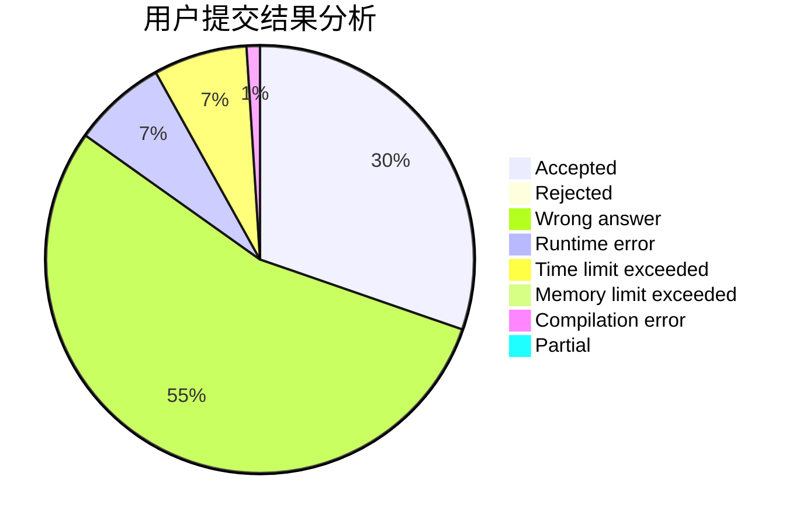
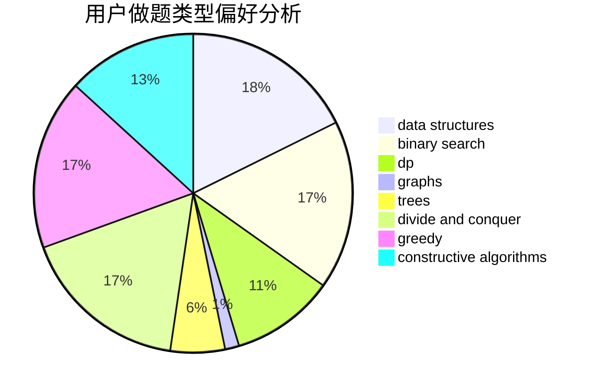
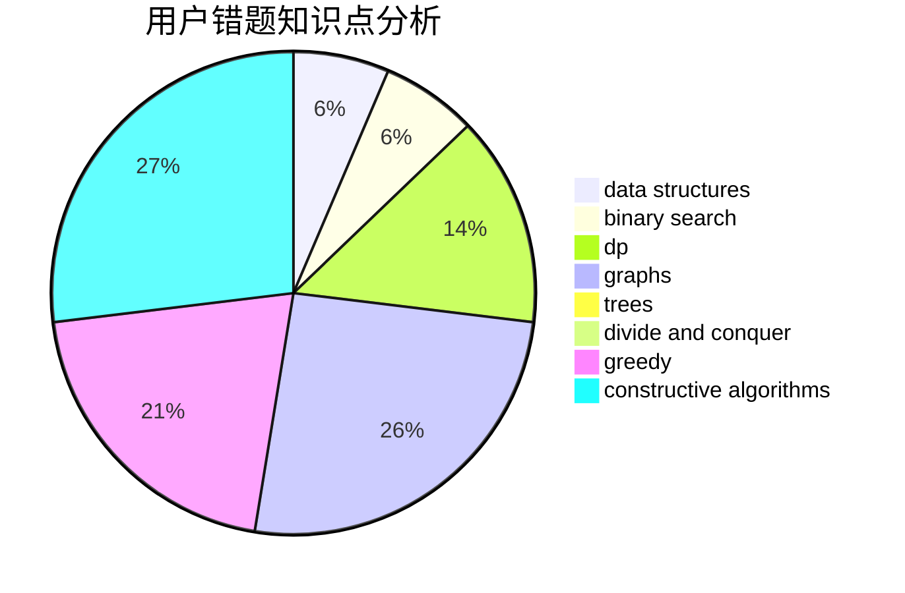

# IIIIndex

<!-- tabs:start -->

#### **用户提交结果分析**

#### **用户做题类型偏好分析**

#### **用户错题知识点分析**

<!-- tabs:end -->
# 推荐题目
[156C](https://codeforces.com/contest/156/problem/C)		combinatorics,
                        dp		  
[799F](https://codeforces.com/contest/799/problem/F)		data structures		  
[199D](https://codeforces.com/contest/199/problem/D)		dsu,graphs,sortings,trees		  
[478D](https://codeforces.com/contest/478/problem/D)		dp		  
[722F](https://codeforces.com/contest/722/problem/F)		chinese remainder theorem,
                        data structures,
                        implementation,
                        number theory,
                        two pointers		  
[238D](https://codeforces.com/contest/238/problem/D)		data structures,
                        implementation		  
[605A](https://codeforces.com/contest/605/problem/A)		constructive algorithms,
                        greedy		  
[538C](https://codeforces.com/contest/538/problem/C)		binary search,
                        brute force,
                        greedy,
                        implementation,
                        math		  
[838C](https://codeforces.com/contest/838/problem/C)		dp,
                        games		  
[218D](https://codeforces.com/contest/218/problem/D)		dsu,graphs,sortings,trees		  
