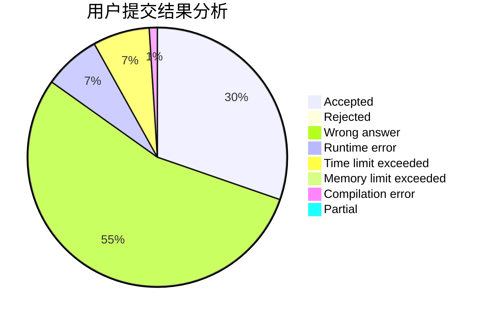
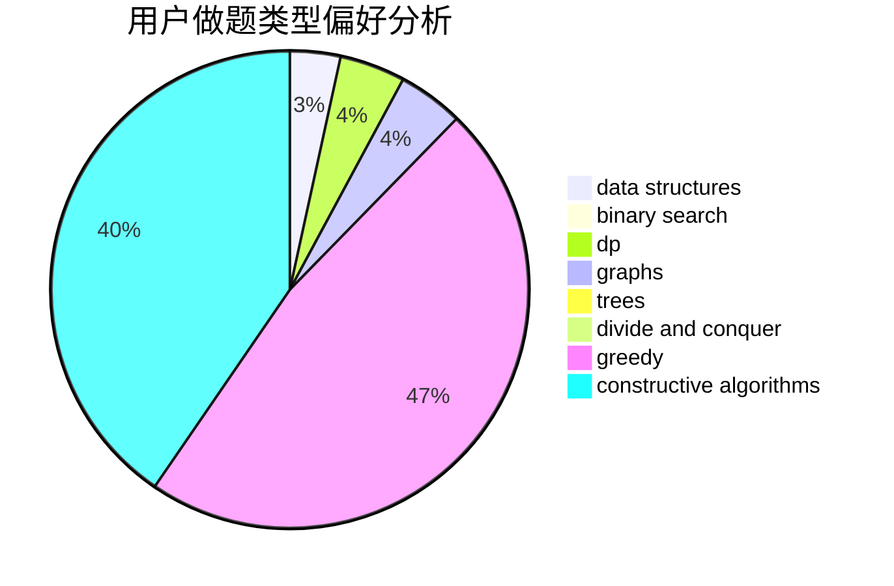
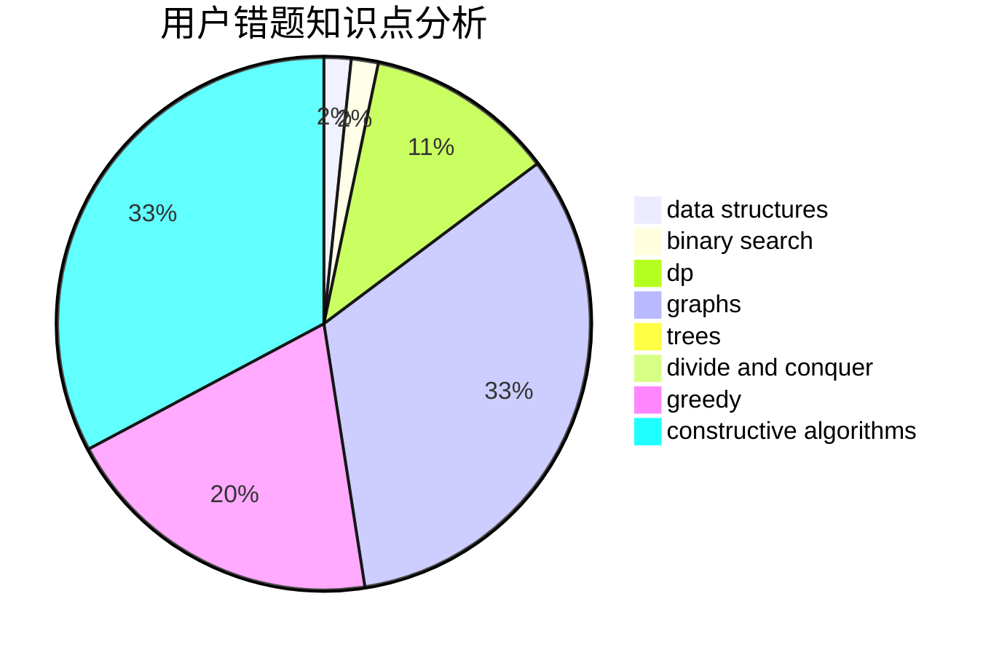

# IIIIndex

<!-- tabs:start -->

#### **用户提交结果分析**

#### **用户做题类型偏好分析**

#### **用户错题知识点分析**

<!-- tabs:end -->
# 推荐题目
[1771](https://codeforces.com/contest/177/problem/1)		dsu,graphs,sortings,trees		  
[813F](https://codeforces.com/contest/813/problem/F)		data structures,
                        dsu,
                        graphs		  
[220C](https://codeforces.com/contest/220/problem/C)		data structures		  
[498D](https://codeforces.com/contest/498/problem/D)		data structures,
                        dp,
                        number theory		  
[73B](https://codeforces.com/contest/73/problem/B)		binary search,
                        greedy,
                        sortings		  
[260A](https://codeforces.com/contest/260/problem/A)		implementation,
                        math		  
[623A](https://codeforces.com/contest/623/problem/A)		constructive algorithms,
                        graphs		  
[559D](https://codeforces.com/contest/559/problem/D)		combinatorics,
                        geometry,
                        probabilities		  
[856C](https://codeforces.com/contest/856/problem/C)		combinatorics,
                        dp,
                        math		  
[238A](https://codeforces.com/contest/238/problem/A)		constructive algorithms,
                        math		  
