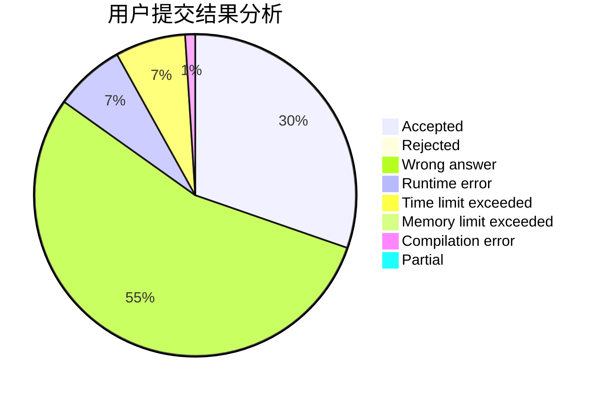
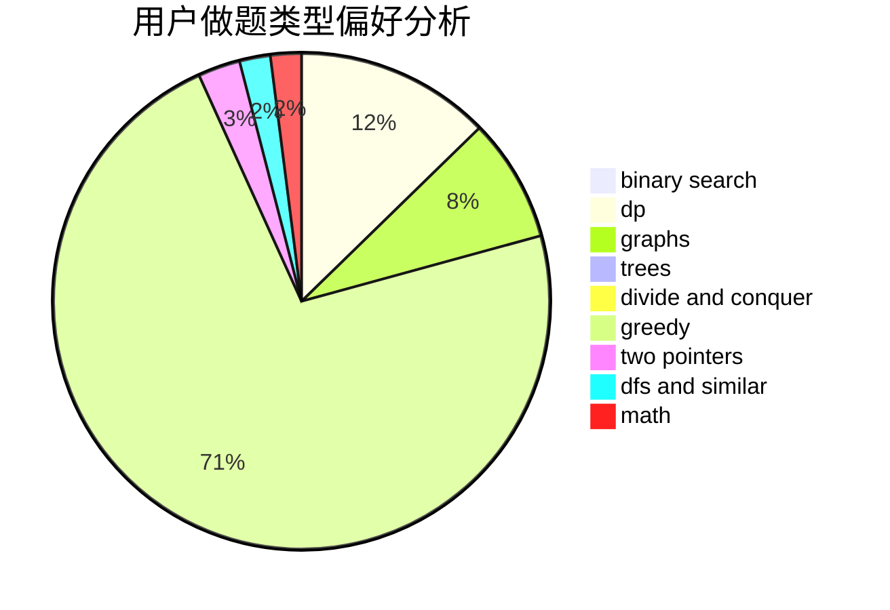

# IIIIndex

<!-- tabs:start -->

#### **用户提交结果分析**

#### **用户做题类型偏好分析**

<!-- tabs:end -->
# 推荐题目
[1771](https://codeforces.com/contest/177/problem/1)
[813F](https://codeforces.com/contest/813/problem/F)
[220C](https://codeforces.com/contest/220/problem/C)
[498D](https://codeforces.com/contest/498/problem/D)
[73B](https://codeforces.com/contest/73/problem/B)
[260A](https://codeforces.com/contest/260/problem/A)
[623A](https://codeforces.com/contest/623/problem/A)
[559D](https://codeforces.com/contest/559/problem/D)
[856C](https://codeforces.com/contest/856/problem/C)
[238A](https://codeforces.com/contest/238/problem/A)
