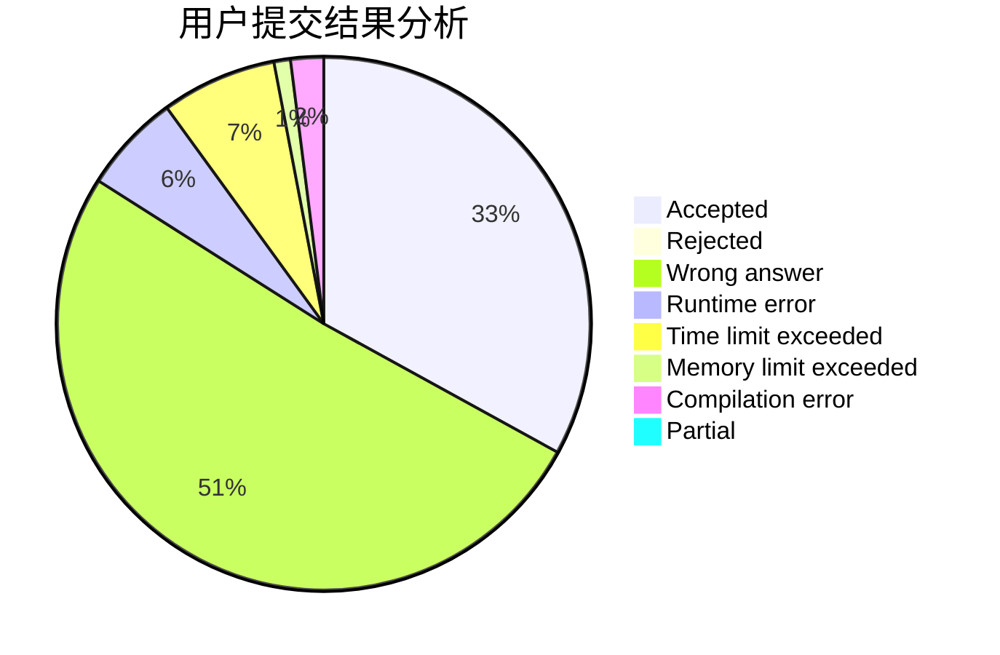
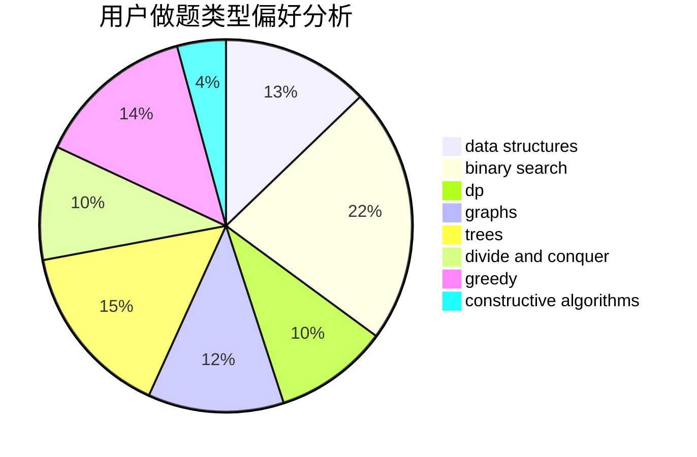
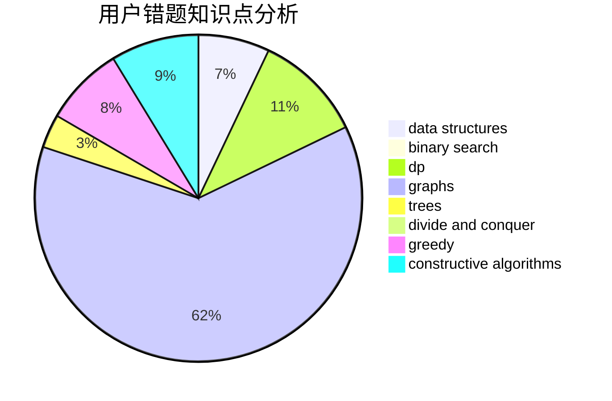

# ILoveSetsuna

<!-- tabs:start -->

#### **用户提交结果分析**

#### **用户做题类型偏好分析**

#### **用户错题知识点分析**

<!-- tabs:end -->
# 推荐题目
[1464C](https://codeforces.com/contest/1464/problem/C)		dsu,graphs,sortings,trees		  
[1238B](https://codeforces.com/contest/1238/problem/B)		greedy,
                        sortings		  
[914C](https://codeforces.com/contest/914/problem/C)		brute force,
                        combinatorics,
                        dp		  
[1301A](https://codeforces.com/contest/1301/problem/A)		implementation,
                        strings		  
[510E](https://codeforces.com/contest/510/problem/E)		flows		  
[1016A](https://codeforces.com/contest/1016/problem/A)		greedy,
                        implementation,
                        math		  
[1358E](https://codeforces.com/contest/1358/problem/E)		constructive algorithms,
                        data structures,
                        greedy,
                        implementation		  
[827E](https://codeforces.com/contest/827/problem/E)		fft,
                        math,
                        strings		  
[164C](https://codeforces.com/contest/164/problem/C)		flows,
                        graphs		  
[1510K](https://codeforces.com/contest/1510/problem/K)		brute force,
                        graphs,
                        implementation		  
