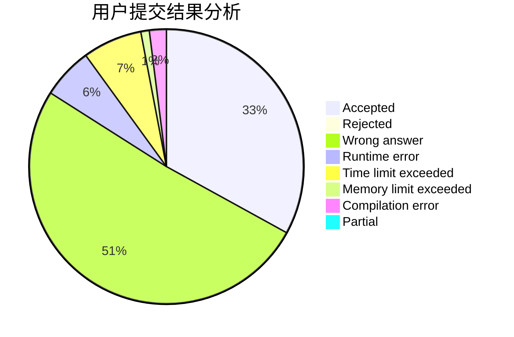
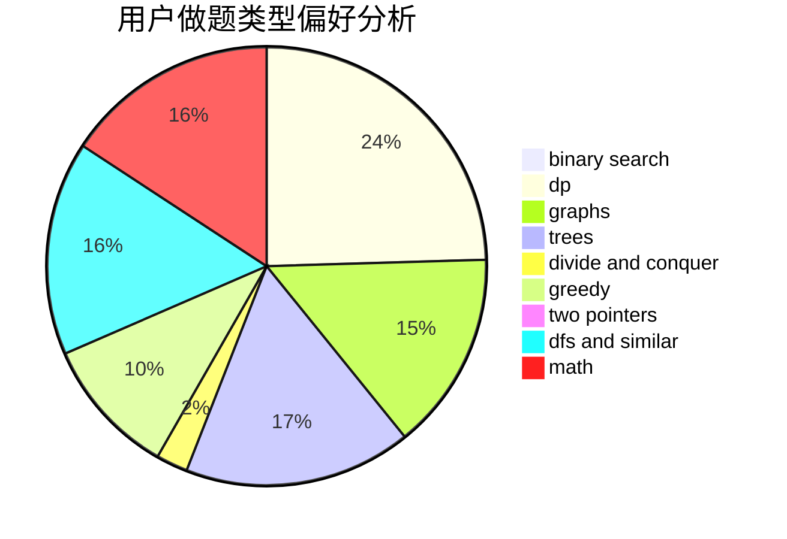

# ILoveSetsuna

<!-- tabs:start -->

#### **用户提交结果分析**

#### **用户做题类型偏好分析**

<!-- tabs:end -->
# 推荐题目
[1471D](https://codeforces.com/contest/1471/problem/D)
[1243A](https://codeforces.com/contest/1243/problem/A)
[933B](https://codeforces.com/contest/933/problem/B)
[1310D](https://codeforces.com/contest/1310/problem/D)
[534F](https://codeforces.com/contest/534/problem/F)
[1016D](https://codeforces.com/contest/1016/problem/D)
[1366G](https://codeforces.com/contest/1366/problem/G)
[846A](https://codeforces.com/contest/846/problem/A)
[18A](https://codeforces.com/contest/18/problem/A)
[166E](https://codeforces.com/contest/166/problem/E)
