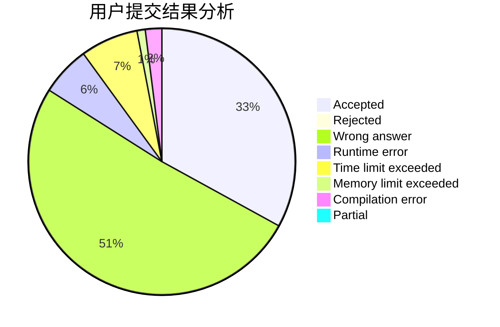
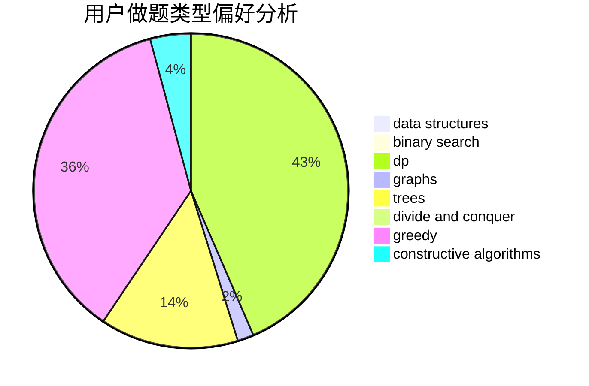
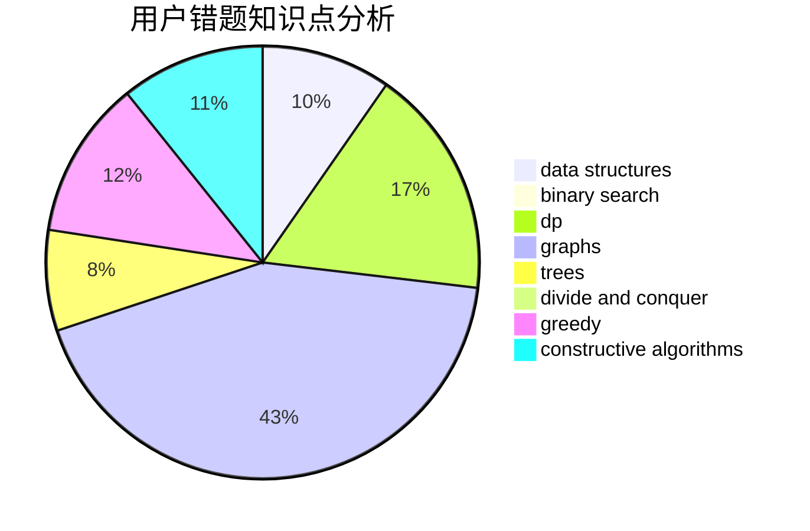

# ILoveSetsuna

<!-- tabs:start -->

#### **用户提交结果分析**

#### **用户做题类型偏好分析**

#### **用户错题知识点分析**

<!-- tabs:end -->
# 推荐题目
[1471D](https://codeforces.com/contest/1471/problem/D)		dsu,graphs,sortings,trees		  
[1243A](https://codeforces.com/contest/1243/problem/A)		implementation		  
[933B](https://codeforces.com/contest/933/problem/B)		math		  
[1310D](https://codeforces.com/contest/1310/problem/D)		dp,
                        graphs,
                        probabilities		  
[534F](https://codeforces.com/contest/534/problem/F)		bitmasks,
                        dp,
                        hashing,
                        meet-in-the-middle		  
[1016D](https://codeforces.com/contest/1016/problem/D)		constructive algorithms,
                        flows,
                        math		  
[1366G](https://codeforces.com/contest/1366/problem/G)		data structures,
                        dp,
                        strings		  
[846A](https://codeforces.com/contest/846/problem/A)		brute force,
                        implementation		  
[18A](https://codeforces.com/contest/18/problem/A)		brute force,
                        geometry		  
[166E](https://codeforces.com/contest/166/problem/E)		dp,
                        math,
                        matrices		  
