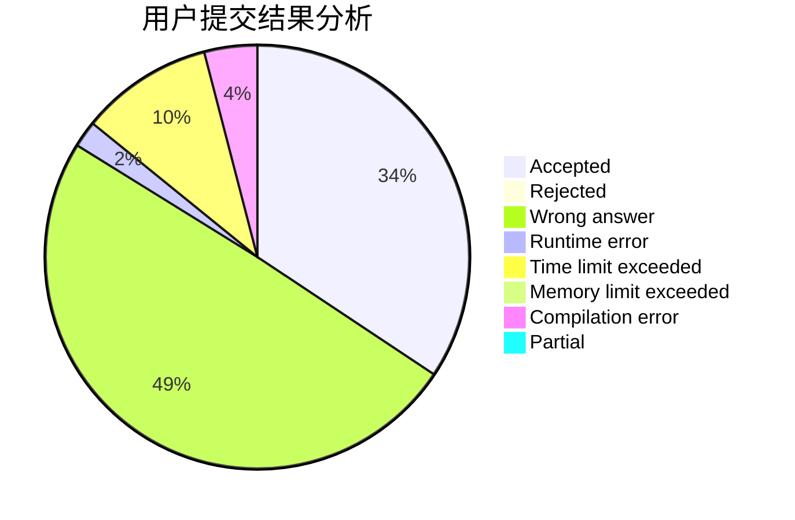
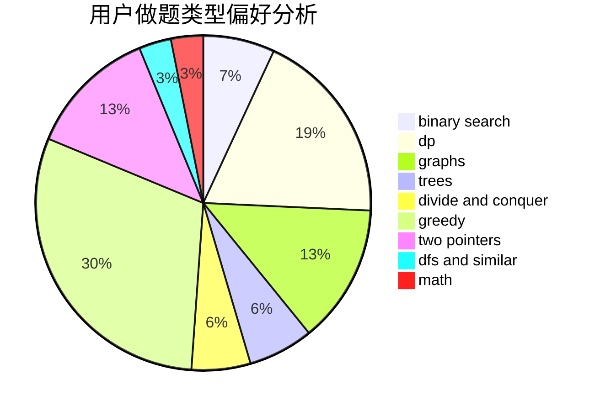

# INight

<!-- tabs:start -->

#### **用户提交结果分析**

#### **用户做题类型偏好分析**

<!-- tabs:end -->
# 推荐题目
[1331E](https://codeforces.com/contest/1331/problem/E)
[854B](https://codeforces.com/contest/854/problem/B)
[427B](https://codeforces.com/contest/427/problem/B)
[889E](https://codeforces.com/contest/889/problem/E)
[282C](https://codeforces.com/contest/282/problem/C)
[249E](https://codeforces.com/contest/249/problem/E)
[1384E](https://codeforces.com/contest/1384/problem/E)
[501C](https://codeforces.com/contest/501/problem/C)
[827D](https://codeforces.com/contest/827/problem/D)
[314C](https://codeforces.com/contest/314/problem/C)
