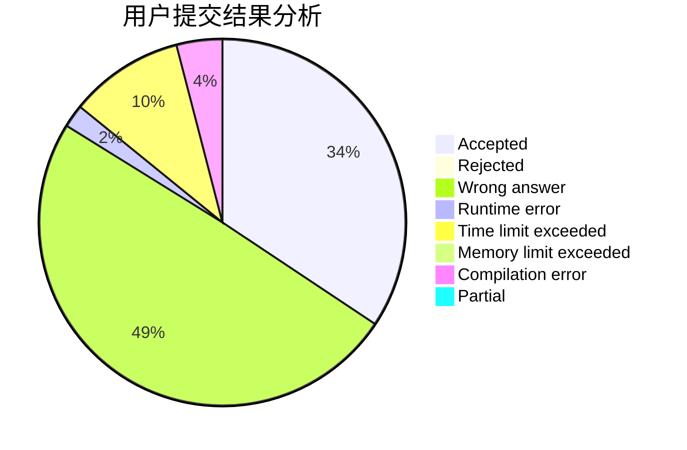
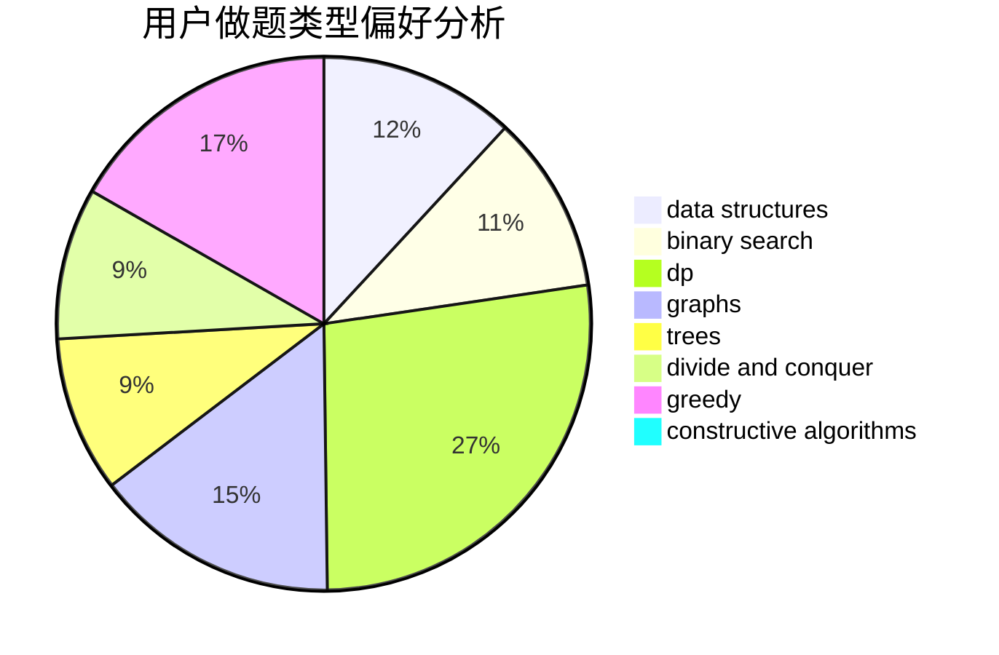

# INight

<!-- tabs:start -->

#### **用户提交结果分析**

#### **用户做题类型偏好分析**

#### **用户错题知识点分析**

<!-- tabs:end -->
# 推荐题目
[1331E](https://codeforces.com/contest/1331/problem/E)		dfs and similar,
                        geometry,
                        implementation		  
[854B](https://codeforces.com/contest/854/problem/B)		constructive algorithms,
                        math		  
[427B](https://codeforces.com/contest/427/problem/B)		data structures,
                        implementation		  
[889E](https://codeforces.com/contest/889/problem/E)		binary search,
                        dp,
                        math		  
[282C](https://codeforces.com/contest/282/problem/C)		constructive algorithms,
                        implementation,
                        math		  
[249E](https://codeforces.com/contest/249/problem/E)		math		  
[1384E](https://codeforces.com/contest/1384/problem/E)		dsu,graphs,sortings,trees		  
[501C](https://codeforces.com/contest/501/problem/C)		constructive algorithms,
                        data structures,
                        greedy,
                        sortings,
                        trees		  
[827D](https://codeforces.com/contest/827/problem/D)		data structures,
                        dfs and similar,
                        graphs,
                        trees		  
[314C](https://codeforces.com/contest/314/problem/C)		data structures,
                        dp		  
