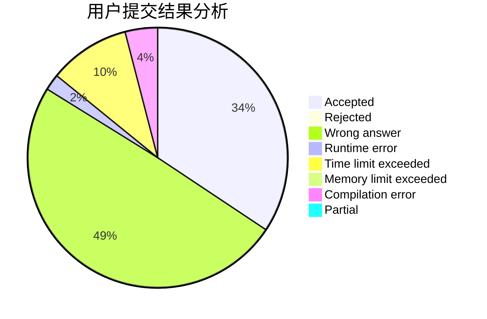
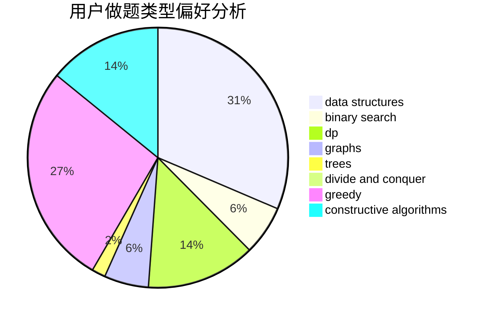

# INight

<!-- tabs:start -->

#### **用户提交结果分析**

#### **用户做题类型偏好分析**

#### **用户错题知识点分析**

<!-- tabs:end -->
# 推荐题目
[1325A](https://codeforces.com/contest/1325/problem/A)		constructive algorithms,
                        greedy,
                        number theory		  
[837B](https://codeforces.com/contest/837/problem/B)		brute force,
                        implementation		  
[39E](https://codeforces.com/contest/39/problem/E)		dp,
                        games		  
[86B](https://codeforces.com/contest/86/problem/B)		constructive algorithms,
                        graph matchings,
                        greedy,
                        math		  
[266D](https://codeforces.com/contest/266/problem/D)		graphs,
                        math,
                        shortest paths		  
[229D](https://codeforces.com/contest/229/problem/D)		dp,
                        greedy,
                        two pointers		  
[1375F](https://codeforces.com/contest/1375/problem/F)		constructive algorithms,
                        games,
                        interactive,
                        math		  
[482D](https://codeforces.com/contest/482/problem/D)		combinatorics,
                        dp,
                        trees		  
[809E](https://codeforces.com/contest/809/problem/E)		divide and conquer,
                        math,
                        number theory,
                        trees		  
[297D](https://codeforces.com/contest/297/problem/D)		constructive algorithms		  
