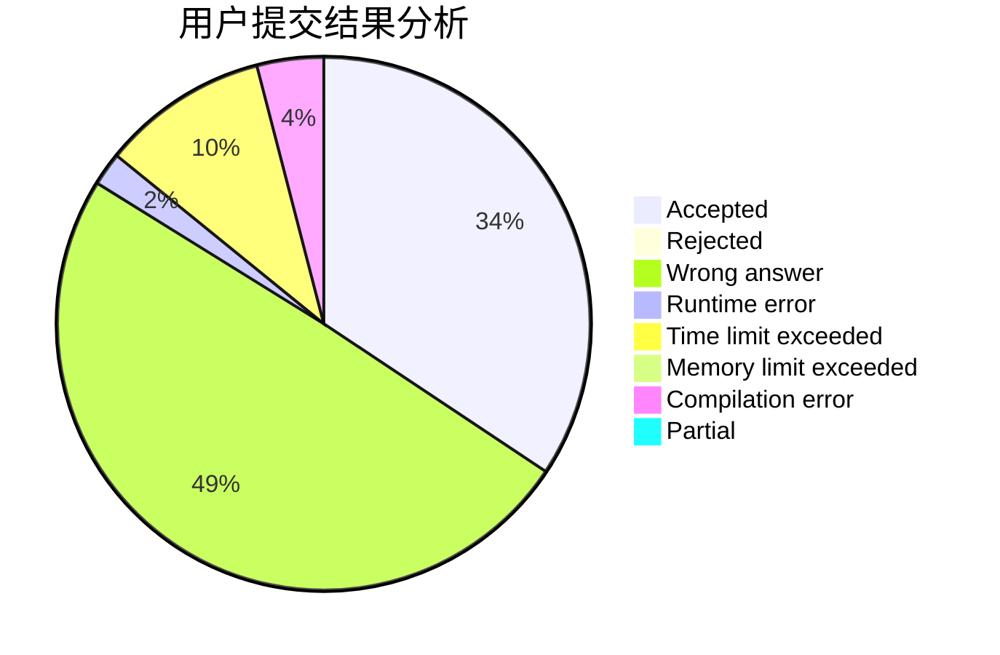
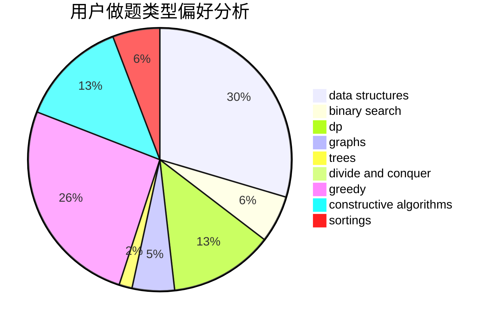

# INight
<!-- tabs:start -->
#### **用户提交结果分析**

#### **用户做题类型偏好分析**

#### **用户错题知识点分析**

<!-- tabs:end -->
# 推荐题目
[1424B](https://codeforces.com/contest/1424/problem/B)		binary search,
                        flows,
                        graph matchings,
                        graphs		  
[809E](http://codeforces.com/problemset/problem/809/E)		divide and conquer,
                        math,
                        number theory,
                        trees		  
[1138D](https://codeforces.com/contest/1138/problem/D)		greedy,
                        hashing,
                        strings		  
[837B](http://codeforces.com/problemset/problem/837/B)		brute force,
                        implementation		  
[266D](http://codeforces.com/problemset/problem/266/D)		graphs,
                        math,
                        shortest paths		  
[1065F](http://codeforces.com/problemset/problem/1065/F)		dfs and similar,
                        dp,
                        trees		  
[86B](http://codeforces.com/problemset/problem/86/B)		constructive algorithms,
                        graph matchings,
                        greedy,
                        math		  
[827E](http://codeforces.com/problemset/problem/827/E)		fft,
                        math,
                        strings		  
[229D](http://codeforces.com/problemset/problem/229/D)		dp,
                        greedy,
                        two pointers		  
[297D](http://codeforces.com/problemset/problem/297/D)		constructive algorithms		  
<!-- tabs:start -->
#### **data structures**
[163E](http://codeforces.com/problemset/problem/163/E)		data structures,
                        dfs and similar,
                        dp,
                        strings,
                        trees		  
[675E](http://codeforces.com/problemset/problem/675/E)		data structures,
                        dp,
                        greedy		  
[552D](http://codeforces.com/problemset/problem/552/D)		brute force,
                        combinatorics,
                        data structures,
                        geometry,
                        math,
                        sortings		  
[866D](https://codeforces.com/contest/866/problem/D)		constructive algorithms,
                        data structures,
                        greedy		  
[1313C1](http://codeforces.com/problemset/problem/1313/C1)		brute force,
                        data structures,
                        dp,
                        greedy		  
[914D](http://codeforces.com/problemset/problem/914/D)		data structures,
                        number theory		  
[1492C](http://codeforces.com/problemset/problem/1492/C)		binary search,
                        data structures,
                        dp,
                        greedy,
                        two pointers		  
[1490G](http://codeforces.com/problemset/problem/1490/G)		binary search,
                        data structures,
                        math		  
[1479D](http://codeforces.com/problemset/problem/1479/D)		binary search,
                        bitmasks,
                        brute force,
                        data structures,
                        probabilities,
                        trees		  
[1497A](http://codeforces.com/problemset/problem/1497/A)		brute force,
                        data structures,
                        greedy,
                        sortings		  
#### **binary search**
[1424B](https://codeforces.com/contest/1424/problem/B)		binary search,
                        flows,
                        graph matchings,
                        graphs		  
[701C](http://codeforces.com/problemset/problem/701/C)		binary search,
                        strings,
                        two pointers		  
[1153D](http://codeforces.com/problemset/problem/1153/D)		binary search,
                        dfs and similar,
                        dp,
                        greedy,
                        trees		  
[1372F](http://codeforces.com/problemset/problem/1372/F)		binary search,
                        divide and conquer,
                        interactive		  
[1010B](http://codeforces.com/problemset/problem/1010/B)		binary search,
                        interactive		  
[1492C](http://codeforces.com/problemset/problem/1492/C)		binary search,
                        data structures,
                        dp,
                        greedy,
                        two pointers		  
[1463D](http://codeforces.com/problemset/problem/1463/D)		binary search,
                        constructive algorithms,
                        greedy,
                        two pointers		  
[1490G](http://codeforces.com/problemset/problem/1490/G)		binary search,
                        data structures,
                        math		  
[1479D](http://codeforces.com/problemset/problem/1479/D)		binary search,
                        bitmasks,
                        brute force,
                        data structures,
                        probabilities,
                        trees		  
[1436E](http://codeforces.com/problemset/problem/1436/E)		binary search,
                        data structures,
                        two pointers		  
#### **dp**
[1065F](http://codeforces.com/problemset/problem/1065/F)		dfs and similar,
                        dp,
                        trees		  
[229D](http://codeforces.com/problemset/problem/229/D)		dp,
                        greedy,
                        two pointers		  
[163E](http://codeforces.com/problemset/problem/163/E)		data structures,
                        dfs and similar,
                        dp,
                        strings,
                        trees		  
[482D](http://codeforces.com/problemset/problem/482/D)		combinatorics,
                        dp,
                        trees		  
[1384E](https://codeforces.com/contest/1384/problem/E)		bitmasks,
                        dp,
                        graphs,
                        trees		  
[675E](http://codeforces.com/problemset/problem/675/E)		data structures,
                        dp,
                        greedy		  
[1253C](http://codeforces.com/problemset/problem/1253/C)		dp,
                        greedy,
                        math,
                        sortings		  
[1185G1](http://codeforces.com/problemset/problem/1185/G1)		bitmasks,
                        combinatorics,
                        dp		  
[730J](http://codeforces.com/problemset/problem/730/J)		dp		  
[1153D](http://codeforces.com/problemset/problem/1153/D)		binary search,
                        dfs and similar,
                        dp,
                        greedy,
                        trees		  
#### **graph**
[1424B](https://codeforces.com/contest/1424/problem/B)		binary search,
                        flows,
                        graph matchings,
                        graphs		  
[266D](http://codeforces.com/problemset/problem/266/D)		graphs,
                        math,
                        shortest paths		  
[86B](http://codeforces.com/problemset/problem/86/B)		constructive algorithms,
                        graph matchings,
                        greedy,
                        math		  
[1384E](https://codeforces.com/contest/1384/problem/E)		bitmasks,
                        dp,
                        graphs,
                        trees		  
[858F](http://codeforces.com/problemset/problem/858/F)		constructive algorithms,
                        dfs and similar,
                        graphs		  
[868E](http://codeforces.com/problemset/problem/868/E)		dp,
                        graphs,
                        trees		  
[1498D](http://codeforces.com/problemset/problem/1498/D)		dfs and similar,
                        dp,
                        graphs,
                        implementation		  
[1487C](http://codeforces.com/problemset/problem/1487/C)		brute force,
                        constructive algorithms,
                        dfs and similar,
                        graphs,
                        greedy,
                        implementation,
                        math		  
[1437C](http://codeforces.com/problemset/problem/1437/C)		dp,
                        flows,
                        graph matchings,
                        greedy,
                        math,
                        sortings		  
[1470D](http://codeforces.com/problemset/problem/1470/D)		constructive algorithms,
                        dfs and similar,
                        graph matchings,
                        graphs,
                        greedy		  
#### **trees**
[809E](http://codeforces.com/problemset/problem/809/E)		divide and conquer,
                        math,
                        number theory,
                        trees		  
[1065F](http://codeforces.com/problemset/problem/1065/F)		dfs and similar,
                        dp,
                        trees		  
[163E](http://codeforces.com/problemset/problem/163/E)		data structures,
                        dfs and similar,
                        dp,
                        strings,
                        trees		  
[482D](http://codeforces.com/problemset/problem/482/D)		combinatorics,
                        dp,
                        trees		  
[1384E](https://codeforces.com/contest/1384/problem/E)		bitmasks,
                        dp,
                        graphs,
                        trees		  
[1153D](http://codeforces.com/problemset/problem/1153/D)		binary search,
                        dfs and similar,
                        dp,
                        greedy,
                        trees		  
[868E](http://codeforces.com/problemset/problem/868/E)		dp,
                        graphs,
                        trees		  
[1479D](http://codeforces.com/problemset/problem/1479/D)		binary search,
                        bitmasks,
                        brute force,
                        data structures,
                        probabilities,
                        trees		  
[1511C](http://codeforces.com/problemset/problem/1511/C)		brute force,
                        data structures,
                        implementation,
                        trees		  
[1499F](http://codeforces.com/problemset/problem/1499/F)		combinatorics,
                        dfs and similar,
                        dp,
                        trees		  
#### **divide and conquer**
[809E](http://codeforces.com/problemset/problem/809/E)		divide and conquer,
                        math,
                        number theory,
                        trees		  
[1372F](http://codeforces.com/problemset/problem/1372/F)		binary search,
                        divide and conquer,
                        interactive		  
[1461D](http://codeforces.com/problemset/problem/1461/D)		binary search,
                        brute force,
                        data structures,
                        divide and conquer,
                        implementation,
                        sortings		  
[1466G](http://codeforces.com/problemset/problem/1466/G)		combinatorics,
                        divide and conquer,
                        hashing,
                        math,
                        string suffix structures,
                        strings		  
[1490D](http://codeforces.com/problemset/problem/1490/D)		dfs and similar,
                        divide and conquer,
                        implementation		  
[1483C](https://codeforces.com/contest/1483/problem/C)		data structures,
                        divide and conquer,
                        dp		  
[1491E](http://codeforces.com/problemset/problem/1491/E)		brute force,
                        dfs and similar,
                        divide and conquer,
                        number theory,
                        trees		  
[1303G](http://codeforces.com/problemset/problem/1303/G)		data structures,
                        divide and conquer,
                        geometry,
                        trees		  
[1494D](http://codeforces.com/problemset/problem/1494/D)		constructive algorithms,
                        data structures,
                        dfs and similar,
                        divide and conquer,
                        dsu,
                        greedy,
                        sortings,
                        trees		  
[1482E](http://codeforces.com/problemset/problem/1482/E)		data structures,
                        divide and conquer,
                        dp		  
#### **greedy**
[1138D](https://codeforces.com/contest/1138/problem/D)		greedy,
                        hashing,
                        strings		  
[86B](http://codeforces.com/problemset/problem/86/B)		constructive algorithms,
                        graph matchings,
                        greedy,
                        math		  
[229D](http://codeforces.com/problemset/problem/229/D)		dp,
                        greedy,
                        two pointers		  
[578B](http://codeforces.com/problemset/problem/578/B)		brute force,
                        greedy		  
[675E](http://codeforces.com/problemset/problem/675/E)		data structures,
                        dp,
                        greedy		  
[1253C](http://codeforces.com/problemset/problem/1253/C)		dp,
                        greedy,
                        math,
                        sortings		  
[1217B](http://codeforces.com/problemset/problem/1217/B)		greedy,
                        math		  
[1325A](http://codeforces.com/problemset/problem/1325/A)		constructive algorithms,
                        greedy,
                        number theory		  
[1153D](http://codeforces.com/problemset/problem/1153/D)		binary search,
                        dfs and similar,
                        dp,
                        greedy,
                        trees		  
[866D](https://codeforces.com/contest/866/problem/D)		constructive algorithms,
                        data structures,
                        greedy		  
#### **constructive algorithms**
[86B](http://codeforces.com/problemset/problem/86/B)		constructive algorithms,
                        graph matchings,
                        greedy,
                        math		  
[297D](http://codeforces.com/problemset/problem/297/D)		constructive algorithms		  
[858F](http://codeforces.com/problemset/problem/858/F)		constructive algorithms,
                        dfs and similar,
                        graphs		  
[1158B](http://codeforces.com/problemset/problem/1158/B)		constructive algorithms,
                        math,
                        strings		  
[1375F](http://codeforces.com/problemset/problem/1375/F)		constructive algorithms,
                        games,
                        interactive,
                        math		  
[1325A](http://codeforces.com/problemset/problem/1325/A)		constructive algorithms,
                        greedy,
                        number theory		  
[866D](https://codeforces.com/contest/866/problem/D)		constructive algorithms,
                        data structures,
                        greedy		  
[1457E](https://codeforces.com/contest/1457/problem/E)		constructive algorithms,
                        greedy,
                        math		  
[1453B](http://codeforces.com/problemset/problem/1453/B)		constructive algorithms,
                        implementation		  
[1493A](http://codeforces.com/problemset/problem/1493/A)		constructive algorithms,
                        greedy		  
#### **sortings**
[1253C](http://codeforces.com/problemset/problem/1253/C)		dp,
                        greedy,
                        math,
                        sortings		  
[552D](http://codeforces.com/problemset/problem/552/D)		brute force,
                        combinatorics,
                        data structures,
                        geometry,
                        math,
                        sortings		  
[1445A](http://codeforces.com/problemset/problem/1445/A)		greedy,
                        sortings		  
[1496C](https://codeforces.com/contest/1496/problem/C)		geometry,
                        greedy,
                        math,
                        sortings		  
[1495A](http://codeforces.com/problemset/problem/1495/A)		geometry,
                        greedy,
                        math,
                        sortings		  
[1497A](http://codeforces.com/problemset/problem/1497/A)		brute force,
                        data structures,
                        greedy,
                        sortings		  
[1427A](http://codeforces.com/problemset/problem/1427/A)		math,
                        sortings		  
[1461D](http://codeforces.com/problemset/problem/1461/D)		binary search,
                        brute force,
                        data structures,
                        divide and conquer,
                        implementation,
                        sortings		  
[1437C](http://codeforces.com/problemset/problem/1437/C)		dp,
                        flows,
                        graph matchings,
                        greedy,
                        math,
                        sortings		  
[1473A](http://codeforces.com/problemset/problem/1473/A)		greedy,
                        implementation,
                        math,
                        sortings		  
<!-- tabs:end -->
