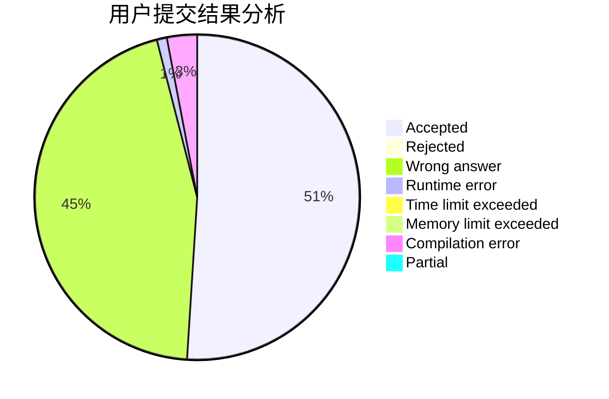
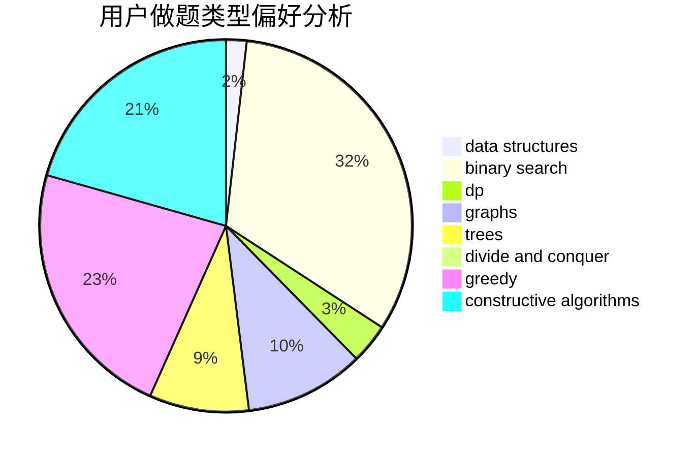

# I_Love_Sakurajima_Mai

<!-- tabs:start -->

#### **用户提交结果分析**

#### **用户做题类型偏好分析**

#### **用户错题知识点分析**

<!-- tabs:end -->
# 推荐题目
[1137A](https://codeforces.com/contest/1137/problem/A)		implementation,
                        sortings		  
[1483E](https://codeforces.com/contest/1483/problem/E)		dsu,graphs,sortings,trees		  
[794C](https://codeforces.com/contest/794/problem/C)		games,
                        greedy,
                        sortings		  
[1290C](https://codeforces.com/contest/1290/problem/C)		dfs and similar,
                        dsu,
                        graphs		  
[4D](https://codeforces.com/contest/4/problem/D)		dp,
                        sortings		  
[1335A](https://codeforces.com/contest/1335/problem/A)		math		  
[1494E](https://codeforces.com/contest/1494/problem/E)		constructive algorithms,
                        data structures,
                        graphs,
                        hashing		  
[1130E](https://codeforces.com/contest/1130/problem/E)		dsu,graphs,sortings,trees		  
[1363C](https://codeforces.com/contest/1363/problem/C)		games,
                        trees		  
[115B](https://codeforces.com/contest/115/problem/B)		greedy,
                        sortings		  
