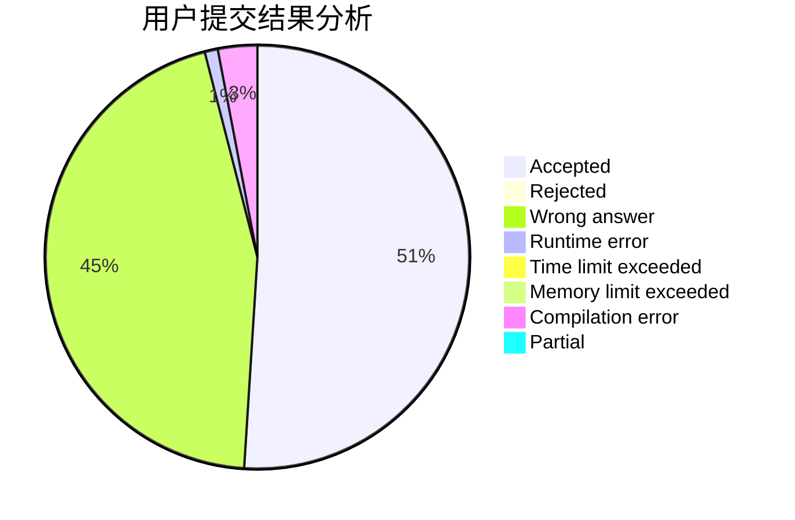
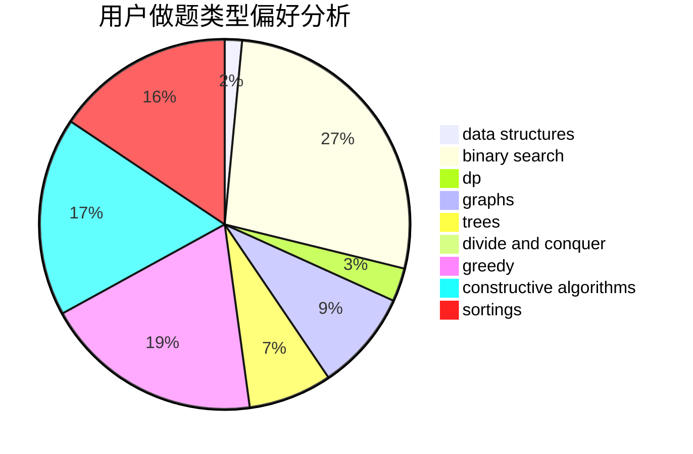

# I_Love_Sakurajima_Mai
<!-- tabs:start -->
#### **用户提交结果分析**

#### **用户做题类型偏好分析**

#### **用户错题知识点分析**

<!-- tabs:end -->
# 推荐题目
[1363C](http://codeforces.com/problemset/problem/1363/C)		games,
                        trees		  
[843D](http://codeforces.com/problemset/problem/843/D)		graphs,
                        shortest paths		  
[1335A](http://codeforces.com/problemset/problem/1335/A)		math		  
[633D](http://codeforces.com/problemset/problem/633/D)		brute force,
                        dp,
                        hashing,
                        implementation,
                        math		  
[1290C](http://codeforces.com/problemset/problem/1290/C)		dfs and similar,
                        dsu,
                        graphs		  
[316C2](http://codeforces.com/problemset/problem/316/C2)		flows,
                        graph matchings		  
[755F](http://codeforces.com/problemset/problem/755/F)		bitmasks,
                        dp,
                        greedy		  
[468A](http://codeforces.com/problemset/problem/468/A)		constructive algorithms,
                        greedy,
                        math		  
[115B](http://codeforces.com/problemset/problem/115/B)		greedy,
                        sortings		  
[174B](http://codeforces.com/problemset/problem/174/B)		dp,
                        greedy,
                        implementation		  
<!-- tabs:start -->
#### **data structures**
[1494E](http://codeforces.com/problemset/problem/1494/E)		constructive algorithms,
                        data structures,
                        graphs,
                        hashing		  
[1373G](http://codeforces.com/problemset/problem/1373/G)		data structures,
                        divide and conquer,
                        greedy		  
[1056E](http://codeforces.com/problemset/problem/1056/E)		brute force,
                        data structures,
                        hashing,
                        strings		  
[914D](http://codeforces.com/problemset/problem/914/D)		data structures,
                        number theory		  
[1492C](http://codeforces.com/problemset/problem/1492/C)		binary search,
                        data structures,
                        dp,
                        greedy,
                        two pointers		  
[1490G](http://codeforces.com/problemset/problem/1490/G)		binary search,
                        data structures,
                        math		  
[1479D](http://codeforces.com/problemset/problem/1479/D)		binary search,
                        bitmasks,
                        brute force,
                        data structures,
                        probabilities,
                        trees		  
[1497A](http://codeforces.com/problemset/problem/1497/A)		brute force,
                        data structures,
                        greedy,
                        sortings		  
[1491C](http://codeforces.com/problemset/problem/1491/C)		brute force,
                        data structures,
                        dp,
                        greedy,
                        implementation		  
[1492B](http://codeforces.com/problemset/problem/1492/B)		data structures,
                        greedy,
                        math		  
#### **binary search**
[810D](https://codeforces.com/contest/810/problem/D)		binary search,
                        interactive		  
[1483E](https://codeforces.com/contest/1483/problem/E)		binary search,
                        interactive		  
[1359C](http://codeforces.com/problemset/problem/1359/C)		binary search,
                        math		  
[1492C](http://codeforces.com/problemset/problem/1492/C)		binary search,
                        data structures,
                        dp,
                        greedy,
                        two pointers		  
[1463D](http://codeforces.com/problemset/problem/1463/D)		binary search,
                        constructive algorithms,
                        greedy,
                        two pointers		  
[1490G](http://codeforces.com/problemset/problem/1490/G)		binary search,
                        data structures,
                        math		  
[1479D](http://codeforces.com/problemset/problem/1479/D)		binary search,
                        bitmasks,
                        brute force,
                        data structures,
                        probabilities,
                        trees		  
[1436E](http://codeforces.com/problemset/problem/1436/E)		binary search,
                        data structures,
                        two pointers		  
[1461D](http://codeforces.com/problemset/problem/1461/D)		binary search,
                        brute force,
                        data structures,
                        divide and conquer,
                        implementation,
                        sortings		  
[1493C](http://codeforces.com/problemset/problem/1493/C)		binary search,
                        brute force,
                        constructive algorithms,
                        greedy,
                        strings		  
#### **dp**
[633D](http://codeforces.com/problemset/problem/633/D)		brute force,
                        dp,
                        hashing,
                        implementation,
                        math		  
[755F](http://codeforces.com/problemset/problem/755/F)		bitmasks,
                        dp,
                        greedy		  
[174B](http://codeforces.com/problemset/problem/174/B)		dp,
                        greedy,
                        implementation		  
[145C](http://codeforces.com/problemset/problem/145/C)		combinatorics,
                        dp,
                        math		  
[643F](http://codeforces.com/problemset/problem/643/F)		dp,
                        math,
                        meet-in-the-middle		  
[1469C](http://codeforces.com/problemset/problem/1469/C)		dp,
                        greedy,
                        implementation,
                        two pointers		  
[4D](http://codeforces.com/problemset/problem/4/D)		dp,
                        sortings		  
[1492C](http://codeforces.com/problemset/problem/1492/C)		binary search,
                        data structures,
                        dp,
                        greedy,
                        two pointers		  
[1457C](https://codeforces.com/contest/1457/problem/C)		brute force,
                        dp,
                        implementation		  
[1491C](http://codeforces.com/problemset/problem/1491/C)		brute force,
                        data structures,
                        dp,
                        greedy,
                        implementation		  
#### **graph**
[843D](http://codeforces.com/problemset/problem/843/D)		graphs,
                        shortest paths		  
[1290C](http://codeforces.com/problemset/problem/1290/C)		dfs and similar,
                        dsu,
                        graphs		  
[316C2](http://codeforces.com/problemset/problem/316/C2)		flows,
                        graph matchings		  
[1494E](http://codeforces.com/problemset/problem/1494/E)		constructive algorithms,
                        data structures,
                        graphs,
                        hashing		  
[1422D](http://codeforces.com/problemset/problem/1422/D)		graphs,
                        shortest paths,
                        sortings		  
[1466F](http://codeforces.com/problemset/problem/1466/F)		bitmasks,
                        dfs and similar,
                        dsu,
                        graphs,
                        greedy,
                        math,
                        sortings		  
[1487C](http://codeforces.com/problemset/problem/1487/C)		brute force,
                        constructive algorithms,
                        dfs and similar,
                        graphs,
                        greedy,
                        implementation,
                        math		  
[1437C](http://codeforces.com/problemset/problem/1437/C)		dp,
                        flows,
                        graph matchings,
                        greedy,
                        math,
                        sortings		  
[1470D](http://codeforces.com/problemset/problem/1470/D)		constructive algorithms,
                        dfs and similar,
                        graph matchings,
                        graphs,
                        greedy		  
[1476C](http://codeforces.com/problemset/problem/1476/C)		dp,
                        graphs,
                        greedy		  
#### **trees**
[1363C](http://codeforces.com/problemset/problem/1363/C)		games,
                        trees		  
[1479D](http://codeforces.com/problemset/problem/1479/D)		binary search,
                        bitmasks,
                        brute force,
                        data structures,
                        probabilities,
                        trees		  
[1511C](http://codeforces.com/problemset/problem/1511/C)		brute force,
                        data structures,
                        implementation,
                        trees		  
[1499F](http://codeforces.com/problemset/problem/1499/F)		combinatorics,
                        dfs and similar,
                        dp,
                        trees		  
[1491E](http://codeforces.com/problemset/problem/1491/E)		brute force,
                        dfs and similar,
                        divide and conquer,
                        number theory,
                        trees		  
[1466D](http://codeforces.com/problemset/problem/1466/D)		data structures,
                        greedy,
                        sortings,
                        trees		  
[1495D](http://codeforces.com/problemset/problem/1495/D)		combinatorics,
                        dfs and similar,
                        graphs,
                        math,
                        shortest paths,
                        trees		  
[1303G](http://codeforces.com/problemset/problem/1303/G)		data structures,
                        divide and conquer,
                        geometry,
                        trees		  
[1454E](http://codeforces.com/problemset/problem/1454/E)		combinatorics,
                        dfs and similar,
                        graphs,
                        trees		  
[1494D](http://codeforces.com/problemset/problem/1494/D)		constructive algorithms,
                        data structures,
                        dfs and similar,
                        divide and conquer,
                        dsu,
                        greedy,
                        sortings,
                        trees		  
#### **divide and conquer**
[1373G](http://codeforces.com/problemset/problem/1373/G)		data structures,
                        divide and conquer,
                        greedy		  
[1461D](http://codeforces.com/problemset/problem/1461/D)		binary search,
                        brute force,
                        data structures,
                        divide and conquer,
                        implementation,
                        sortings		  
[1466G](http://codeforces.com/problemset/problem/1466/G)		combinatorics,
                        divide and conquer,
                        hashing,
                        math,
                        string suffix structures,
                        strings		  
[1490D](http://codeforces.com/problemset/problem/1490/D)		dfs and similar,
                        divide and conquer,
                        implementation		  
[1483C](https://codeforces.com/contest/1483/problem/C)		data structures,
                        divide and conquer,
                        dp		  
[1491E](http://codeforces.com/problemset/problem/1491/E)		brute force,
                        dfs and similar,
                        divide and conquer,
                        number theory,
                        trees		  
[1303G](http://codeforces.com/problemset/problem/1303/G)		data structures,
                        divide and conquer,
                        geometry,
                        trees		  
[1494D](http://codeforces.com/problemset/problem/1494/D)		constructive algorithms,
                        data structures,
                        dfs and similar,
                        divide and conquer,
                        dsu,
                        greedy,
                        sortings,
                        trees		  
[1482E](http://codeforces.com/problemset/problem/1482/E)		data structures,
                        divide and conquer,
                        dp		  
[566C](http://codeforces.com/problemset/problem/566/C)		dfs and similar,
                        divide and conquer,
                        trees		  
#### **greedy**
[755F](http://codeforces.com/problemset/problem/755/F)		bitmasks,
                        dp,
                        greedy		  
[468A](http://codeforces.com/problemset/problem/468/A)		constructive algorithms,
                        greedy,
                        math		  
[115B](http://codeforces.com/problemset/problem/115/B)		greedy,
                        sortings		  
[174B](http://codeforces.com/problemset/problem/174/B)		dp,
                        greedy,
                        implementation		  
[1209A](http://codeforces.com/problemset/problem/1209/A)		greedy,
                        implementation,
                        math		  
[1400C](http://codeforces.com/problemset/problem/1400/C)		2-sat,
                        brute force,
                        constructive algorithms,
                        greedy		  
[794C](http://codeforces.com/problemset/problem/794/C)		games,
                        greedy,
                        sortings		  
[1373G](http://codeforces.com/problemset/problem/1373/G)		data structures,
                        divide and conquer,
                        greedy		  
[1469C](http://codeforces.com/problemset/problem/1469/C)		dp,
                        greedy,
                        implementation,
                        two pointers		  
[1466F](http://codeforces.com/problemset/problem/1466/F)		bitmasks,
                        dfs and similar,
                        dsu,
                        graphs,
                        greedy,
                        math,
                        sortings		  
#### **constructive algorithms**
[468A](http://codeforces.com/problemset/problem/468/A)		constructive algorithms,
                        greedy,
                        math		  
[1130E](https://codeforces.com/contest/1130/problem/E)		constructive algorithms		  
[1494E](http://codeforces.com/problemset/problem/1494/E)		constructive algorithms,
                        data structures,
                        graphs,
                        hashing		  
[1400C](http://codeforces.com/problemset/problem/1400/C)		2-sat,
                        brute force,
                        constructive algorithms,
                        greedy		  
[1493A](http://codeforces.com/problemset/problem/1493/A)		constructive algorithms,
                        greedy		  
[1463D](http://codeforces.com/problemset/problem/1463/D)		binary search,
                        constructive algorithms,
                        greedy,
                        two pointers		  
[1456B](https://codeforces.com/contest/1456/problem/B)		bitmasks,
                        brute force,
                        constructive algorithms		  
[1492D](http://codeforces.com/problemset/problem/1492/D)		bitmasks,
                        constructive algorithms,
                        greedy,
                        math		  
[1504D](https://codeforces.com/contest/1504/problem/D)		constructive algorithms,
                        games,
                        interactive		  
[1483A](https://codeforces.com/contest/1483/problem/A)		brute force,
                        constructive algorithms,
                        greedy,
                        implementation		  
#### **sortings**
[115B](http://codeforces.com/problemset/problem/115/B)		greedy,
                        sortings		  
[12B](http://codeforces.com/problemset/problem/12/B)		implementation,
                        sortings		  
[1137A](http://codeforces.com/problemset/problem/1137/A)		implementation,
                        sortings		  
[794C](http://codeforces.com/problemset/problem/794/C)		games,
                        greedy,
                        sortings		  
[1422D](http://codeforces.com/problemset/problem/1422/D)		graphs,
                        shortest paths,
                        sortings		  
[4D](http://codeforces.com/problemset/problem/4/D)		dp,
                        sortings		  
[1466F](http://codeforces.com/problemset/problem/1466/F)		bitmasks,
                        dfs and similar,
                        dsu,
                        graphs,
                        greedy,
                        math,
                        sortings		  
[1496C](https://codeforces.com/contest/1496/problem/C)		geometry,
                        greedy,
                        math,
                        sortings		  
[1495A](http://codeforces.com/problemset/problem/1495/A)		geometry,
                        greedy,
                        math,
                        sortings		  
[1497A](http://codeforces.com/problemset/problem/1497/A)		brute force,
                        data structures,
                        greedy,
                        sortings		  
<!-- tabs:end -->
