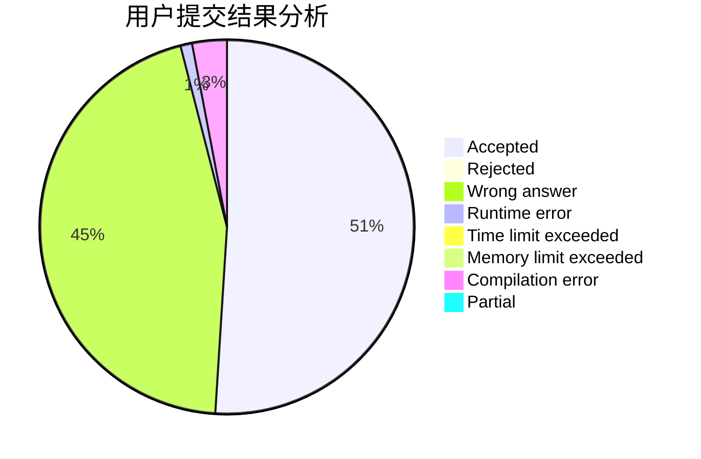
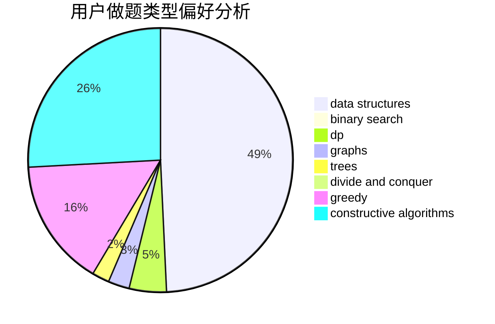

# I_Love_Sakurajima_Mai

<!-- tabs:start -->

#### **用户提交结果分析**

#### **用户做题类型偏好分析**

#### **用户错题知识点分析**

<!-- tabs:end -->
# 推荐题目
[1139B](https://codeforces.com/contest/1139/problem/B)		greedy,
                        implementation		  
[1491C](https://codeforces.com/contest/1491/problem/C)		brute force,
                        data structures,
                        dp,
                        greedy,
                        implementation		  
[809D](https://codeforces.com/contest/809/problem/D)		data structures,
                        dp		  
[1296F](https://codeforces.com/contest/1296/problem/F)		constructive algorithms,
                        dfs and similar,
                        greedy,
                        sortings,
                        trees		  
[520E](https://codeforces.com/contest/520/problem/E)		combinatorics,
                        dp,
                        math,
                        number theory		  
[1342A](https://codeforces.com/contest/1342/problem/A)		greedy,
                        math		  
[1503E](https://codeforces.com/contest/1503/problem/E)		combinatorics,
                        dp,
                        math		  
[1132F](https://codeforces.com/contest/1132/problem/F)		dp		  
[1370B](https://codeforces.com/contest/1370/problem/B)		constructive algorithms,
                        math,
                        number theory		  
[11631](https://codeforces.com/contest/1163/problem/1)		dsu,graphs,sortings,trees		  
