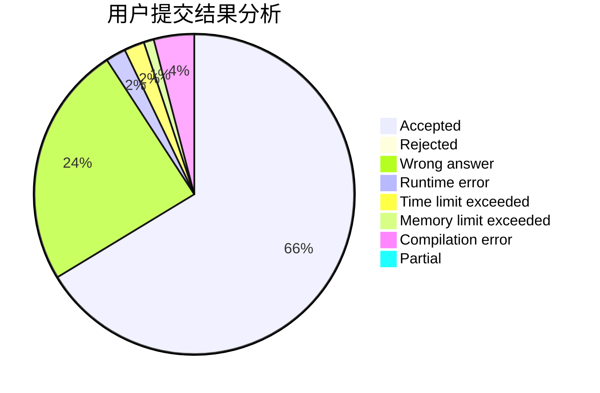
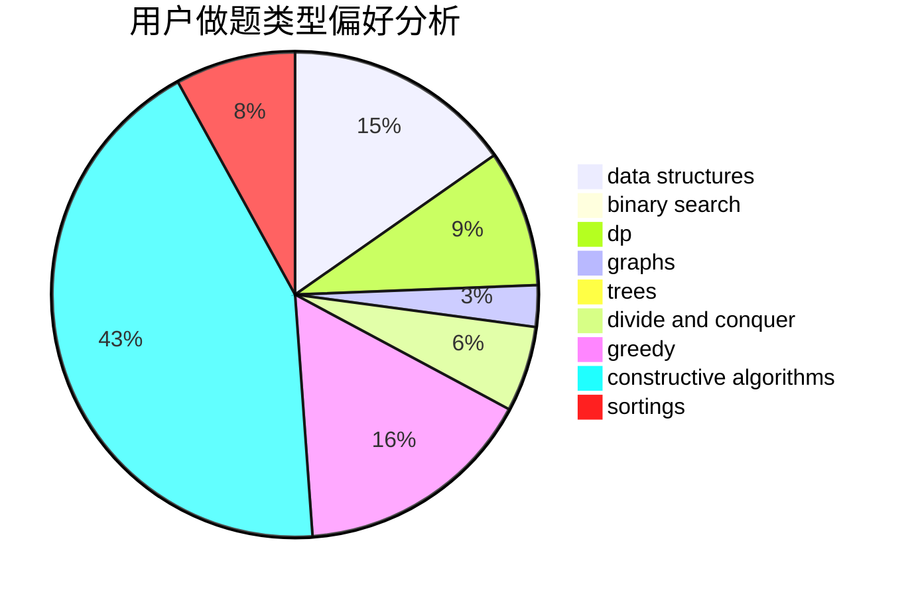
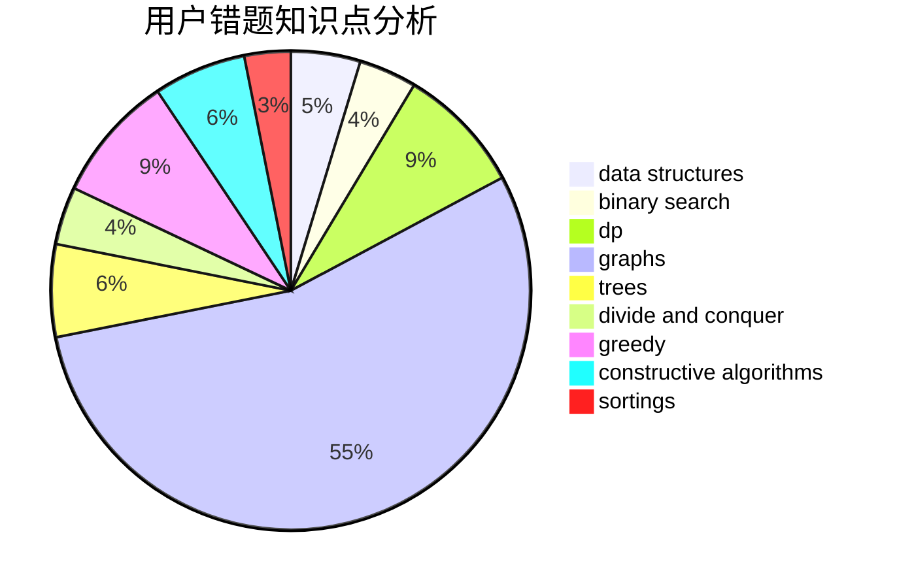

# I_love_zyc
<!-- tabs:start -->
#### **用户提交结果分析**

#### **用户做题类型偏好分析**

#### **用户错题知识点分析**

<!-- tabs:end -->
# 推荐题目
[742C](https://codeforces.com/contest/742/problem/C)		dfs and similar,
                        math		  
[265D](https://codeforces.com/contest/265/problem/D)		dp,
                        number theory		  
[1432E](https://codeforces.com/contest/1432/problem/E)		greedy		  
[383A](http://codeforces.com/problemset/problem/383/A)		data structures,
                        greedy		  
[56B](http://codeforces.com/problemset/problem/56/B)		implementation		  
[552E](http://codeforces.com/problemset/problem/552/E)		brute force,
                        dp,
                        expression parsing,
                        greedy,
                        implementation,
                        strings		  
[856F](http://codeforces.com/problemset/problem/856/F)		greedy		  
[1263B](http://codeforces.com/problemset/problem/1263/B)		greedy,
                        implementation		  
[189A](http://codeforces.com/problemset/problem/189/A)		brute force,
                        dp		  
[1240A](https://codeforces.com/contest/1240/problem/A)		binary search,
                        greedy		  
<!-- tabs:start -->
#### **data structures**
[383A](http://codeforces.com/problemset/problem/383/A)		data structures,
                        greedy		  
[799F](http://codeforces.com/problemset/problem/799/F)		data structures		  
[1154E](http://codeforces.com/problemset/problem/1154/E)		data structures,
                        implementation,
                        sortings		  
[1417C](https://codeforces.com/contest/1417/problem/C)		binary search,
                        data structures,
                        implementation,
                        two pointers		  
[1042F](http://codeforces.com/problemset/problem/1042/F)		data structures,
                        dfs and similar,
                        dsu,
                        graphs,
                        greedy,
                        sortings,
                        trees		  
[1137F](http://codeforces.com/problemset/problem/1137/F)		data structures,
                        trees		  
[1056G](http://codeforces.com/problemset/problem/1056/G)		brute force,
                        data structures,
                        graphs		  
[633C](http://codeforces.com/problemset/problem/633/C)		data structures,
                        dp,
                        hashing,
                        implementation,
                        sortings,
                        string suffix structures,
                        strings		  
[587C](http://codeforces.com/problemset/problem/587/C)		data structures,
                        trees		  
[1163F](http://codeforces.com/problemset/problem/1163/F)		data structures,
                        graphs,
                        shortest paths		  
#### **binary search**
[1240A](https://codeforces.com/contest/1240/problem/A)		binary search,
                        greedy		  
[504C](https://codeforces.com/contest/504/problem/C)		binary search,
                        combinatorics,
                        implementation		  
[1417C](https://codeforces.com/contest/1417/problem/C)		binary search,
                        data structures,
                        implementation,
                        two pointers		  
[325B](http://codeforces.com/problemset/problem/325/B)		binary search,
                        math		  
[83B](http://codeforces.com/problemset/problem/83/B)		binary search,
                        math,
                        sortings		  
[1328B](http://codeforces.com/problemset/problem/1328/B)		binary search,
                        brute force,
                        combinatorics,
                        implementation,
                        math		  
[1492C](http://codeforces.com/problemset/problem/1492/C)		binary search,
                        data structures,
                        dp,
                        greedy,
                        two pointers		  
[1463D](http://codeforces.com/problemset/problem/1463/D)		binary search,
                        constructive algorithms,
                        greedy,
                        two pointers		  
[1490G](http://codeforces.com/problemset/problem/1490/G)		binary search,
                        data structures,
                        math		  
[1479D](http://codeforces.com/problemset/problem/1479/D)		binary search,
                        bitmasks,
                        brute force,
                        data structures,
                        probabilities,
                        trees		  
#### **dp**
[265D](https://codeforces.com/contest/265/problem/D)		dp,
                        number theory		  
[552E](http://codeforces.com/problemset/problem/552/E)		brute force,
                        dp,
                        expression parsing,
                        greedy,
                        implementation,
                        strings		  
[189A](http://codeforces.com/problemset/problem/189/A)		brute force,
                        dp		  
[1294F](http://codeforces.com/problemset/problem/1294/F)		dfs and similar,
                        dp,
                        greedy,
                        trees		  
[313D](http://codeforces.com/problemset/problem/313/D)		dp		  
[809C](http://codeforces.com/problemset/problem/809/C)		combinatorics,
                        divide and conquer,
                        dp		  
[633C](http://codeforces.com/problemset/problem/633/C)		data structures,
                        dp,
                        hashing,
                        implementation,
                        sortings,
                        string suffix structures,
                        strings		  
[1223E](http://codeforces.com/problemset/problem/1223/E)		dp,
                        sortings,
                        trees		  
[671D](http://codeforces.com/problemset/problem/671/D)		data structures,
                        dp,
                        greedy		  
[1492C](http://codeforces.com/problemset/problem/1492/C)		binary search,
                        data structures,
                        dp,
                        greedy,
                        two pointers		  
#### **graph**
[859E](http://codeforces.com/problemset/problem/859/E)		combinatorics,
                        dfs and similar,
                        dsu,
                        graphs,
                        trees		  
[1042F](http://codeforces.com/problemset/problem/1042/F)		data structures,
                        dfs and similar,
                        dsu,
                        graphs,
                        greedy,
                        sortings,
                        trees		  
[1056G](http://codeforces.com/problemset/problem/1056/G)		brute force,
                        data structures,
                        graphs		  
[1027D](http://codeforces.com/problemset/problem/1027/D)		dfs and similar,
                        graphs		  
[331E1](http://codeforces.com/problemset/problem/331/E1)		constructive algorithms,
                        graphs,
                        implementation		  
[1163F](http://codeforces.com/problemset/problem/1163/F)		data structures,
                        graphs,
                        shortest paths		  
[862B](http://codeforces.com/problemset/problem/862/B)		dfs and similar,
                        graphs,
                        trees		  
[1487C](http://codeforces.com/problemset/problem/1487/C)		brute force,
                        constructive algorithms,
                        dfs and similar,
                        graphs,
                        greedy,
                        implementation,
                        math		  
[1437C](http://codeforces.com/problemset/problem/1437/C)		dp,
                        flows,
                        graph matchings,
                        greedy,
                        math,
                        sortings		  
[1470D](http://codeforces.com/problemset/problem/1470/D)		constructive algorithms,
                        dfs and similar,
                        graph matchings,
                        graphs,
                        greedy		  
#### **trees**
[1283F](http://codeforces.com/problemset/problem/1283/F)		constructive algorithms,
                        greedy,
                        trees		  
[1294F](http://codeforces.com/problemset/problem/1294/F)		dfs and similar,
                        dp,
                        greedy,
                        trees		  
[859E](http://codeforces.com/problemset/problem/859/E)		combinatorics,
                        dfs and similar,
                        dsu,
                        graphs,
                        trees		  
[1042F](http://codeforces.com/problemset/problem/1042/F)		data structures,
                        dfs and similar,
                        dsu,
                        graphs,
                        greedy,
                        sortings,
                        trees		  
[1137F](http://codeforces.com/problemset/problem/1137/F)		data structures,
                        trees		  
[587C](http://codeforces.com/problemset/problem/587/C)		data structures,
                        trees		  
[1223E](http://codeforces.com/problemset/problem/1223/E)		dp,
                        sortings,
                        trees		  
[862B](http://codeforces.com/problemset/problem/862/B)		dfs and similar,
                        graphs,
                        trees		  
[914E](http://codeforces.com/problemset/problem/914/E)		bitmasks,
                        data structures,
                        divide and conquer,
                        trees		  
[1479D](http://codeforces.com/problemset/problem/1479/D)		binary search,
                        bitmasks,
                        brute force,
                        data structures,
                        probabilities,
                        trees		  
#### **divide and conquer**
[809C](http://codeforces.com/problemset/problem/809/C)		combinatorics,
                        divide and conquer,
                        dp		  
[914E](http://codeforces.com/problemset/problem/914/E)		bitmasks,
                        data structures,
                        divide and conquer,
                        trees		  
[1461D](http://codeforces.com/problemset/problem/1461/D)		binary search,
                        brute force,
                        data structures,
                        divide and conquer,
                        implementation,
                        sortings		  
[1466G](http://codeforces.com/problemset/problem/1466/G)		combinatorics,
                        divide and conquer,
                        hashing,
                        math,
                        string suffix structures,
                        strings		  
[1490D](http://codeforces.com/problemset/problem/1490/D)		dfs and similar,
                        divide and conquer,
                        implementation		  
[1483C](https://codeforces.com/contest/1483/problem/C)		data structures,
                        divide and conquer,
                        dp		  
[1491E](http://codeforces.com/problemset/problem/1491/E)		brute force,
                        dfs and similar,
                        divide and conquer,
                        number theory,
                        trees		  
[1303G](http://codeforces.com/problemset/problem/1303/G)		data structures,
                        divide and conquer,
                        geometry,
                        trees		  
[1494D](http://codeforces.com/problemset/problem/1494/D)		constructive algorithms,
                        data structures,
                        dfs and similar,
                        divide and conquer,
                        dsu,
                        greedy,
                        sortings,
                        trees		  
[1482E](http://codeforces.com/problemset/problem/1482/E)		data structures,
                        divide and conquer,
                        dp		  
#### **greedy**
[1432E](https://codeforces.com/contest/1432/problem/E)		greedy		  
[383A](http://codeforces.com/problemset/problem/383/A)		data structures,
                        greedy		  
[552E](http://codeforces.com/problemset/problem/552/E)		brute force,
                        dp,
                        expression parsing,
                        greedy,
                        implementation,
                        strings		  
[856F](http://codeforces.com/problemset/problem/856/F)		greedy		  
[1263B](http://codeforces.com/problemset/problem/1263/B)		greedy,
                        implementation		  
[1240A](https://codeforces.com/contest/1240/problem/A)		binary search,
                        greedy		  
[215D](http://codeforces.com/problemset/problem/215/D)		greedy		  
[1283F](http://codeforces.com/problemset/problem/1283/F)		constructive algorithms,
                        greedy,
                        trees		  
[1294F](http://codeforces.com/problemset/problem/1294/F)		dfs and similar,
                        dp,
                        greedy,
                        trees		  
[859F](http://codeforces.com/problemset/problem/859/F)		greedy		  
#### **constructive algorithms**
[1283F](http://codeforces.com/problemset/problem/1283/F)		constructive algorithms,
                        greedy,
                        trees		  
[331E1](http://codeforces.com/problemset/problem/331/E1)		constructive algorithms,
                        graphs,
                        implementation		  
[613C](http://codeforces.com/problemset/problem/613/C)		constructive algorithms,
                        math		  
[1091F](http://codeforces.com/problemset/problem/1091/F)		constructive algorithms,
                        greedy		  
[1254A](http://codeforces.com/problemset/problem/1254/A)		constructive algorithms,
                        greedy,
                        implementation		  
[1493A](http://codeforces.com/problemset/problem/1493/A)		constructive algorithms,
                        greedy		  
[1463D](http://codeforces.com/problemset/problem/1463/D)		binary search,
                        constructive algorithms,
                        greedy,
                        two pointers		  
[1456B](https://codeforces.com/contest/1456/problem/B)		bitmasks,
                        brute force,
                        constructive algorithms		  
[1492D](http://codeforces.com/problemset/problem/1492/D)		bitmasks,
                        constructive algorithms,
                        greedy,
                        math		  
[1504D](https://codeforces.com/contest/1504/problem/D)		constructive algorithms,
                        games,
                        interactive		  
#### **sortings**
[1154E](http://codeforces.com/problemset/problem/1154/E)		data structures,
                        implementation,
                        sortings		  
[1042F](http://codeforces.com/problemset/problem/1042/F)		data structures,
                        dfs and similar,
                        dsu,
                        graphs,
                        greedy,
                        sortings,
                        trees		  
[810B](http://codeforces.com/problemset/problem/810/B)		greedy,
                        sortings		  
[83B](http://codeforces.com/problemset/problem/83/B)		binary search,
                        math,
                        sortings		  
[633C](http://codeforces.com/problemset/problem/633/C)		data structures,
                        dp,
                        hashing,
                        implementation,
                        sortings,
                        string suffix structures,
                        strings		  
[1223E](http://codeforces.com/problemset/problem/1223/E)		dp,
                        sortings,
                        trees		  
[1496C](https://codeforces.com/contest/1496/problem/C)		geometry,
                        greedy,
                        math,
                        sortings		  
[1495A](http://codeforces.com/problemset/problem/1495/A)		geometry,
                        greedy,
                        math,
                        sortings		  
[1497A](http://codeforces.com/problemset/problem/1497/A)		brute force,
                        data structures,
                        greedy,
                        sortings		  
[1427A](http://codeforces.com/problemset/problem/1427/A)		math,
                        sortings		  
<!-- tabs:end -->
