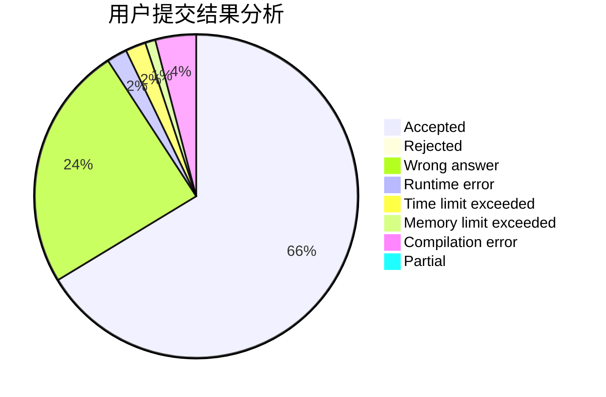
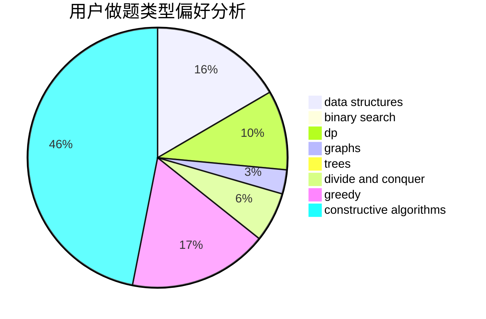
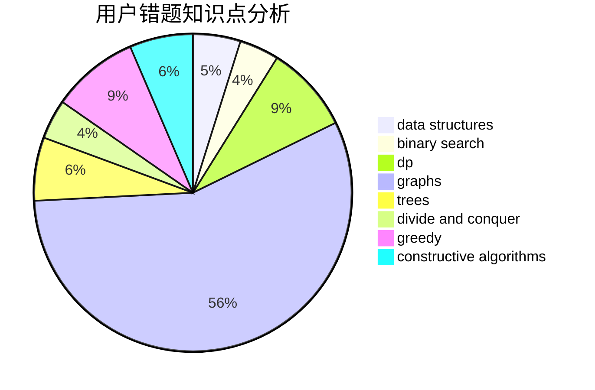

# I_love_zyc

<!-- tabs:start -->

#### **用户提交结果分析**

#### **用户做题类型偏好分析**

#### **用户错题知识点分析**

<!-- tabs:end -->
# 推荐题目
[1089F](https://codeforces.com/contest/1089/problem/F)		math		  
[1434B](https://codeforces.com/contest/1434/problem/B)		dsu,graphs,sortings,trees		  
[1432E](https://codeforces.com/contest/1432/problem/E)		dsu,graphs,sortings,trees		  
[1294F](https://codeforces.com/contest/1294/problem/F)		dfs and similar,
                        dp,
                        greedy,
                        trees		  
[325B](https://codeforces.com/contest/325/problem/B)		binary search,
                        math		  
[552E](https://codeforces.com/contest/552/problem/E)		brute force,
                        dp,
                        expression parsing,
                        greedy,
                        implementation,
                        strings		  
[1417C](https://codeforces.com/contest/1417/problem/C)		dsu,graphs,sortings,trees		  
[1283F](https://codeforces.com/contest/1283/problem/F)		constructive algorithms,
                        greedy,
                        trees		  
[189A](https://codeforces.com/contest/189/problem/A)		brute force,
                        dp		  
[1164I](https://codeforces.com/contest/1164/problem/I)		dsu,graphs,sortings,trees		  
