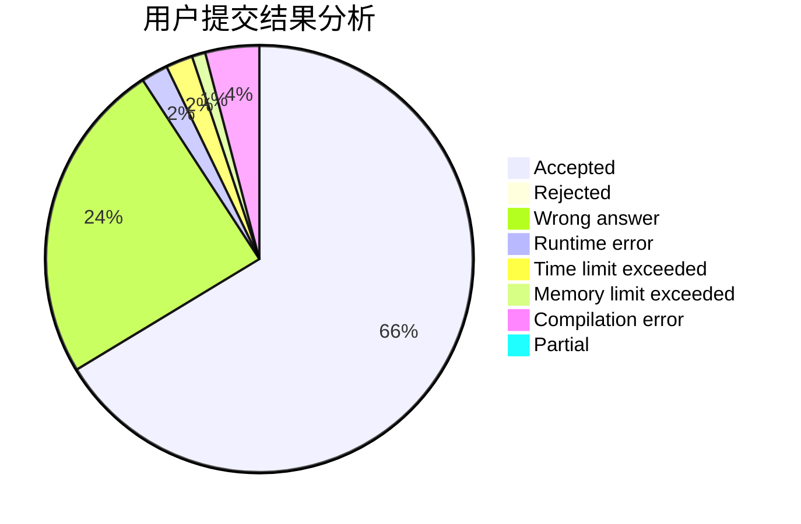
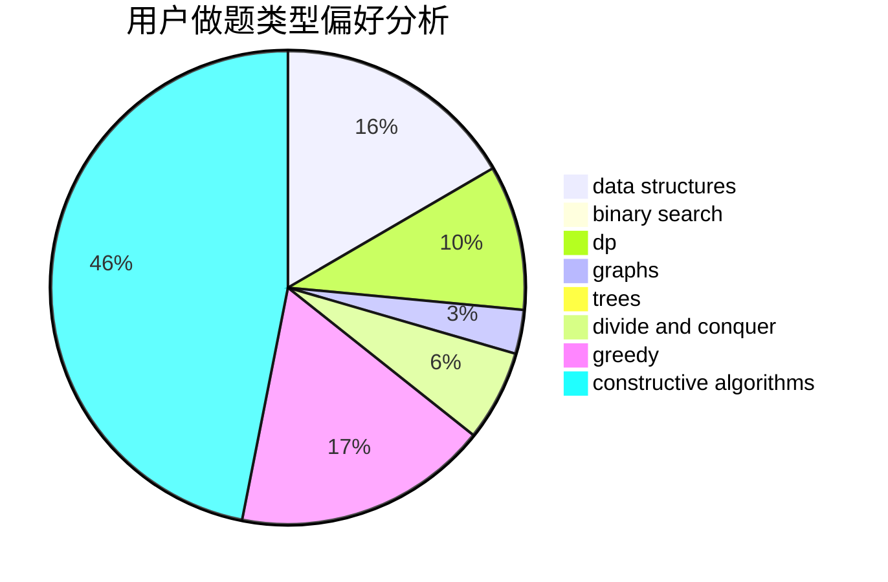
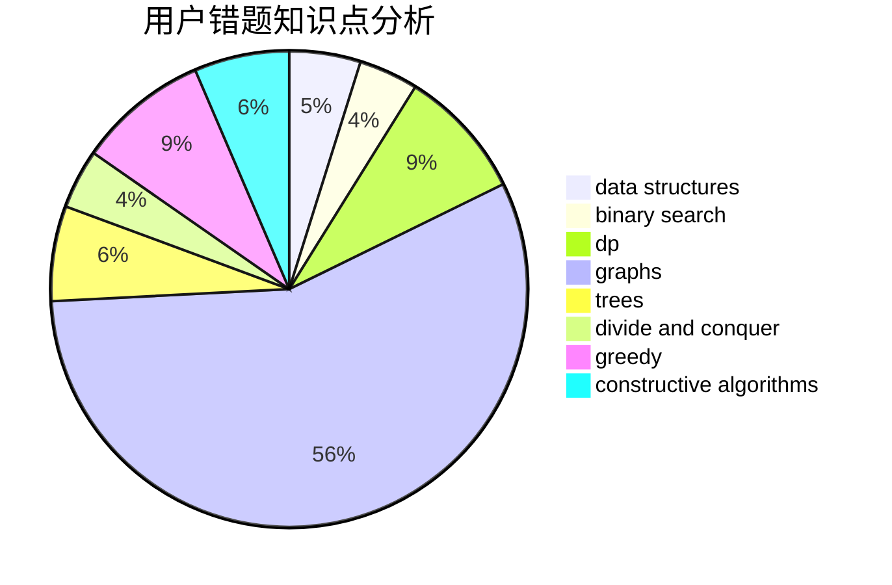

# I_love_zyc
<!-- tabs:start -->
#### **用户提交结果分析**

#### **用户做题类型偏好分析**

#### **用户错题知识点分析**

<!-- tabs:end -->
# 推荐题目
[Arpa's loud Owf and Mehrdad's evil plan](https://codeforces.com/contest/742/problem/C)		dfs and similar,
                        math		  
[Good Sequences](https://codeforces.com/contest/265/problem/D)		dp,
                        number theory		  
[Binary String Minimizing](https://codeforces.com/contest/1432/problem/E)		greedy		  
[Milking cows](http://codeforces.com/problemset/problem/383/A)		data structures,
                        greedy		  
[Spoilt Permutation](http://codeforces.com/problemset/problem/56/B)		implementation		  
[Vanya and Brackets](http://codeforces.com/problemset/problem/552/E)		brute force,
                        dp,
                        expression parsing,
                        greedy,
                        implementation,
                        strings		  
[To Play or not to Play](http://codeforces.com/problemset/problem/856/F)		greedy		  
[PIN Codes](http://codeforces.com/problemset/problem/1263/B)		greedy,
                        implementation		  
[Cut Ribbon](http://codeforces.com/problemset/problem/189/A)		brute force,
                        dp		  
[Save the Nature](https://codeforces.com/contest/1240/problem/A)		binary search,
                        greedy		  
<!-- tabs:start -->
#### **data structures**
[Milking cows](http://codeforces.com/problemset/problem/383/A)		data structures,
                        greedy		  
[Beautiful fountains rows](http://codeforces.com/problemset/problem/799/F)		data structures		  
[Two Teams](http://codeforces.com/problemset/problem/1154/E)		data structures,
                        implementation,
                        sortings		  
[k-Amazing Numbers](https://codeforces.com/contest/1417/problem/C)		binary search,
                        data structures,
                        implementation,
                        two pointers		  
[Leaf Sets](http://codeforces.com/problemset/problem/1042/F)		data structures,
                        dfs and similar,
                        dsu,
                        graphs,
                        greedy,
                        sortings,
                        trees		  
[Matches Are Not a Child's Play](http://codeforces.com/problemset/problem/1137/F)		data structures,
                        trees		  
[Take Metro](http://codeforces.com/problemset/problem/1056/G)		brute force,
                        data structures,
                        graphs		  
[Spy Syndrome 2](http://codeforces.com/problemset/problem/633/C)		data structures,
                        dp,
                        hashing,
                        implementation,
                        sortings,
                        string suffix structures,
                        strings		  
[Duff in the Army](http://codeforces.com/problemset/problem/587/C)		data structures,
                        trees		  
[Indecisive Taxi Fee](http://codeforces.com/problemset/problem/1163/F)		data structures,
                        graphs,
                        shortest paths		  
#### **binary search**
[Save the Nature](https://codeforces.com/contest/1240/problem/A)		binary search,
                        greedy		  
[Misha and Palindrome Degree](https://codeforces.com/contest/504/problem/C)		binary search,
                        combinatorics,
                        implementation		  
[k-Amazing Numbers](https://codeforces.com/contest/1417/problem/C)		binary search,
                        data structures,
                        implementation,
                        two pointers		  
[Stadium and Games](http://codeforces.com/problemset/problem/325/B)		binary search,
                        math		  
[Doctor](http://codeforces.com/problemset/problem/83/B)		binary search,
                        math,
                        sortings		  
[K-th Beautiful String](http://codeforces.com/problemset/problem/1328/B)		binary search,
                        brute force,
                        combinatorics,
                        implementation,
                        math		  
[Maximum width](http://codeforces.com/problemset/problem/1492/C)		binary search,
                        data structures,
                        dp,
                        greedy,
                        two pointers		  
[Pairs](http://codeforces.com/problemset/problem/1463/D)		binary search,
                        constructive algorithms,
                        greedy,
                        two pointers		  
[Old Floppy Drive](http://codeforces.com/problemset/problem/1490/G)		binary search,
                        data structures,
                        math		  
[Odd Mineral Resource](http://codeforces.com/problemset/problem/1479/D)		binary search,
                        bitmasks,
                        brute force,
                        data structures,
                        probabilities,
                        trees		  
#### **dp**
[Good Sequences](https://codeforces.com/contest/265/problem/D)		dp,
                        number theory		  
[Vanya and Brackets](http://codeforces.com/problemset/problem/552/E)		brute force,
                        dp,
                        expression parsing,
                        greedy,
                        implementation,
                        strings		  
[Cut Ribbon](http://codeforces.com/problemset/problem/189/A)		brute force,
                        dp		  
[Three Paths on a Tree](http://codeforces.com/problemset/problem/1294/F)		dfs and similar,
                        dp,
                        greedy,
                        trees		  
[Ilya and Roads](http://codeforces.com/problemset/problem/313/D)		dp		  
[Find a car](http://codeforces.com/problemset/problem/809/C)		combinatorics,
                        divide and conquer,
                        dp		  
[Spy Syndrome 2](http://codeforces.com/problemset/problem/633/C)		data structures,
                        dp,
                        hashing,
                        implementation,
                        sortings,
                        string suffix structures,
                        strings		  
[Paint the Tree](http://codeforces.com/problemset/problem/1223/E)		dp,
                        sortings,
                        trees		  
[Roads in Yusland](http://codeforces.com/problemset/problem/671/D)		data structures,
                        dp,
                        greedy		  
[Maximum width](http://codeforces.com/problemset/problem/1492/C)		binary search,
                        data structures,
                        dp,
                        greedy,
                        two pointers		  
#### **graph**
[Desk Disorder](http://codeforces.com/problemset/problem/859/E)		combinatorics,
                        dfs and similar,
                        dsu,
                        graphs,
                        trees		  
[Leaf Sets](http://codeforces.com/problemset/problem/1042/F)		data structures,
                        dfs and similar,
                        dsu,
                        graphs,
                        greedy,
                        sortings,
                        trees		  
[Take Metro](http://codeforces.com/problemset/problem/1056/G)		brute force,
                        data structures,
                        graphs		  
[Mouse Hunt](http://codeforces.com/problemset/problem/1027/D)		dfs and similar,
                        graphs		  
[Deja Vu](http://codeforces.com/problemset/problem/331/E1)		constructive algorithms,
                        graphs,
                        implementation		  
[Indecisive Taxi Fee](http://codeforces.com/problemset/problem/1163/F)		data structures,
                        graphs,
                        shortest paths		  
[Mahmoud and Ehab and the bipartiteness](http://codeforces.com/problemset/problem/862/B)		dfs and similar,
                        graphs,
                        trees		  
[Minimum Ties](http://codeforces.com/problemset/problem/1487/C)		brute force,
                        constructive algorithms,
                        dfs and similar,
                        graphs,
                        greedy,
                        implementation,
                        math		  
[Chef Monocarp](http://codeforces.com/problemset/problem/1437/C)		dp,
                        flows,
                        graph matchings,
                        greedy,
                        math,
                        sortings		  
[Strange Housing](http://codeforces.com/problemset/problem/1470/D)		constructive algorithms,
                        dfs and similar,
                        graph matchings,
                        graphs,
                        greedy		  
#### **trees**
[DIY Garland](http://codeforces.com/problemset/problem/1283/F)		constructive algorithms,
                        greedy,
                        trees		  
[Three Paths on a Tree](http://codeforces.com/problemset/problem/1294/F)		dfs and similar,
                        dp,
                        greedy,
                        trees		  
[Desk Disorder](http://codeforces.com/problemset/problem/859/E)		combinatorics,
                        dfs and similar,
                        dsu,
                        graphs,
                        trees		  
[Leaf Sets](http://codeforces.com/problemset/problem/1042/F)		data structures,
                        dfs and similar,
                        dsu,
                        graphs,
                        greedy,
                        sortings,
                        trees		  
[Matches Are Not a Child's Play](http://codeforces.com/problemset/problem/1137/F)		data structures,
                        trees		  
[Duff in the Army](http://codeforces.com/problemset/problem/587/C)		data structures,
                        trees		  
[Paint the Tree](http://codeforces.com/problemset/problem/1223/E)		dp,
                        sortings,
                        trees		  
[Mahmoud and Ehab and the bipartiteness](http://codeforces.com/problemset/problem/862/B)		dfs and similar,
                        graphs,
                        trees		  
[Palindromes in a Tree](http://codeforces.com/problemset/problem/914/E)		bitmasks,
                        data structures,
                        divide and conquer,
                        trees		  
[Odd Mineral Resource](http://codeforces.com/problemset/problem/1479/D)		binary search,
                        bitmasks,
                        brute force,
                        data structures,
                        probabilities,
                        trees		  
#### **divide and conquer**
[Find a car](http://codeforces.com/problemset/problem/809/C)		combinatorics,
                        divide and conquer,
                        dp		  
[Palindromes in a Tree](http://codeforces.com/problemset/problem/914/E)		bitmasks,
                        data structures,
                        divide and conquer,
                        trees		  
[Divide and Summarize](http://codeforces.com/problemset/problem/1461/D)		binary search,
                        brute force,
                        data structures,
                        divide and conquer,
                        implementation,
                        sortings		  
[Song of the Sirens](http://codeforces.com/problemset/problem/1466/G)		combinatorics,
                        divide and conquer,
                        hashing,
                        math,
                        string suffix structures,
                        strings		  
[Permutation Transformation](http://codeforces.com/problemset/problem/1490/D)		dfs and similar,
                        divide and conquer,
                        implementation		  
[Skyline Photo](https://codeforces.com/contest/1483/problem/C)		data structures,
                        divide and conquer,
                        dp		  
[Fib-tree](http://codeforces.com/problemset/problem/1491/E)		brute force,
                        dfs and similar,
                        divide and conquer,
                        number theory,
                        trees		  
[Sum of Prefix Sums](http://codeforces.com/problemset/problem/1303/G)		data structures,
                        divide and conquer,
                        geometry,
                        trees		  
[Dogeforces](http://codeforces.com/problemset/problem/1494/D)		constructive algorithms,
                        data structures,
                        dfs and similar,
                        divide and conquer,
                        dsu,
                        greedy,
                        sortings,
                        trees		  
[Logistical Questions](http://codeforces.com/problemset/problem/566/C)		dfs and similar,
                        divide and conquer,
                        trees		  
#### **greedy**
[Binary String Minimizing](https://codeforces.com/contest/1432/problem/E)		greedy		  
[Milking cows](http://codeforces.com/problemset/problem/383/A)		data structures,
                        greedy		  
[Vanya and Brackets](http://codeforces.com/problemset/problem/552/E)		brute force,
                        dp,
                        expression parsing,
                        greedy,
                        implementation,
                        strings		  
[To Play or not to Play](http://codeforces.com/problemset/problem/856/F)		greedy		  
[PIN Codes](http://codeforces.com/problemset/problem/1263/B)		greedy,
                        implementation		  
[Save the Nature](https://codeforces.com/contest/1240/problem/A)		binary search,
                        greedy		  
[Hot Days](http://codeforces.com/problemset/problem/215/D)		greedy		  
[DIY Garland](http://codeforces.com/problemset/problem/1283/F)		constructive algorithms,
                        greedy,
                        trees		  
[Three Paths on a Tree](http://codeforces.com/problemset/problem/1294/F)		dfs and similar,
                        dp,
                        greedy,
                        trees		  
[Ordering T-Shirts](http://codeforces.com/problemset/problem/859/F)		greedy		  
#### **constructive algorithms**
[DIY Garland](http://codeforces.com/problemset/problem/1283/F)		constructive algorithms,
                        greedy,
                        trees		  
[Deja Vu](http://codeforces.com/problemset/problem/331/E1)		constructive algorithms,
                        graphs,
                        implementation		  
[Necklace](http://codeforces.com/problemset/problem/613/C)		constructive algorithms,
                        math		  
[New Year and the Mallard Expedition](http://codeforces.com/problemset/problem/1091/F)		constructive algorithms,
                        greedy		  
[Feeding Chicken](http://codeforces.com/problemset/problem/1254/A)		constructive algorithms,
                        greedy,
                        implementation		  
[Anti-knapsack](http://codeforces.com/problemset/problem/1493/A)		constructive algorithms,
                        greedy		  
[Pairs](http://codeforces.com/problemset/problem/1463/D)		binary search,
                        constructive algorithms,
                        greedy,
                        two pointers		  
[XOR-gun](https://codeforces.com/contest/1456/problem/B)		bitmasks,
                        brute force,
                        constructive algorithms		  
[Genius's Gambit](http://codeforces.com/problemset/problem/1492/D)		bitmasks,
                        constructive algorithms,
                        greedy,
                        math		  
[3-Coloring](https://codeforces.com/contest/1504/problem/D)		constructive algorithms,
                        games,
                        interactive		  
#### **sortings**
[Two Teams](http://codeforces.com/problemset/problem/1154/E)		data structures,
                        implementation,
                        sortings		  
[Leaf Sets](http://codeforces.com/problemset/problem/1042/F)		data structures,
                        dfs and similar,
                        dsu,
                        graphs,
                        greedy,
                        sortings,
                        trees		  
[Summer sell-off](http://codeforces.com/problemset/problem/810/B)		greedy,
                        sortings		  
[Doctor](http://codeforces.com/problemset/problem/83/B)		binary search,
                        math,
                        sortings		  
[Spy Syndrome 2](http://codeforces.com/problemset/problem/633/C)		data structures,
                        dp,
                        hashing,
                        implementation,
                        sortings,
                        string suffix structures,
                        strings		  
[Paint the Tree](http://codeforces.com/problemset/problem/1223/E)		dp,
                        sortings,
                        trees		  
[Diamond Miner](https://codeforces.com/contest/1496/problem/C)		geometry,
                        greedy,
                        math,
                        sortings		  
[Meximization](http://codeforces.com/problemset/problem/1497/A)		brute force,
                        data structures,
                        greedy,
                        sortings		  
[Avoiding Zero](http://codeforces.com/problemset/problem/1427/A)		math,
                        sortings		  
[Divide and Summarize](http://codeforces.com/problemset/problem/1461/D)		binary search,
                        brute force,
                        data structures,
                        divide and conquer,
                        implementation,
                        sortings		  
<!-- tabs:end -->
