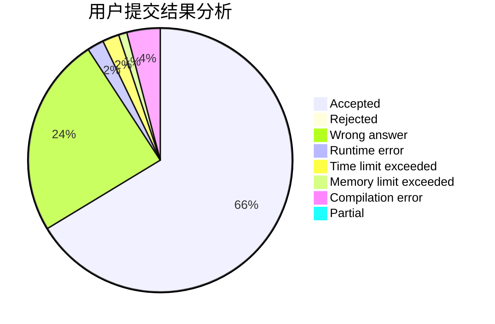
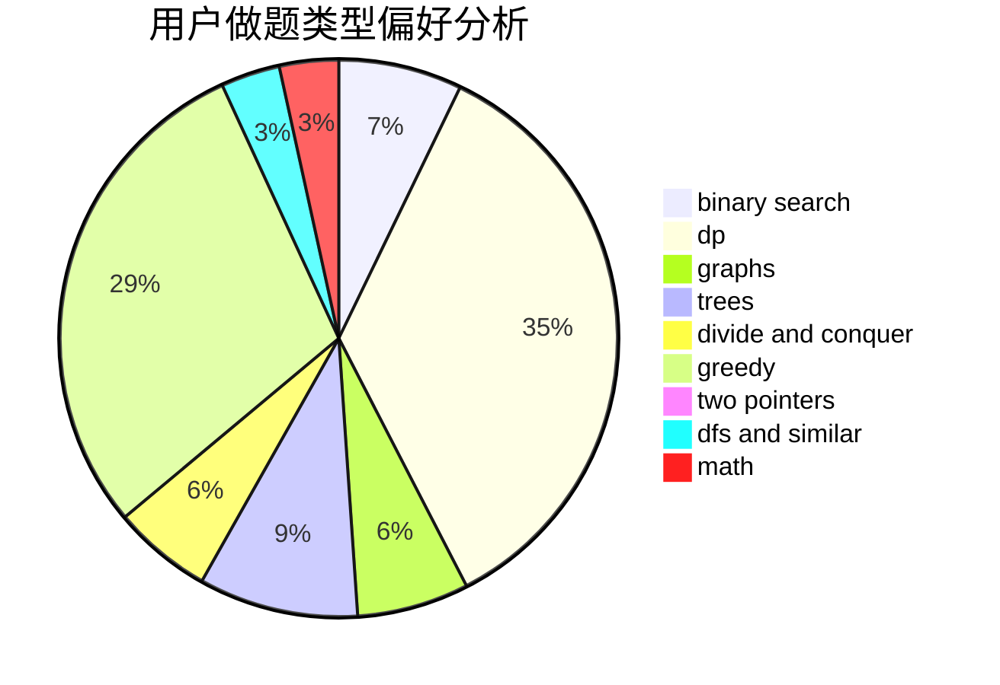

# I_love_zyc

<!-- tabs:start -->

#### **用户提交结果分析**

#### **用户做题类型偏好分析**

<!-- tabs:end -->
# 推荐题目
[1089K](https://codeforces.com/contest/1089/problem/K)
[1444B](https://codeforces.com/contest/1444/problem/B)
[1442D](https://codeforces.com/contest/1442/problem/D)
[1301C](https://codeforces.com/contest/1301/problem/C)
[354C](https://codeforces.com/contest/354/problem/C)
[578B](https://codeforces.com/contest/578/problem/B)
[1424M](https://codeforces.com/contest/1424/problem/M)
[1290F](https://codeforces.com/contest/1290/problem/F)
[212E](https://codeforces.com/contest/212/problem/E)
[1166A](https://codeforces.com/contest/1166/problem/A)
