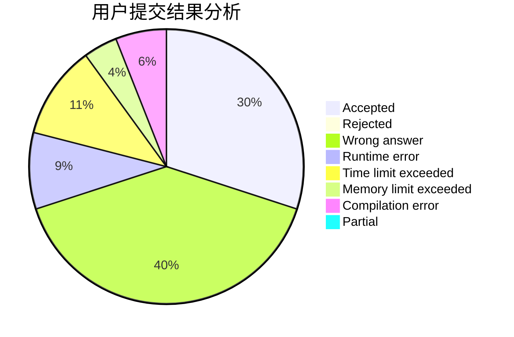
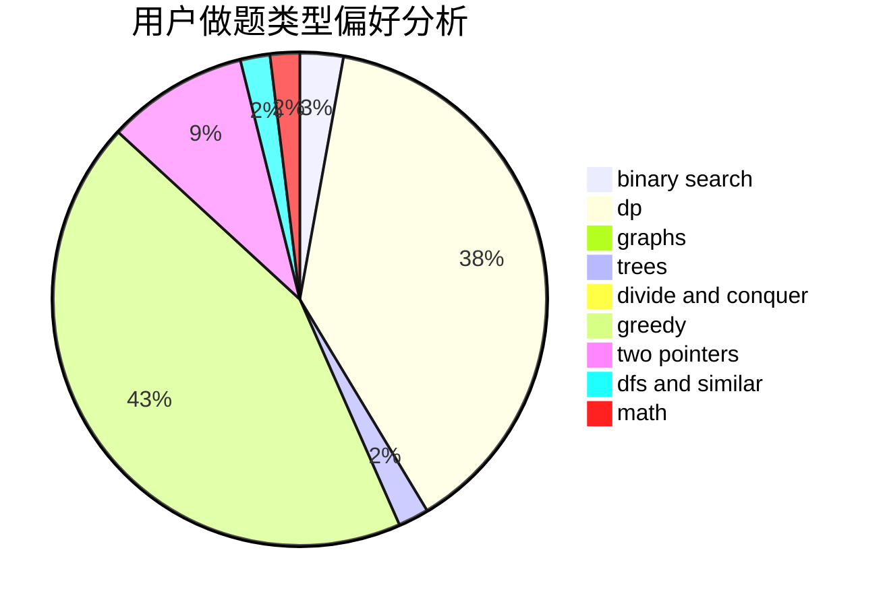

# Iamonlytupids

<!-- tabs:start -->

#### **用户提交结果分析**

#### **用户做题类型偏好分析**

<!-- tabs:end -->
# 推荐题目
[1254A](https://codeforces.com/contest/1254/problem/A)
[1207B](https://codeforces.com/contest/1207/problem/B)
[736B](https://codeforces.com/contest/736/problem/B)
[56B](https://codeforces.com/contest/56/problem/B)
[8D](https://codeforces.com/contest/8/problem/D)
[822B](https://codeforces.com/contest/822/problem/B)
[315A](https://codeforces.com/contest/315/problem/A)
[1471F](https://codeforces.com/contest/1471/problem/F)
[934B](https://codeforces.com/contest/934/problem/B)
[846F](https://codeforces.com/contest/846/problem/F)
