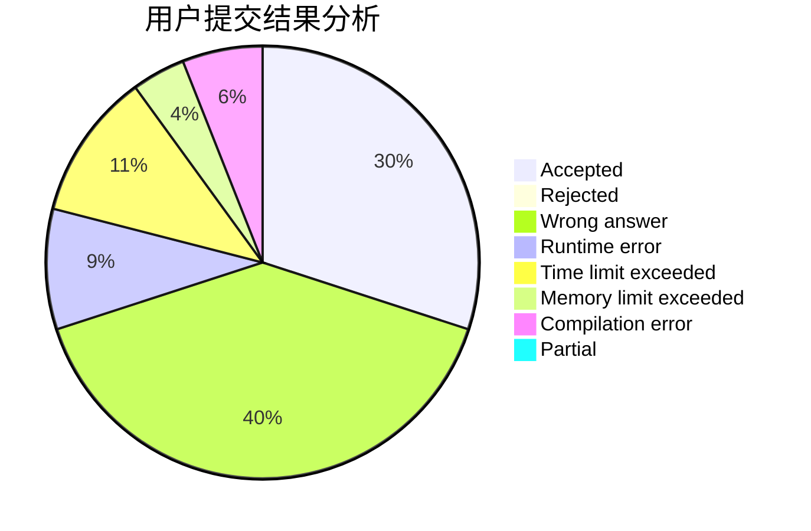
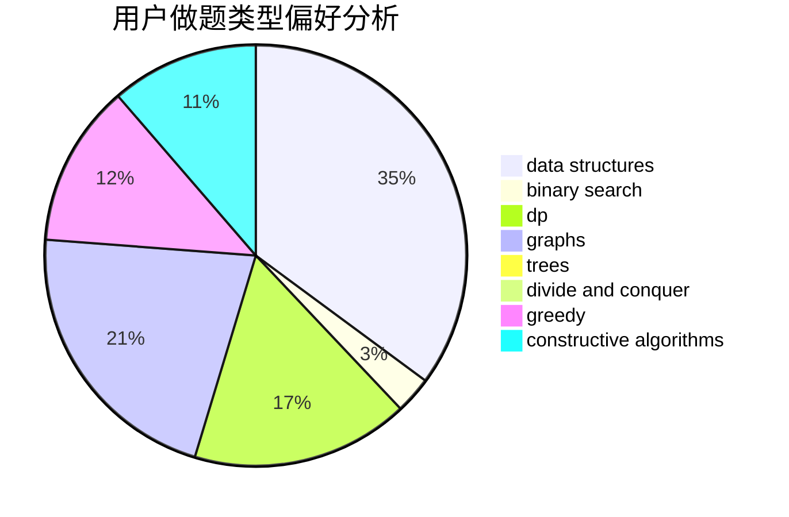
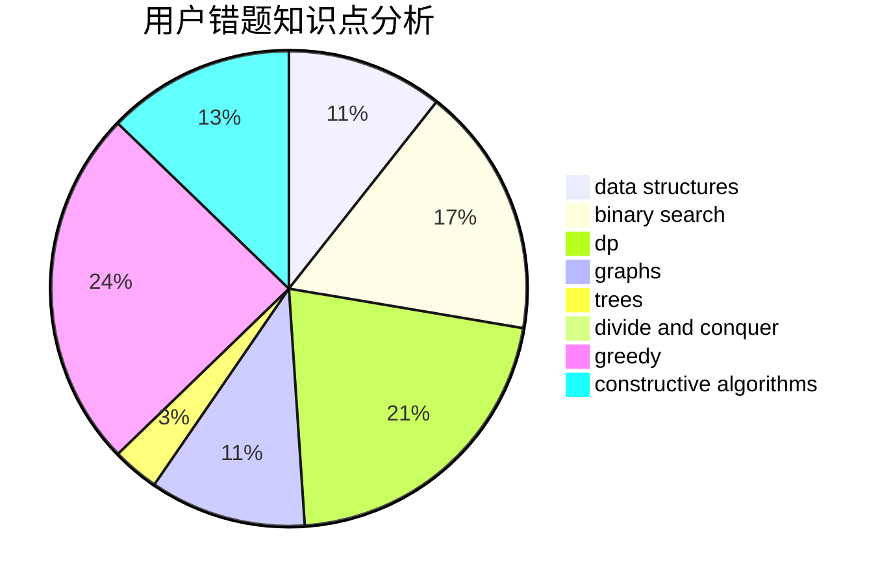

# Iamonlytupids

<!-- tabs:start -->

#### **用户提交结果分析**

#### **用户做题类型偏好分析**

#### **用户错题知识点分析**

<!-- tabs:end -->
# 推荐题目
[1250C](https://codeforces.com/contest/1250/problem/C)		data structures		  
[1202D](https://codeforces.com/contest/1202/problem/D)		combinatorics,
                        constructive algorithms,
                        math,
                        strings		  
[719A](https://codeforces.com/contest/719/problem/A)		implementation		  
[545B](https://codeforces.com/contest/545/problem/B)		greedy		  
[87C](https://codeforces.com/contest/87/problem/C)		dp,
                        games,
                        math		  
[807A](https://codeforces.com/contest/807/problem/A)		implementation,
                        sortings		  
[297E](https://codeforces.com/contest/297/problem/E)		data structures		  
[1464E](https://codeforces.com/contest/1464/problem/E)		dsu,graphs,sortings,trees		  
[914F](https://codeforces.com/contest/914/problem/F)		bitmasks,
                        brute force,
                        data structures,
                        string suffix structures,
                        strings		  
[828C](https://codeforces.com/contest/828/problem/C)		dsu,graphs,sortings,trees		  
