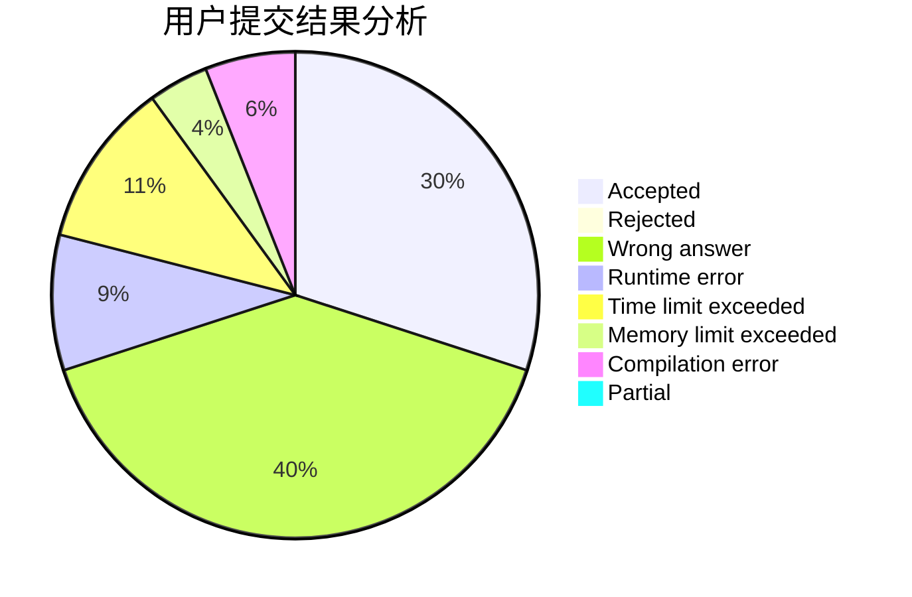
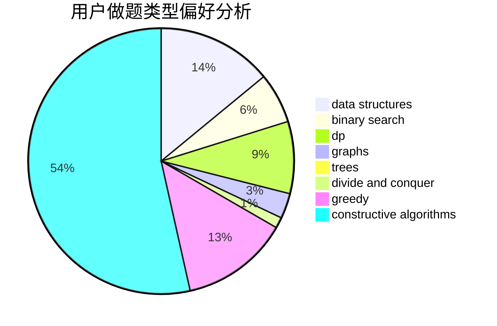
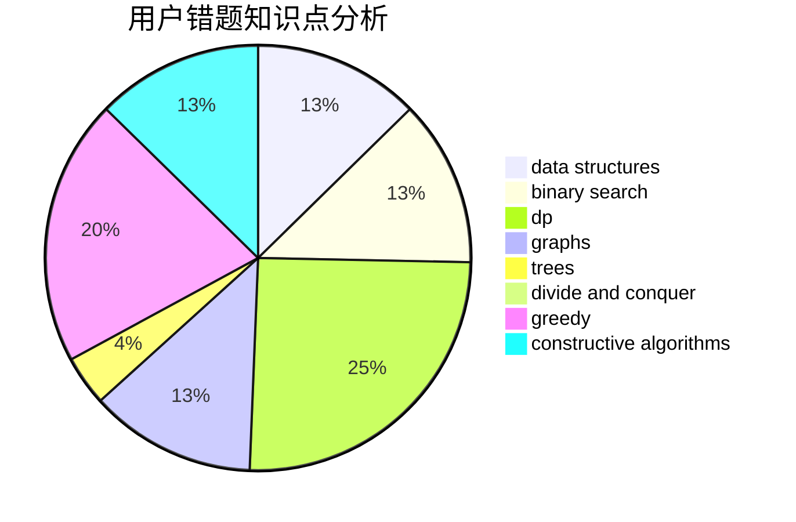

# Iamonlytupids

<!-- tabs:start -->

#### **用户提交结果分析**

#### **用户做题类型偏好分析**

#### **用户错题知识点分析**

<!-- tabs:end -->
# 推荐题目
[1254A](https://codeforces.com/contest/1254/problem/A)		constructive algorithms,
                        greedy,
                        implementation		  
[1207B](https://codeforces.com/contest/1207/problem/B)		constructive algorithms,
                        greedy,
                        implementation		  
[736B](https://codeforces.com/contest/736/problem/B)		dsu,graphs,sortings,trees		  
[56B](https://codeforces.com/contest/56/problem/B)		implementation		  
[8D](https://codeforces.com/contest/8/problem/D)		binary search,
                        geometry		  
[822B](https://codeforces.com/contest/822/problem/B)		brute force,
                        implementation,
                        strings		  
[315A](https://codeforces.com/contest/315/problem/A)		brute force		  
[1471F](https://codeforces.com/contest/1471/problem/F)		dsu,graphs,sortings,trees		  
[934B](https://codeforces.com/contest/934/problem/B)		constructive algorithms,
                        implementation		  
[846F](https://codeforces.com/contest/846/problem/F)		data structures,
                        math,
                        probabilities,
                        two pointers		  
