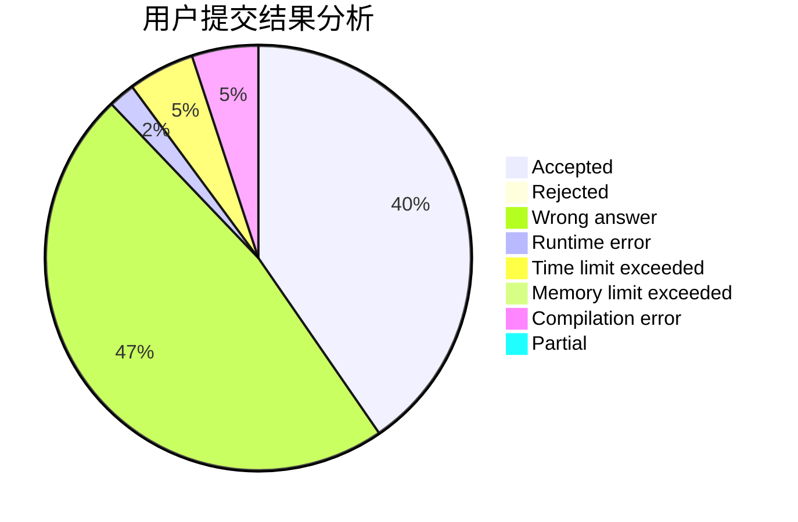
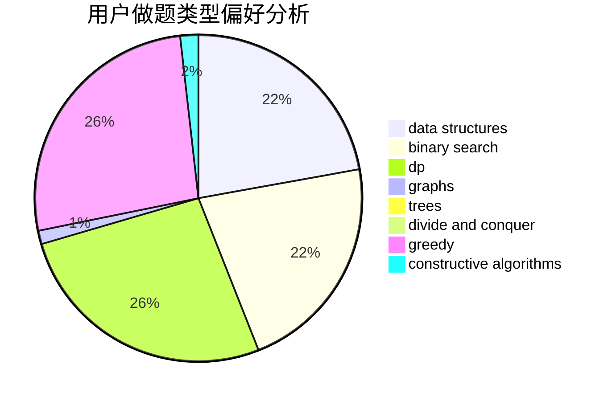
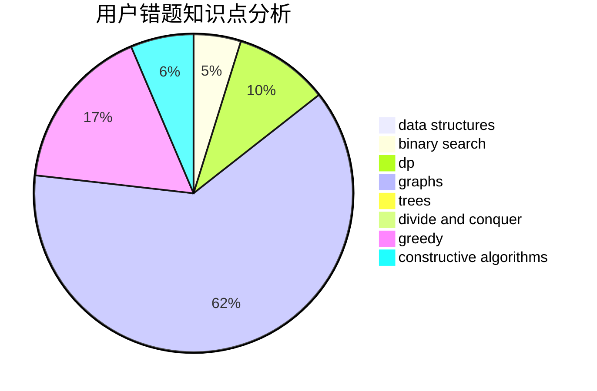

# Iamso
<!-- tabs:start -->
#### **用户提交结果分析**

#### **用户做题类型偏好分析**

#### **用户错题知识点分析**

<!-- tabs:end -->
# 推荐题目
[Keyboard Purchase](http://codeforces.com/problemset/problem/1238/E)		bitmasks,
                        dp		  
[Traffic Jams in the Land](http://codeforces.com/problemset/problem/498/D)		data structures,
                        dp,
                        number theory		  
[p-binary](https://codeforces.com/contest/1246/problem/A)		bitmasks,
                        brute force,
                        math		  
[Star](http://codeforces.com/problemset/problem/171/B)		*special problem,
                        combinatorics		  
[Anton and Danik](http://codeforces.com/problemset/problem/734/A)		implementation,
                        strings		  
[Find Extra One](http://codeforces.com/problemset/problem/900/A)		geometry,
                        implementation		  
[Alice and Bob](http://codeforces.com/problemset/problem/346/A)		games,
                        math,
                        number theory		  
[Take Metro](http://codeforces.com/problemset/problem/1056/G)		brute force,
                        data structures,
                        graphs		  
[Maximum splitting](https://codeforces.com/contest/872/problem/C)		dp,
                        greedy,
                        math,
                        number theory		  
[Vasya and Binary String](http://codeforces.com/problemset/problem/1107/E)		dp		  
<!-- tabs:start -->
#### **data structures**
[Keyboard Purchase](http://codeforces.com/problemset/problem/498/D)		data structures,
                        dp,
                        number theory		  
[Traffic Jams in the Land](http://codeforces.com/problemset/problem/1056/G)		brute force,
                        data structures,
                        graphs		  
[p-binary](http://codeforces.com/problemset/problem/702/E)		data structures,
                        graphs		  
[Star](http://codeforces.com/problemset/problem/321/E)		data structures,
                        divide and conquer,
                        dp		  
[Anton and Danik](http://codeforces.com/problemset/problem/311/D)		data structures,
                        math		  
[Find Extra One](http://codeforces.com/problemset/problem/1104/B)		data structures,
                        implementation,
                        math		  
[Alice and Bob](https://codeforces.com/contest/759/problem/C)		data structures		  
[Take Metro](http://codeforces.com/problemset/problem/720/D)		data structures,
                        dp,
                        sortings		  
[Maximum splitting](http://codeforces.com/problemset/problem/501/C)		constructive algorithms,
                        data structures,
                        greedy,
                        sortings,
                        trees		  
[Vasya and Binary String](http://codeforces.com/problemset/problem/1439/B)		constructive algorithms,
                        data structures,
                        graphs		  
#### **binary search**
[Keyboard Purchase](http://codeforces.com/problemset/problem/1476/B)		binary search,
                        brute force,
                        greedy,
                        math		  
[Traffic Jams in the Land](http://codeforces.com/problemset/problem/1492/C)		binary search,
                        data structures,
                        dp,
                        greedy,
                        two pointers		  
[p-binary](http://codeforces.com/problemset/problem/1463/D)		binary search,
                        constructive algorithms,
                        greedy,
                        two pointers		  
[Star](http://codeforces.com/problemset/problem/1490/G)		binary search,
                        data structures,
                        math		  
[Anton and Danik](http://codeforces.com/problemset/problem/1479/D)		binary search,
                        bitmasks,
                        brute force,
                        data structures,
                        probabilities,
                        trees		  
[Find Extra One](http://codeforces.com/problemset/problem/1436/E)		binary search,
                        data structures,
                        two pointers		  
[Alice and Bob](http://codeforces.com/problemset/problem/1461/D)		binary search,
                        brute force,
                        data structures,
                        divide and conquer,
                        implementation,
                        sortings		  
[Take Metro](http://codeforces.com/problemset/problem/1493/C)		binary search,
                        brute force,
                        constructive algorithms,
                        greedy,
                        strings		  
[Maximum splitting](http://codeforces.com/problemset/problem/1487/D)		binary search,
                        brute force,
                        math,
                        number theory		  
[Vasya and Binary String](http://codeforces.com/problemset/problem/1486/B)		binary search,
                        geometry,
                        shortest paths,
                        sortings		  
#### **dp**
[Keyboard Purchase](http://codeforces.com/problemset/problem/1238/E)		bitmasks,
                        dp		  
[Traffic Jams in the Land](http://codeforces.com/problemset/problem/498/D)		data structures,
                        dp,
                        number theory		  
[p-binary](https://codeforces.com/contest/872/problem/C)		dp,
                        greedy,
                        math,
                        number theory		  
[Star](http://codeforces.com/problemset/problem/1107/E)		dp		  
[Anton and Danik](http://codeforces.com/problemset/problem/321/E)		data structures,
                        divide and conquer,
                        dp		  
[Find Extra One](http://codeforces.com/problemset/problem/1383/C)		bitmasks,
                        dp,
                        graphs,
                        trees		  
[Alice and Bob](http://codeforces.com/problemset/problem/720/D)		data structures,
                        dp,
                        sortings		  
[Take Metro](http://codeforces.com/problemset/problem/364/B)		dp,
                        greedy		  
[Maximum splitting](http://codeforces.com/problemset/problem/873/B)		dp,
                        implementation		  
[Vasya and Binary String](http://codeforces.com/problemset/problem/1479/B2)		constructive algorithms,
                        data structures,
                        dp,
                        greedy,
                        implementation		  
#### **graph**
[Keyboard Purchase](http://codeforces.com/problemset/problem/1056/G)		brute force,
                        data structures,
                        graphs		  
[Traffic Jams in the Land](http://codeforces.com/problemset/problem/702/E)		data structures,
                        graphs		  
[p-binary](http://codeforces.com/problemset/problem/1383/C)		bitmasks,
                        dp,
                        graphs,
                        trees		  
[Star](http://codeforces.com/problemset/problem/1439/B)		constructive algorithms,
                        data structures,
                        graphs		  
[Anton and Danik](http://codeforces.com/problemset/problem/1424/M)		graphs,
                        sortings		  
[Find Extra One](http://codeforces.com/problemset/problem/193/A)		constructive algorithms,
                        graphs,
                        trees		  
[Alice and Bob](http://codeforces.com/problemset/problem/715/E)		combinatorics,
                        fft,
                        graphs,
                        math		  
[Take Metro](http://codeforces.com/problemset/problem/718/E)		bitmasks,
                        graphs		  
[Maximum splitting](http://codeforces.com/problemset/problem/1487/C)		brute force,
                        constructive algorithms,
                        dfs and similar,
                        graphs,
                        greedy,
                        implementation,
                        math		  
[Vasya and Binary String](http://codeforces.com/problemset/problem/1437/C)		dp,
                        flows,
                        graph matchings,
                        greedy,
                        math,
                        sortings		  
#### **trees**
[Keyboard Purchase](http://codeforces.com/problemset/problem/1383/C)		bitmasks,
                        dp,
                        graphs,
                        trees		  
[Traffic Jams in the Land](http://codeforces.com/problemset/problem/501/C)		constructive algorithms,
                        data structures,
                        greedy,
                        sortings,
                        trees		  
[p-binary](http://codeforces.com/problemset/problem/193/A)		constructive algorithms,
                        graphs,
                        trees		  
[Star](http://codeforces.com/problemset/problem/1479/D)		binary search,
                        bitmasks,
                        brute force,
                        data structures,
                        probabilities,
                        trees		  
[Anton and Danik](http://codeforces.com/problemset/problem/1511/C)		brute force,
                        data structures,
                        implementation,
                        trees		  
[Find Extra One](http://codeforces.com/problemset/problem/1499/F)		combinatorics,
                        dfs and similar,
                        dp,
                        trees		  
[Alice and Bob](http://codeforces.com/problemset/problem/1491/E)		brute force,
                        dfs and similar,
                        divide and conquer,
                        number theory,
                        trees		  
[Take Metro](http://codeforces.com/problemset/problem/1466/D)		data structures,
                        greedy,
                        sortings,
                        trees		  
[Maximum splitting](http://codeforces.com/problemset/problem/1495/D)		combinatorics,
                        dfs and similar,
                        graphs,
                        math,
                        shortest paths,
                        trees		  
[Vasya and Binary String](http://codeforces.com/problemset/problem/1303/G)		data structures,
                        divide and conquer,
                        geometry,
                        trees		  
#### **divide and conquer**
[Keyboard Purchase](http://codeforces.com/problemset/problem/321/E)		data structures,
                        divide and conquer,
                        dp		  
[Traffic Jams in the Land](http://codeforces.com/problemset/problem/19/E)		dfs and similar,
                        divide and conquer,
                        dsu		  
[p-binary](http://codeforces.com/problemset/problem/1461/D)		binary search,
                        brute force,
                        data structures,
                        divide and conquer,
                        implementation,
                        sortings		  
[Star](http://codeforces.com/problemset/problem/1466/G)		combinatorics,
                        divide and conquer,
                        hashing,
                        math,
                        string suffix structures,
                        strings		  
[Anton and Danik](http://codeforces.com/problemset/problem/1490/D)		dfs and similar,
                        divide and conquer,
                        implementation		  
[Find Extra One](https://codeforces.com/contest/1483/problem/C)		data structures,
                        divide and conquer,
                        dp		  
[Alice and Bob](http://codeforces.com/problemset/problem/1491/E)		brute force,
                        dfs and similar,
                        divide and conquer,
                        number theory,
                        trees		  
[Take Metro](http://codeforces.com/problemset/problem/1303/G)		data structures,
                        divide and conquer,
                        geometry,
                        trees		  
[Maximum splitting](http://codeforces.com/problemset/problem/1494/D)		constructive algorithms,
                        data structures,
                        dfs and similar,
                        divide and conquer,
                        dsu,
                        greedy,
                        sortings,
                        trees		  
[Vasya and Binary String](http://codeforces.com/problemset/problem/1482/E)		data structures,
                        divide and conquer,
                        dp		  
#### **greedy**
[Keyboard Purchase](https://codeforces.com/contest/872/problem/C)		dp,
                        greedy,
                        math,
                        number theory		  
[Traffic Jams in the Land](https://codeforces.com/contest/1138/problem/D)		greedy,
                        hashing,
                        strings		  
[p-binary](http://codeforces.com/problemset/problem/803/C)		constructive algorithms,
                        greedy,
                        math		  
[Star](http://codeforces.com/problemset/problem/364/B)		dp,
                        greedy		  
[Anton and Danik](http://codeforces.com/problemset/problem/501/C)		constructive algorithms,
                        data structures,
                        greedy,
                        sortings,
                        trees		  
[Find Extra One](http://codeforces.com/problemset/problem/1201/B)		greedy,
                        math		  
[Alice and Bob](http://codeforces.com/problemset/problem/1479/B2)		constructive algorithms,
                        data structures,
                        dp,
                        greedy,
                        implementation		  
[Take Metro](http://codeforces.com/problemset/problem/891/A)		brute force,
                        dp,
                        greedy,
                        math,
                        number theory		  
[Maximum splitting](http://codeforces.com/problemset/problem/1295/C)		dp,
                        greedy,
                        strings		  
[Vasya and Binary String](http://codeforces.com/problemset/problem/1373/A)		greedy,
                        implementation,
                        math		  
#### **constructive algorithms**
[Keyboard Purchase](http://codeforces.com/problemset/problem/803/C)		constructive algorithms,
                        greedy,
                        math		  
[Traffic Jams in the Land](http://codeforces.com/problemset/problem/501/C)		constructive algorithms,
                        data structures,
                        greedy,
                        sortings,
                        trees		  
[p-binary](http://codeforces.com/problemset/problem/1439/B)		constructive algorithms,
                        data structures,
                        graphs		  
[Star](http://codeforces.com/problemset/problem/193/A)		constructive algorithms,
                        graphs,
                        trees		  
[Anton and Danik](http://codeforces.com/problemset/problem/1479/B2)		constructive algorithms,
                        data structures,
                        dp,
                        greedy,
                        implementation		  
[Find Extra One](http://codeforces.com/problemset/problem/1166/B)		constructive algorithms,
                        math,
                        number theory		  
[Alice and Bob](http://codeforces.com/problemset/problem/1114/B)		constructive algorithms,
                        greedy,
                        sortings		  
[Take Metro](http://codeforces.com/problemset/problem/1393/C)		constructive algorithms,
                        greedy,
                        math,
                        sortings		  
[Maximum splitting](http://codeforces.com/problemset/problem/578/E)		constructive algorithms,
                        greedy		  
[Vasya and Binary String](http://codeforces.com/problemset/problem/1493/A)		constructive algorithms,
                        greedy		  
#### **sortings**
[Keyboard Purchase](http://codeforces.com/problemset/problem/720/D)		data structures,
                        dp,
                        sortings		  
[Traffic Jams in the Land](http://codeforces.com/problemset/problem/501/C)		constructive algorithms,
                        data structures,
                        greedy,
                        sortings,
                        trees		  
[p-binary](http://codeforces.com/problemset/problem/1424/M)		graphs,
                        sortings		  
[Star](http://codeforces.com/problemset/problem/1012/A)		brute force,
                        implementation,
                        math,
                        sortings		  
[Anton and Danik](http://codeforces.com/problemset/problem/1114/B)		constructive algorithms,
                        greedy,
                        sortings		  
[Find Extra One](http://codeforces.com/problemset/problem/1393/C)		constructive algorithms,
                        greedy,
                        math,
                        sortings		  
[Alice and Bob](https://codeforces.com/contest/1496/problem/C)		geometry,
                        greedy,
                        math,
                        sortings		  
[Take Metro](http://codeforces.com/problemset/problem/1495/A)		geometry,
                        greedy,
                        math,
                        sortings		  
[Maximum splitting](http://codeforces.com/problemset/problem/1497/A)		brute force,
                        data structures,
                        greedy,
                        sortings		  
[Vasya and Binary String](http://codeforces.com/problemset/problem/1427/A)		math,
                        sortings		  
<!-- tabs:end -->
