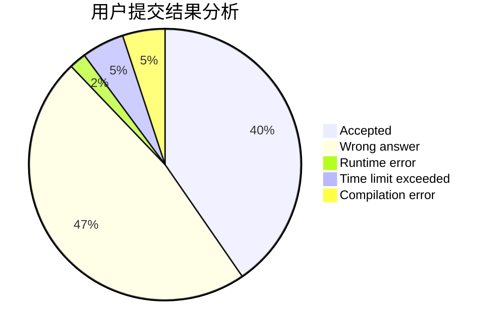
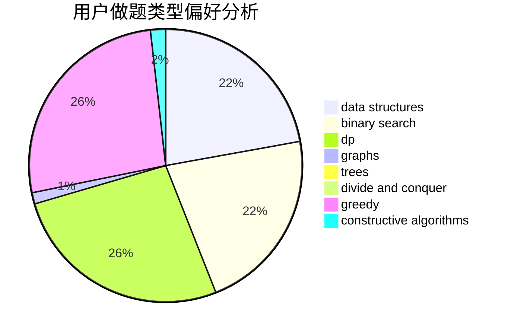
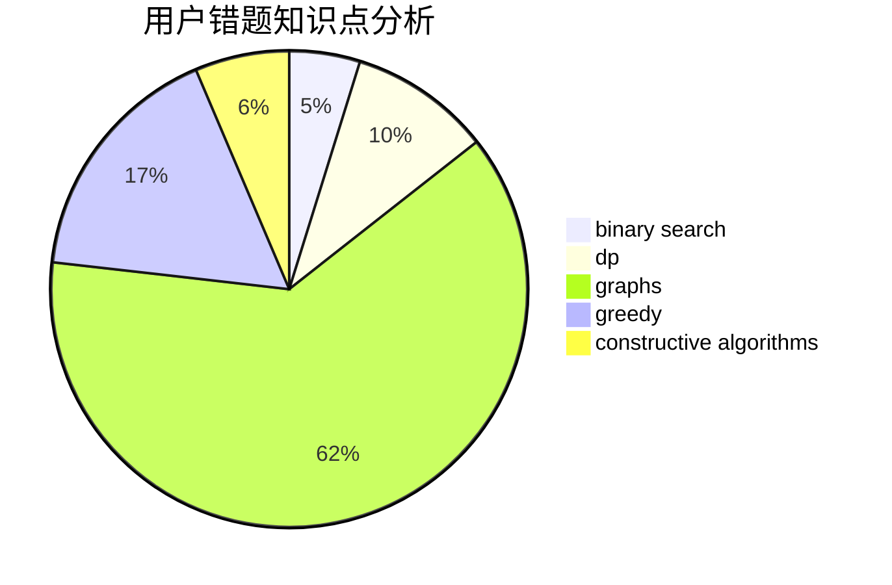

# Iamso
<!-- tabs:start -->
#### **用户提交结果分析**

#### **用户做题类型偏好分析**

#### **用户错题知识点分析**

<!-- tabs:end -->
# 推荐题目
[Keyboard Purchase](http://codeforces.com/problemset/problem/1238/E)		bitmasks,
                        dp		  
[Traffic Jams in the Land](http://codeforces.com/problemset/problem/498/D)		data structures,
                        dp,
                        number theory		  
[p-binary](https://codeforces.com/contest/1246/problem/A)		bitmasks,
                        brute force,
                        math		  
[Star](http://codeforces.com/problemset/problem/171/B)		*special problem,
                        combinatorics		  
[Anton and Danik](http://codeforces.com/problemset/problem/734/A)		implementation,
                        strings		  
[Find Extra One](http://codeforces.com/problemset/problem/900/A)		geometry,
                        implementation		  
[Alice and Bob](http://codeforces.com/problemset/problem/346/A)		games,
                        math,
                        number theory		  
[Take Metro](http://codeforces.com/problemset/problem/1056/G)		brute force,
                        data structures,
                        graphs		  
[Maximum splitting](https://codeforces.com/contest/872/problem/C)		dp,
                        greedy,
                        math,
                        number theory		  
[Vasya and Binary String](http://codeforces.com/problemset/problem/1107/E)		dp		  
<!-- tabs:start -->
#### **data structures**
[Traffic Jams in the Land](http://codeforces.com/problemset/problem/498/D)		data structures,
                        dp,
                        number theory		  
[Take Metro](http://codeforces.com/problemset/problem/1056/G)		brute force,
                        data structures,
                        graphs		  
[Analysis of Pathes in Functional Graph](http://codeforces.com/problemset/problem/702/E)		data structures,
                        graphs		  
[Ciel and Gondolas](http://codeforces.com/problemset/problem/321/E)		data structures,
                        divide and conquer,
                        dp		  
[Interval Cubing](http://codeforces.com/problemset/problem/311/D)		data structures,
                        math		  
[Game with string](http://codeforces.com/problemset/problem/1104/B)		data structures,
                        implementation,
                        math		  
[Nikita and stack](https://codeforces.com/contest/759/problem/C)		data structures		  
[Slalom](http://codeforces.com/problemset/problem/720/D)		data structures,
                        dp,
                        sortings		  
[Misha and Forest](http://codeforces.com/problemset/problem/501/C)		constructive algorithms,
                        data structures,
                        greedy,
                        sortings,
                        trees		  
[Graph Subset Problem](http://codeforces.com/problemset/problem/1439/B)		constructive algorithms,
                        data structures,
                        graphs		  
#### **binary search**
[Inflation](http://codeforces.com/problemset/problem/1476/B)		binary search,
                        brute force,
                        greedy,
                        math		  
[Maximum width](http://codeforces.com/problemset/problem/1492/C)		binary search,
                        data structures,
                        dp,
                        greedy,
                        two pointers		  
[Pairs](http://codeforces.com/problemset/problem/1463/D)		binary search,
                        constructive algorithms,
                        greedy,
                        two pointers		  
[Old Floppy Drive](http://codeforces.com/problemset/problem/1490/G)		binary search,
                        data structures,
                        math		  
[Odd Mineral Resource](http://codeforces.com/problemset/problem/1479/D)		binary search,
                        bitmasks,
                        brute force,
                        data structures,
                        probabilities,
                        trees		  
[Complicated Computations](http://codeforces.com/problemset/problem/1436/E)		binary search,
                        data structures,
                        two pointers		  
[Divide and Summarize](http://codeforces.com/problemset/problem/1461/D)		binary search,
                        brute force,
                        data structures,
                        divide and conquer,
                        implementation,
                        sortings		  
[K-beautiful Strings](http://codeforces.com/problemset/problem/1493/C)		binary search,
                        brute force,
                        constructive algorithms,
                        greedy,
                        strings		  
[Pythagorean Triples](http://codeforces.com/problemset/problem/1487/D)		binary search,
                        brute force,
                        math,
                        number theory		  
[Eastern Exhibition](http://codeforces.com/problemset/problem/1486/B)		binary search,
                        geometry,
                        shortest paths,
                        sortings		  
#### **dp**
[Keyboard Purchase](http://codeforces.com/problemset/problem/1238/E)		bitmasks,
                        dp		  
[Traffic Jams in the Land](http://codeforces.com/problemset/problem/498/D)		data structures,
                        dp,
                        number theory		  
[Maximum splitting](https://codeforces.com/contest/872/problem/C)		dp,
                        greedy,
                        math,
                        number theory		  
[Vasya and Binary String](http://codeforces.com/problemset/problem/1107/E)		dp		  
[Ciel and Gondolas](http://codeforces.com/problemset/problem/321/E)		data structures,
                        divide and conquer,
                        dp		  
[String Transformation 2](http://codeforces.com/problemset/problem/1383/C)		bitmasks,
                        dp,
                        graphs,
                        trees		  
[Slalom](http://codeforces.com/problemset/problem/720/D)		data structures,
                        dp,
                        sortings		  
[Free Market](http://codeforces.com/problemset/problem/364/B)		dp,
                        greedy		  
[Balanced Substring](http://codeforces.com/problemset/problem/873/B)		dp,
                        implementation		  
[Painting the Array II](http://codeforces.com/problemset/problem/1479/B2)		constructive algorithms,
                        data structures,
                        dp,
                        greedy,
                        implementation		  
#### **graph**
[Take Metro](http://codeforces.com/problemset/problem/1056/G)		brute force,
                        data structures,
                        graphs		  
[Analysis of Pathes in Functional Graph](http://codeforces.com/problemset/problem/702/E)		data structures,
                        graphs		  
[String Transformation 2](http://codeforces.com/problemset/problem/1383/C)		bitmasks,
                        dp,
                        graphs,
                        trees		  
[Graph Subset Problem](http://codeforces.com/problemset/problem/1439/B)		constructive algorithms,
                        data structures,
                        graphs		  
[Ancient Language](http://codeforces.com/problemset/problem/1424/M)		graphs,
                        sortings		  
[Cutting Figure](http://codeforces.com/problemset/problem/193/A)		constructive algorithms,
                        graphs,
                        trees		  
[Complete the Permutations](http://codeforces.com/problemset/problem/715/E)		combinatorics,
                        fft,
                        graphs,
                        math		  
[Matvey's Birthday](http://codeforces.com/problemset/problem/718/E)		bitmasks,
                        graphs		  
[Minimum Ties](http://codeforces.com/problemset/problem/1487/C)		brute force,
                        constructive algorithms,
                        dfs and similar,
                        graphs,
                        greedy,
                        implementation,
                        math		  
[Chef Monocarp](http://codeforces.com/problemset/problem/1437/C)		dp,
                        flows,
                        graph matchings,
                        greedy,
                        math,
                        sortings		  
#### **trees**
[String Transformation 2](http://codeforces.com/problemset/problem/1383/C)		bitmasks,
                        dp,
                        graphs,
                        trees		  
[Misha and Forest](http://codeforces.com/problemset/problem/501/C)		constructive algorithms,
                        data structures,
                        greedy,
                        sortings,
                        trees		  
[Cutting Figure](http://codeforces.com/problemset/problem/193/A)		constructive algorithms,
                        graphs,
                        trees		  
[Odd Mineral Resource](http://codeforces.com/problemset/problem/1479/D)		binary search,
                        bitmasks,
                        brute force,
                        data structures,
                        probabilities,
                        trees		  
[Yet Another Card Deck](http://codeforces.com/problemset/problem/1511/C)		brute force,
                        data structures,
                        implementation,
                        trees		  
[Diameter Cuts](http://codeforces.com/problemset/problem/1499/F)		combinatorics,
                        dfs and similar,
                        dp,
                        trees		  
[Fib-tree](http://codeforces.com/problemset/problem/1491/E)		brute force,
                        dfs and similar,
                        divide and conquer,
                        number theory,
                        trees		  
[13th Labour of Heracles](http://codeforces.com/problemset/problem/1466/D)		data structures,
                        greedy,
                        sortings,
                        trees		  
[BFS Trees](http://codeforces.com/problemset/problem/1495/D)		combinatorics,
                        dfs and similar,
                        graphs,
                        math,
                        shortest paths,
                        trees		  
[Sum of Prefix Sums](http://codeforces.com/problemset/problem/1303/G)		data structures,
                        divide and conquer,
                        geometry,
                        trees		  
#### **divide and conquer**
[Ciel and Gondolas](http://codeforces.com/problemset/problem/321/E)		data structures,
                        divide and conquer,
                        dp		  
[Fairy](http://codeforces.com/problemset/problem/19/E)		dfs and similar,
                        divide and conquer,
                        dsu		  
[Divide and Summarize](http://codeforces.com/problemset/problem/1461/D)		binary search,
                        brute force,
                        data structures,
                        divide and conquer,
                        implementation,
                        sortings		  
[Song of the Sirens](http://codeforces.com/problemset/problem/1466/G)		combinatorics,
                        divide and conquer,
                        hashing,
                        math,
                        string suffix structures,
                        strings		  
[Permutation Transformation](http://codeforces.com/problemset/problem/1490/D)		dfs and similar,
                        divide and conquer,
                        implementation		  
[Skyline Photo](https://codeforces.com/contest/1483/problem/C)		data structures,
                        divide and conquer,
                        dp		  
[Fib-tree](http://codeforces.com/problemset/problem/1491/E)		brute force,
                        dfs and similar,
                        divide and conquer,
                        number theory,
                        trees		  
[Sum of Prefix Sums](http://codeforces.com/problemset/problem/1303/G)		data structures,
                        divide and conquer,
                        geometry,
                        trees		  
[Dogeforces](http://codeforces.com/problemset/problem/1494/D)		constructive algorithms,
                        data structures,
                        dfs and similar,
                        divide and conquer,
                        dsu,
                        greedy,
                        sortings,
                        trees		  
[Logistical Questions](http://codeforces.com/problemset/problem/566/C)		dfs and similar,
                        divide and conquer,
                        trees		  
#### **greedy**
[Maximum splitting](https://codeforces.com/contest/872/problem/C)		dp,
                        greedy,
                        math,
                        number theory		  
[Camp Schedule](https://codeforces.com/contest/1138/problem/D)		greedy,
                        hashing,
                        strings		  
[Maximal GCD](http://codeforces.com/problemset/problem/803/C)		constructive algorithms,
                        greedy,
                        math		  
[Free Market](http://codeforces.com/problemset/problem/364/B)		dp,
                        greedy		  
[Misha and Forest](http://codeforces.com/problemset/problem/501/C)		constructive algorithms,
                        data structures,
                        greedy,
                        sortings,
                        trees		  
[Zero Array](http://codeforces.com/problemset/problem/1201/B)		greedy,
                        math		  
[Painting the Array II](http://codeforces.com/problemset/problem/1479/B2)		constructive algorithms,
                        data structures,
                        dp,
                        greedy,
                        implementation		  
[Pride](http://codeforces.com/problemset/problem/891/A)		brute force,
                        dp,
                        greedy,
                        math,
                        number theory		  
[Obtain The String](http://codeforces.com/problemset/problem/1295/C)		dp,
                        greedy,
                        strings		  
[Donut Shops](http://codeforces.com/problemset/problem/1373/A)		greedy,
                        implementation,
                        math		  
#### **constructive algorithms**
[Maximal GCD](http://codeforces.com/problemset/problem/803/C)		constructive algorithms,
                        greedy,
                        math		  
[Misha and Forest](http://codeforces.com/problemset/problem/501/C)		constructive algorithms,
                        data structures,
                        greedy,
                        sortings,
                        trees		  
[Graph Subset Problem](http://codeforces.com/problemset/problem/1439/B)		constructive algorithms,
                        data structures,
                        graphs		  
[Cutting Figure](http://codeforces.com/problemset/problem/193/A)		constructive algorithms,
                        graphs,
                        trees		  
[Painting the Array II](http://codeforces.com/problemset/problem/1479/B2)		constructive algorithms,
                        data structures,
                        dp,
                        greedy,
                        implementation		  
[All the Vowels Please](http://codeforces.com/problemset/problem/1166/B)		constructive algorithms,
                        math,
                        number theory		  
[Yet Another Array Partitioning Task](http://codeforces.com/problemset/problem/1114/B)		constructive algorithms,
                        greedy,
                        sortings		  
[Pinkie Pie Eats Patty-cakes](http://codeforces.com/problemset/problem/1393/C)		constructive algorithms,
                        greedy,
                        math,
                        sortings		  
[Walking!](http://codeforces.com/problemset/problem/578/E)		constructive algorithms,
                        greedy		  
[Anti-knapsack](http://codeforces.com/problemset/problem/1493/A)		constructive algorithms,
                        greedy		  
#### **sortings**
[Slalom](http://codeforces.com/problemset/problem/720/D)		data structures,
                        dp,
                        sortings		  
[Misha and Forest](http://codeforces.com/problemset/problem/501/C)		constructive algorithms,
                        data structures,
                        greedy,
                        sortings,
                        trees		  
[Ancient Language](http://codeforces.com/problemset/problem/1424/M)		graphs,
                        sortings		  
[Photo of The Sky](http://codeforces.com/problemset/problem/1012/A)		brute force,
                        implementation,
                        math,
                        sortings		  
[Yet Another Array Partitioning Task](http://codeforces.com/problemset/problem/1114/B)		constructive algorithms,
                        greedy,
                        sortings		  
[Pinkie Pie Eats Patty-cakes](http://codeforces.com/problemset/problem/1393/C)		constructive algorithms,
                        greedy,
                        math,
                        sortings		  
[Diamond Miner](https://codeforces.com/contest/1496/problem/C)		geometry,
                        greedy,
                        math,
                        sortings		  
[Meximization](http://codeforces.com/problemset/problem/1497/A)		brute force,
                        data structures,
                        greedy,
                        sortings		  
[Avoiding Zero](http://codeforces.com/problemset/problem/1427/A)		math,
                        sortings		  
[Divide and Summarize](http://codeforces.com/problemset/problem/1461/D)		binary search,
                        brute force,
                        data structures,
                        divide and conquer,
                        implementation,
                        sortings		  
<!-- tabs:end -->
