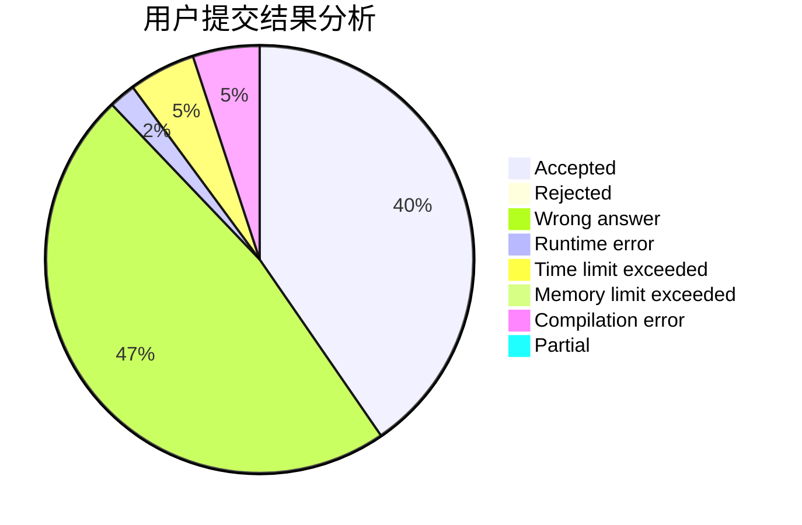
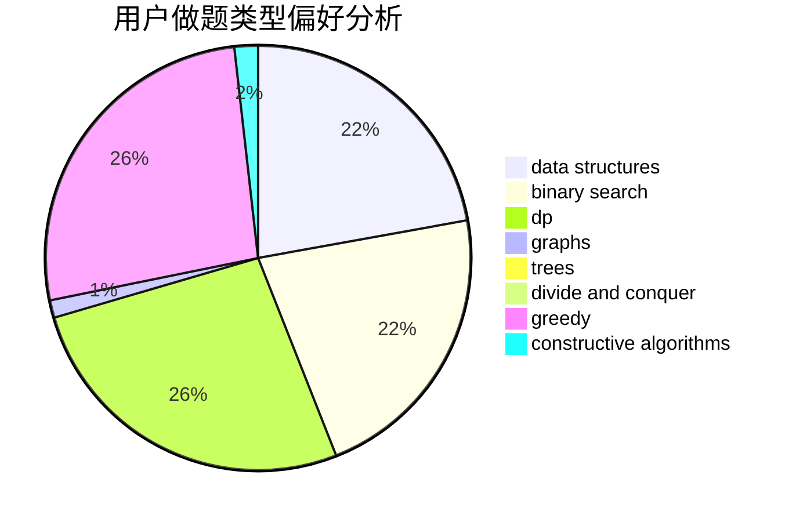
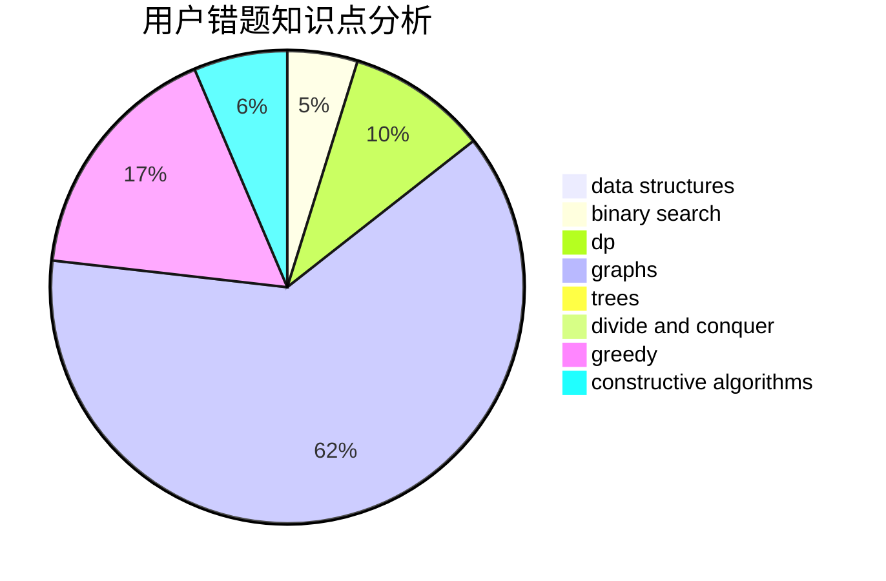

# Iamso

<!-- tabs:start -->

#### **用户提交结果分析**

#### **用户做题类型偏好分析**

#### **用户错题知识点分析**

<!-- tabs:end -->
# 推荐题目
[1238E](https://codeforces.com/contest/1238/problem/E)		bitmasks,
                        dp		  
[1246A](https://codeforces.com/contest/1246/problem/A)		dsu,graphs,sortings,trees		  
[900A](https://codeforces.com/contest/900/problem/A)		geometry,
                        implementation		  
[498D](https://codeforces.com/contest/498/problem/D)		data structures,
                        dp,
                        number theory		  
[171B](https://codeforces.com/contest/171/problem/B)		*special problem,
                        combinatorics		  
[1201B](https://codeforces.com/contest/1201/problem/B)		greedy,
                        math		  
[20A](https://codeforces.com/contest/20/problem/A)		implementation		  
[1107E](https://codeforces.com/contest/1107/problem/E)		dp		  
[872C](https://codeforces.com/contest/872/problem/C)		dsu,graphs,sortings,trees		  
[321E](https://codeforces.com/contest/321/problem/E)		data structures,
                        divide and conquer,
                        dp		  
