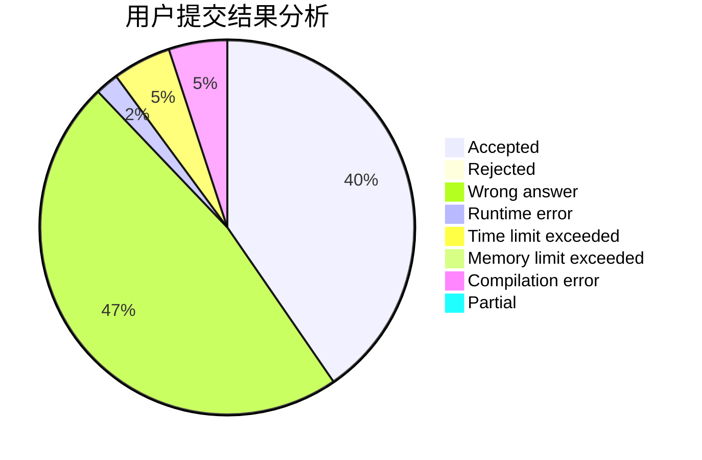
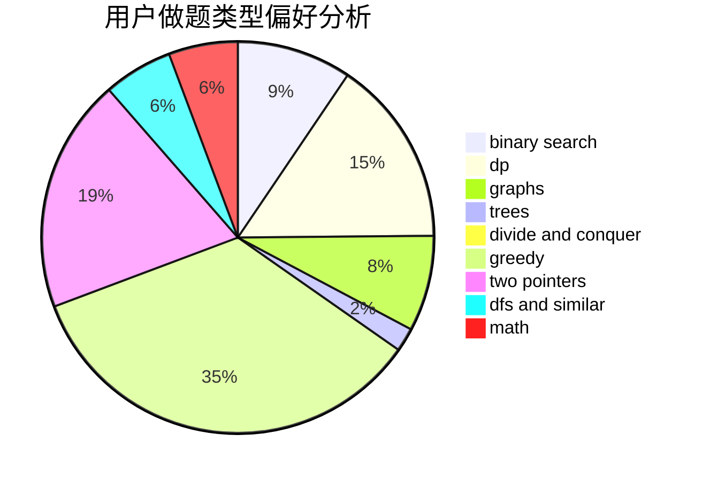

# Iamso

<!-- tabs:start -->

#### **用户提交结果分析**

#### **用户做题类型偏好分析**

<!-- tabs:end -->
# 推荐题目
[1243E](https://codeforces.com/contest/1243/problem/E)
[1250I](https://codeforces.com/contest/1250/problem/I)
[916D](https://codeforces.com/contest/916/problem/D)
[519D](https://codeforces.com/contest/519/problem/D)
[198B](https://codeforces.com/contest/198/problem/B)
[1205F](https://codeforces.com/contest/1205/problem/F)
[231C](https://codeforces.com/contest/231/problem/C)
[11082](https://codeforces.com/contest/1108/problem/2)
[893E](https://codeforces.com/contest/893/problem/E)
[353D](https://codeforces.com/contest/353/problem/D)
