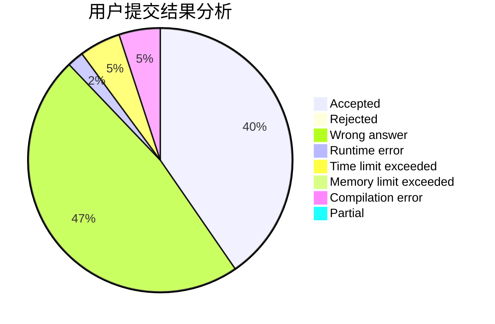
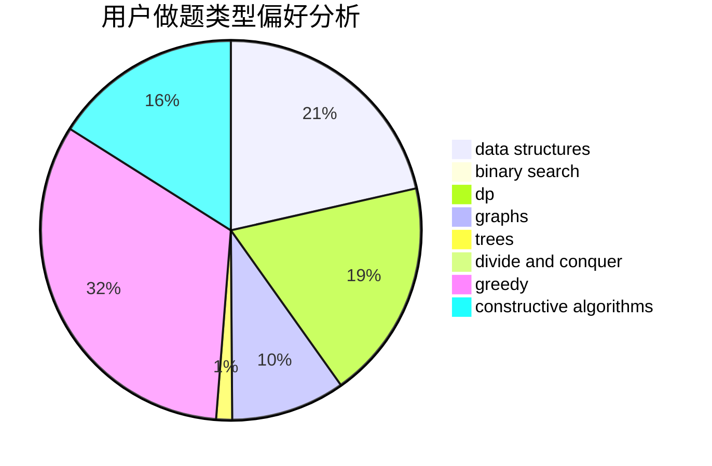
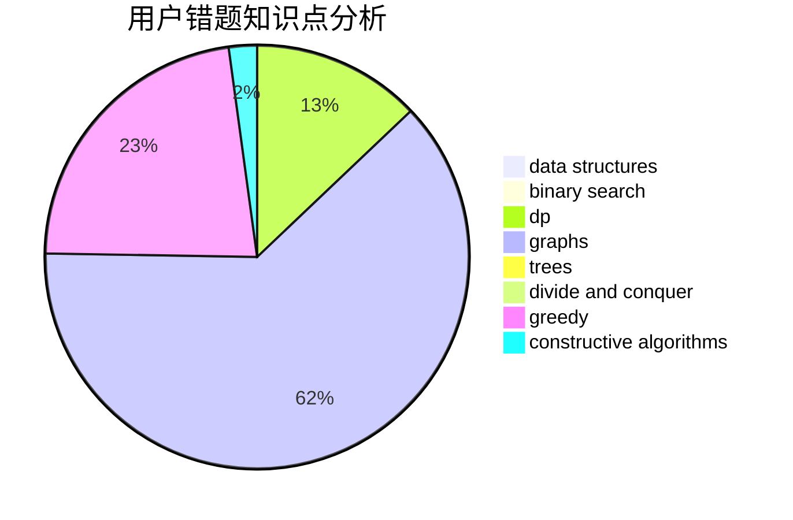

# Iamso

<!-- tabs:start -->

#### **用户提交结果分析**

#### **用户做题类型偏好分析**

#### **用户错题知识点分析**

<!-- tabs:end -->
# 推荐题目
[1243E](https://codeforces.com/contest/1243/problem/E)		dsu,graphs,sortings,trees		  
[1250I](https://codeforces.com/contest/1250/problem/I)		binary search,
                        brute force,
                        greedy,
                        shortest paths		  
[916D](https://codeforces.com/contest/916/problem/D)		data structures,
                        interactive,
                        trees		  
[519D](https://codeforces.com/contest/519/problem/D)		data structures,
                        dp,
                        two pointers		  
[198B](https://codeforces.com/contest/198/problem/B)		shortest paths		  
[1205F](https://codeforces.com/contest/1205/problem/F)		constructive algorithms,
                        math		  
[231C](https://codeforces.com/contest/231/problem/C)		binary search,
                        sortings,
                        two pointers		  
[11082](https://codeforces.com/contest/1108/problem/2)		dsu,graphs,sortings,trees		  
[893E](https://codeforces.com/contest/893/problem/E)		combinatorics,
                        dp,
                        math,
                        number theory		  
[353D](https://codeforces.com/contest/353/problem/D)		constructive algorithms,
                        dp		  
