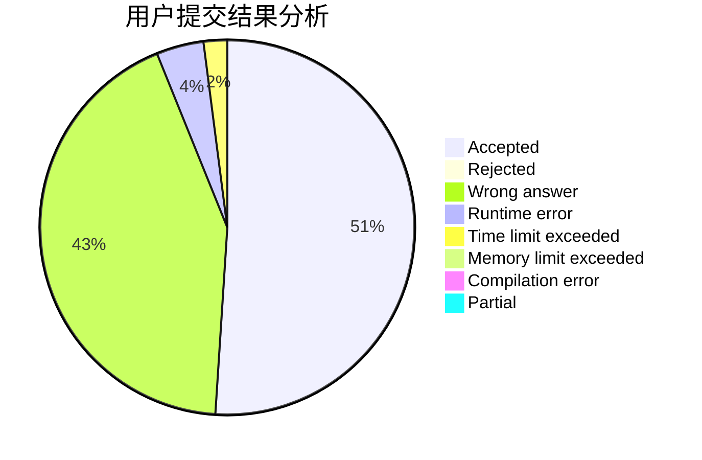
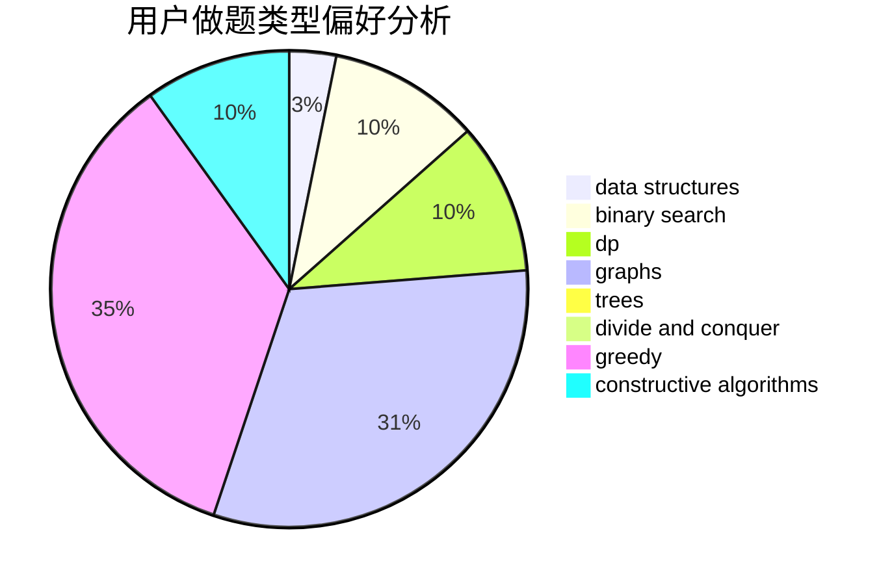
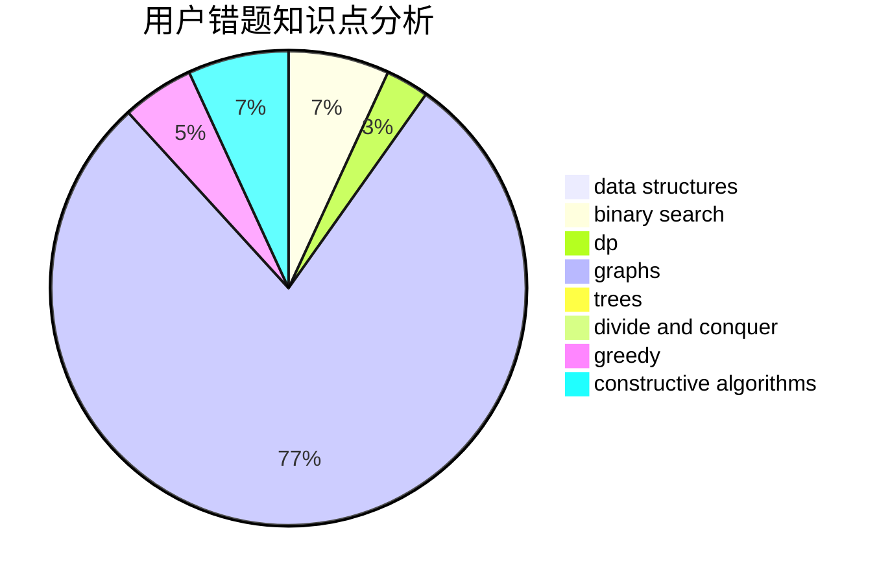

# Ice_man

<!-- tabs:start -->

#### **用户提交结果分析**

#### **用户做题类型偏好分析**

#### **用户错题知识点分析**

<!-- tabs:end -->
# 推荐题目
[1401E](https://codeforces.com/contest/1401/problem/E)		data structures,
                        geometry,
                        implementation,
                        sortings		  
[436C](https://codeforces.com/contest/436/problem/C)		dsu,
                        graphs,
                        greedy,
                        trees		  
[11082](https://codeforces.com/contest/1108/problem/2)		dsu,graphs,sortings,trees		  
[1113D](https://codeforces.com/contest/1113/problem/D)		dsu,graphs,sortings,trees		  
[622C](https://codeforces.com/contest/622/problem/C)		data structures,
                        implementation		  
[551A](https://codeforces.com/contest/551/problem/A)		brute force,
                        implementation,
                        sortings		  
[3161](https://codeforces.com/contest/316/problem/1)		dsu,graphs,sortings,trees		  
[46F](https://codeforces.com/contest/46/problem/F)		dsu,
                        graphs		  
[886E](https://codeforces.com/contest/886/problem/E)		combinatorics,
                        dp,
                        math		  
[1364E](https://codeforces.com/contest/1364/problem/E)		bitmasks,
                        constructive algorithms,
                        divide and conquer,
                        interactive,
                        probabilities		  
