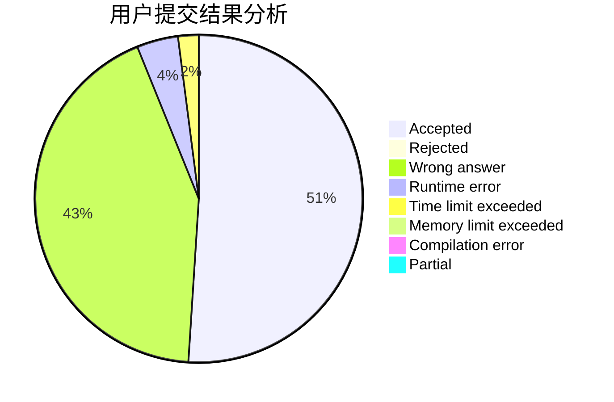
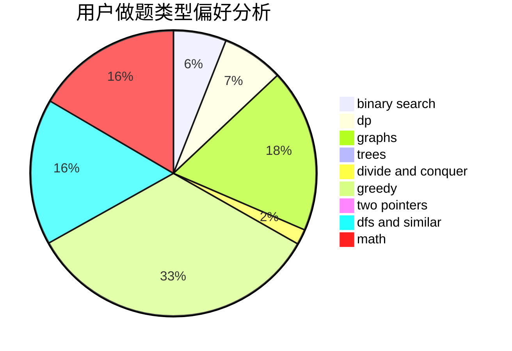

# Ice_man

<!-- tabs:start -->

#### **用户提交结果分析**

#### **用户做题类型偏好分析**

<!-- tabs:end -->
# 推荐题目
[1401E](https://codeforces.com/contest/1401/problem/E)
[436C](https://codeforces.com/contest/436/problem/C)
[11082](https://codeforces.com/contest/1108/problem/2)
[1113D](https://codeforces.com/contest/1113/problem/D)
[622C](https://codeforces.com/contest/622/problem/C)
[551A](https://codeforces.com/contest/551/problem/A)
[3161](https://codeforces.com/contest/316/problem/1)
[46F](https://codeforces.com/contest/46/problem/F)
[886E](https://codeforces.com/contest/886/problem/E)
[1364E](https://codeforces.com/contest/1364/problem/E)
