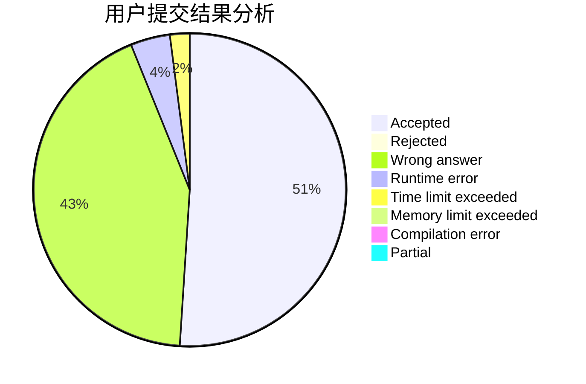
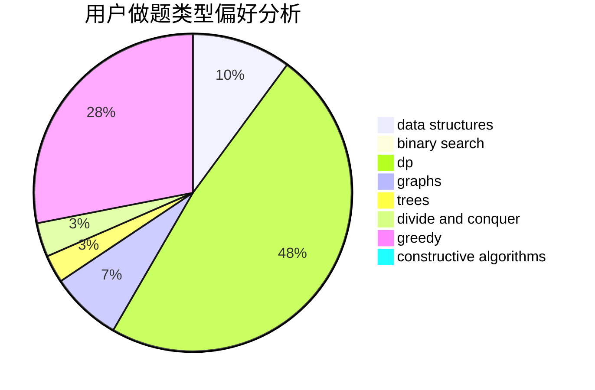
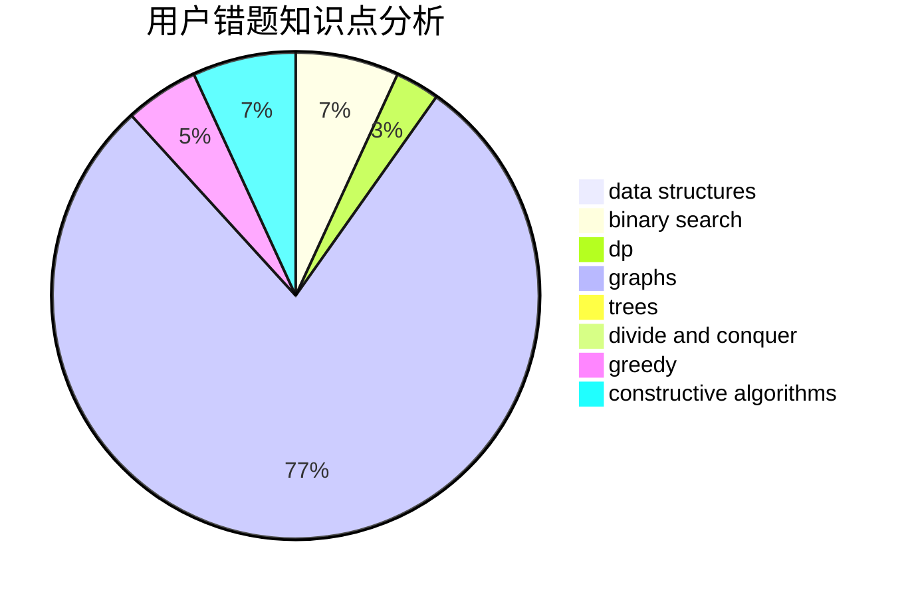

# Ice_man

<!-- tabs:start -->

#### **用户提交结果分析**

#### **用户做题类型偏好分析**

#### **用户错题知识点分析**

<!-- tabs:end -->
# 推荐题目
[1393E2](https://codeforces.com/contest/1393E/problem/2)		dp,
                        hashing,
                        implementation,
                        string suffix structures,
                        strings,
                        two pointers		  
[407E](https://codeforces.com/contest/407/problem/E)		data structures		  
[1107E](https://codeforces.com/contest/1107/problem/E)		dp		  
[1113A](https://codeforces.com/contest/1113/problem/A)		dp,
                        greedy,
                        math		  
[604A](https://codeforces.com/contest/604/problem/A)		implementation		  
[526G](https://codeforces.com/contest/526/problem/G)		greedy,
                        trees		  
[299B](https://codeforces.com/contest/299/problem/B)		brute force,
                        implementation		  
[44A](https://codeforces.com/contest/44/problem/A)		implementation		  
[866C](https://codeforces.com/contest/866/problem/C)		dsu,graphs,sortings,trees		  
[1357B2](https://codeforces.com/contest/1357B/problem/2)		nan		  
