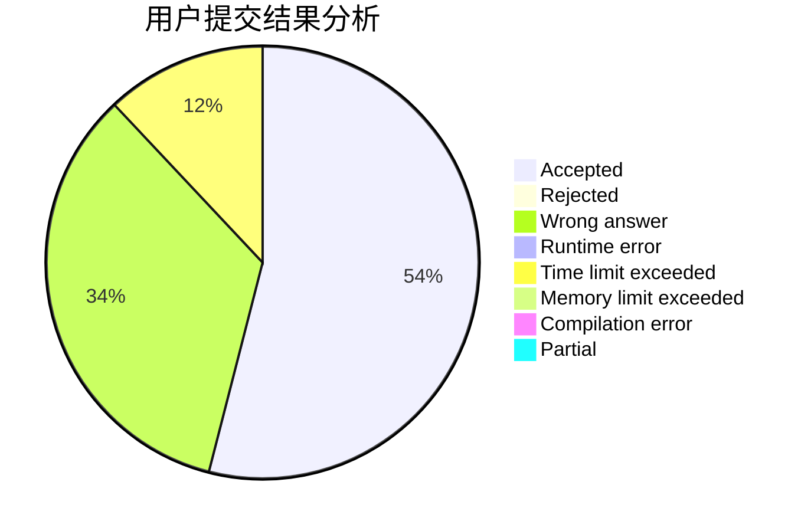
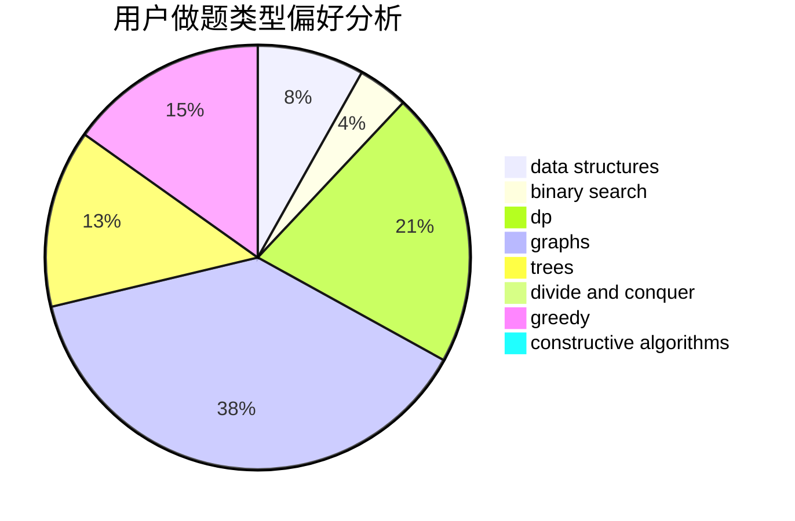
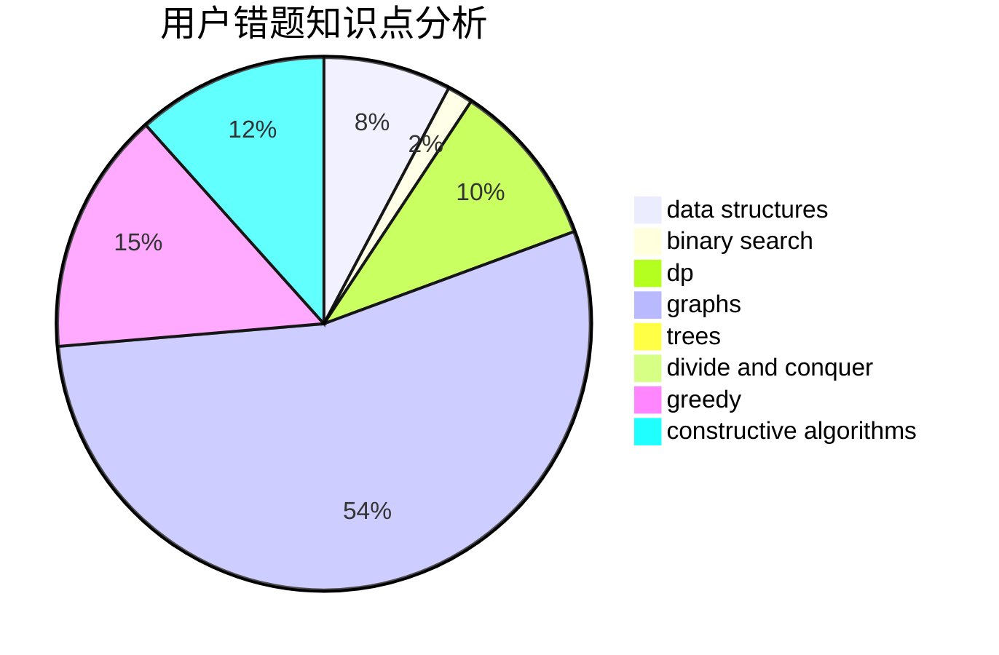

# Icontofig

<!-- tabs:start -->

#### **用户提交结果分析**

#### **用户做题类型偏好分析**

#### **用户错题知识点分析**

<!-- tabs:end -->
# 推荐题目
[232A](https://codeforces.com/contest/232/problem/A)		binary search,
                        constructive algorithms,
                        graphs,
                        greedy		  
[208D](https://codeforces.com/contest/208/problem/D)		implementation		  
[913B](https://codeforces.com/contest/913/problem/B)		implementation,
                        trees		  
[1285F](https://codeforces.com/contest/1285/problem/F)		binary search,
                        combinatorics,
                        number theory		  
[792E](https://codeforces.com/contest/792/problem/E)		greedy,
                        math,
                        number theory		  
[38A](https://codeforces.com/contest/38/problem/A)		implementation		  
[1071C](https://codeforces.com/contest/1071/problem/C)		dsu,graphs,sortings,trees		  
[1037B](https://codeforces.com/contest/1037/problem/B)		greedy		  
[1012B](https://codeforces.com/contest/1012/problem/B)		constructive algorithms,
                        dfs and similar,
                        dsu,
                        graphs,
                        matrices		  
[1008D](https://codeforces.com/contest/1008/problem/D)		dsu,graphs,sortings,trees		  
