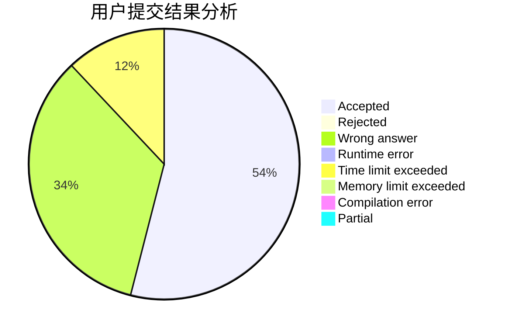
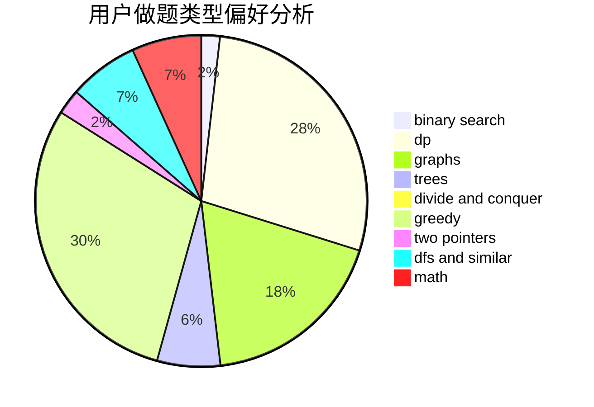

# Icontofig

<!-- tabs:start -->

#### **用户提交结果分析**

#### **用户做题类型偏好分析**

<!-- tabs:end -->
# 推荐题目
[232A](https://codeforces.com/contest/232/problem/A)
[208D](https://codeforces.com/contest/208/problem/D)
[913B](https://codeforces.com/contest/913/problem/B)
[1285F](https://codeforces.com/contest/1285/problem/F)
[792E](https://codeforces.com/contest/792/problem/E)
[38A](https://codeforces.com/contest/38/problem/A)
[1071C](https://codeforces.com/contest/1071/problem/C)
[1037B](https://codeforces.com/contest/1037/problem/B)
[1012B](https://codeforces.com/contest/1012/problem/B)
[1008D](https://codeforces.com/contest/1008/problem/D)
