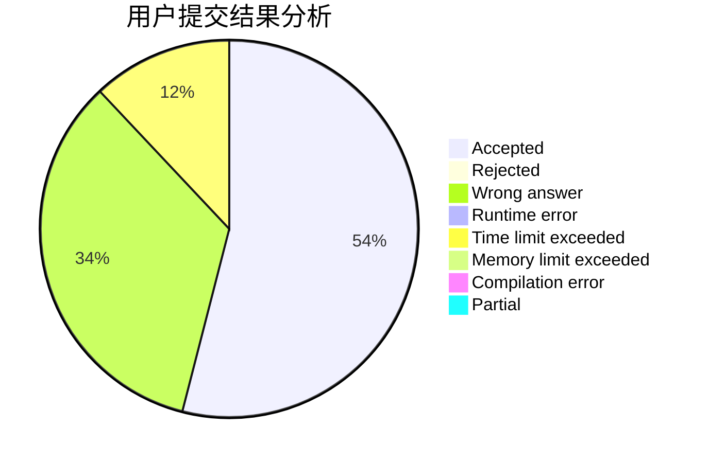
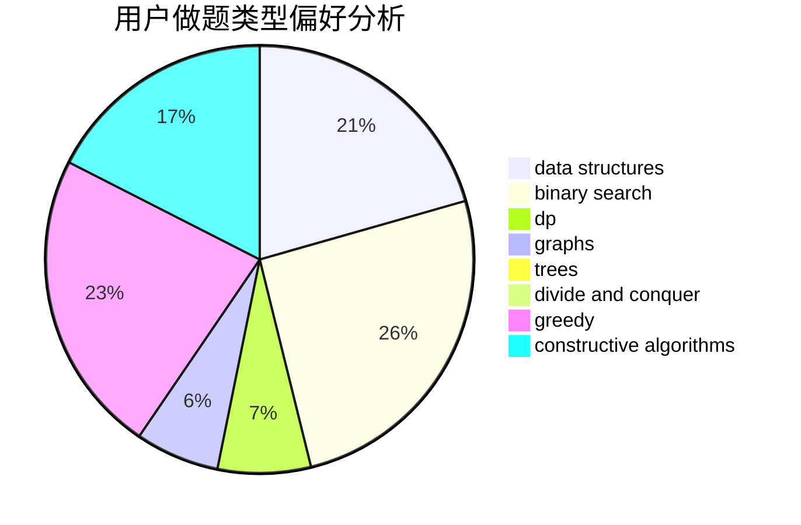
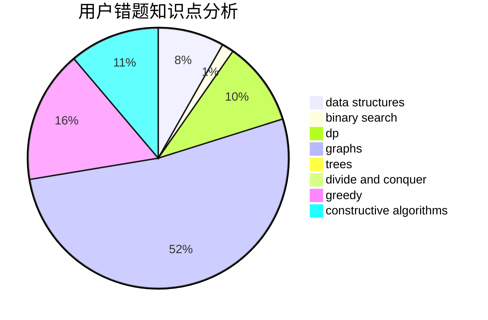

# Icontofig
<!-- tabs:start -->
#### **用户提交结果分析**

#### **用户做题类型偏好分析**

#### **用户错题知识点分析**

<!-- tabs:end -->
# 推荐题目
[Algoland and Berland](http://codeforces.com/problemset/problem/1070/M)		constructive algorithms,
                        divide and conquer,
                        geometry		  
[Privatization](http://codeforces.com/problemset/problem/212/A)		flows,
                        graphs		  
[Fence](http://codeforces.com/problemset/problem/363/B)		brute force,
                        dp		  
[Fixing the Cloud](https://codeforces.com/contest/1460/problem/A)		nan		  
[String Mark](http://codeforces.com/problemset/problem/895/D)		combinatorics,
                        math,
                        strings		  
[New Year Permutations](http://codeforces.com/problemset/problem/1279/E)		combinatorics,
                        dp		  
[Blog Post Rating](http://codeforces.com/problemset/problem/773/E)		data structures,
                        sortings		  
[Number of Triplets](http://codeforces.com/problemset/problem/181/B)		binary search,
                        brute force		  
[Chaotic V.](http://codeforces.com/problemset/problem/1292/D)		dp,
                        graphs,
                        greedy,
                        math,
                        number theory,
                        trees		  
[Block diagonal matrix](http://codeforces.com/problemset/problem/1116/D1)		nan		  
<!-- tabs:start -->
#### **data structures**
[Algoland and Berland](http://codeforces.com/problemset/problem/773/E)		data structures,
                        sortings		  
[Privatization](https://codeforces.com/contest/1447/problem/F2)		data structures,
                        greedy,
                        two pointers		  
[Fence](http://codeforces.com/problemset/problem/1499/C)		brute force,
                        data structures,
                        greedy,
                        math		  
[Fixing the Cloud](http://codeforces.com/problemset/problem/1175/E)		data structures,
                        dfs and similar,
                        divide and conquer,
                        dp,
                        greedy,
                        implementation,
                        trees		  
[String Mark](http://codeforces.com/problemset/problem/777/B)		data structures,
                        dp,
                        greedy,
                        sortings		  
[New Year Permutations](http://codeforces.com/problemset/problem/1492/C)		binary search,
                        data structures,
                        dp,
                        greedy,
                        two pointers		  
[Blog Post Rating](http://codeforces.com/problemset/problem/1490/G)		binary search,
                        data structures,
                        math		  
[Number of Triplets](http://codeforces.com/problemset/problem/1479/D)		binary search,
                        bitmasks,
                        brute force,
                        data structures,
                        probabilities,
                        trees		  
[Chaotic V.](http://codeforces.com/problemset/problem/1497/A)		brute force,
                        data structures,
                        greedy,
                        sortings		  
[Block diagonal matrix](http://codeforces.com/problemset/problem/1491/C)		brute force,
                        data structures,
                        dp,
                        greedy,
                        implementation		  
#### **binary search**
[Algoland and Berland](http://codeforces.com/problemset/problem/181/B)		binary search,
                        brute force		  
[Privatization](http://codeforces.com/problemset/problem/232/A)		binary search,
                        constructive algorithms,
                        graphs,
                        greedy		  
[Fence](http://codeforces.com/problemset/problem/1492/C)		binary search,
                        data structures,
                        dp,
                        greedy,
                        two pointers		  
[Fixing the Cloud](http://codeforces.com/problemset/problem/1463/D)		binary search,
                        constructive algorithms,
                        greedy,
                        two pointers		  
[String Mark](http://codeforces.com/problemset/problem/1490/G)		binary search,
                        data structures,
                        math		  
[New Year Permutations](http://codeforces.com/problemset/problem/1479/D)		binary search,
                        bitmasks,
                        brute force,
                        data structures,
                        probabilities,
                        trees		  
[Blog Post Rating](http://codeforces.com/problemset/problem/1436/E)		binary search,
                        data structures,
                        two pointers		  
[Number of Triplets](http://codeforces.com/problemset/problem/1461/D)		binary search,
                        brute force,
                        data structures,
                        divide and conquer,
                        implementation,
                        sortings		  
[Chaotic V.](http://codeforces.com/problemset/problem/1493/C)		binary search,
                        brute force,
                        constructive algorithms,
                        greedy,
                        strings		  
[Block diagonal matrix](http://codeforces.com/problemset/problem/1487/D)		binary search,
                        brute force,
                        math,
                        number theory		  
#### **dp**
[Algoland and Berland](http://codeforces.com/problemset/problem/363/B)		brute force,
                        dp		  
[Privatization](http://codeforces.com/problemset/problem/1279/E)		combinatorics,
                        dp		  
[Fence](http://codeforces.com/problemset/problem/1292/D)		dp,
                        graphs,
                        greedy,
                        math,
                        number theory,
                        trees		  
[Fixing the Cloud](https://codeforces.com/contest/1241/problem/E)		brute force,
                        constructive algorithms,
                        dp,
                        graphs,
                        implementation,
                        trees		  
[String Mark](http://codeforces.com/problemset/problem/1175/E)		data structures,
                        dfs and similar,
                        divide and conquer,
                        dp,
                        greedy,
                        implementation,
                        trees		  
[New Year Permutations](http://codeforces.com/problemset/problem/777/B)		data structures,
                        dp,
                        greedy,
                        sortings		  
[Blog Post Rating](http://codeforces.com/problemset/problem/1492/C)		binary search,
                        data structures,
                        dp,
                        greedy,
                        two pointers		  
[Number of Triplets](https://codeforces.com/contest/1457/problem/C)		brute force,
                        dp,
                        implementation		  
[Chaotic V.](http://codeforces.com/problemset/problem/1491/C)		brute force,
                        data structures,
                        dp,
                        greedy,
                        implementation		  
[Block diagonal matrix](http://codeforces.com/problemset/problem/1437/C)		dp,
                        flows,
                        graph matchings,
                        greedy,
                        math,
                        sortings		  
#### **graph**
[Algoland and Berland](http://codeforces.com/problemset/problem/212/A)		flows,
                        graphs		  
[Privatization](http://codeforces.com/problemset/problem/1292/D)		dp,
                        graphs,
                        greedy,
                        math,
                        number theory,
                        trees		  
[Fence](https://codeforces.com/contest/1241/problem/E)		brute force,
                        constructive algorithms,
                        dp,
                        graphs,
                        implementation,
                        trees		  
[Fixing the Cloud](http://codeforces.com/problemset/problem/232/A)		binary search,
                        constructive algorithms,
                        graphs,
                        greedy		  
[String Mark](http://codeforces.com/problemset/problem/1487/C)		brute force,
                        constructive algorithms,
                        dfs and similar,
                        graphs,
                        greedy,
                        implementation,
                        math		  
[New Year Permutations](http://codeforces.com/problemset/problem/1437/C)		dp,
                        flows,
                        graph matchings,
                        greedy,
                        math,
                        sortings		  
[Blog Post Rating](http://codeforces.com/problemset/problem/1470/D)		constructive algorithms,
                        dfs and similar,
                        graph matchings,
                        graphs,
                        greedy		  
[Number of Triplets](http://codeforces.com/problemset/problem/1476/C)		dp,
                        graphs,
                        greedy		  
[Chaotic V.](http://codeforces.com/problemset/problem/1304/D)		constructive algorithms,
                        graphs,
                        greedy,
                        two pointers		  
[Block diagonal matrix](http://codeforces.com/problemset/problem/1475/C)		combinatorics,
                        graphs,
                        math		  
#### **trees**
[Algoland and Berland](http://codeforces.com/problemset/problem/1292/D)		dp,
                        graphs,
                        greedy,
                        math,
                        number theory,
                        trees		  
[Privatization](https://codeforces.com/contest/1241/problem/E)		brute force,
                        constructive algorithms,
                        dp,
                        graphs,
                        implementation,
                        trees		  
[Fence](https://codeforces.com/contest/1087/problem/D)		constructive algorithms,
                        implementation,
                        trees		  
[Fixing the Cloud](http://codeforces.com/problemset/problem/1175/E)		data structures,
                        dfs and similar,
                        divide and conquer,
                        dp,
                        greedy,
                        implementation,
                        trees		  
[String Mark](http://codeforces.com/problemset/problem/1479/D)		binary search,
                        bitmasks,
                        brute force,
                        data structures,
                        probabilities,
                        trees		  
[New Year Permutations](http://codeforces.com/problemset/problem/1511/C)		brute force,
                        data structures,
                        implementation,
                        trees		  
[Blog Post Rating](http://codeforces.com/problemset/problem/1499/F)		combinatorics,
                        dfs and similar,
                        dp,
                        trees		  
[Number of Triplets](http://codeforces.com/problemset/problem/1491/E)		brute force,
                        dfs and similar,
                        divide and conquer,
                        number theory,
                        trees		  
[Chaotic V.](http://codeforces.com/problemset/problem/1466/D)		data structures,
                        greedy,
                        sortings,
                        trees		  
[Block diagonal matrix](http://codeforces.com/problemset/problem/1495/D)		combinatorics,
                        dfs and similar,
                        graphs,
                        math,
                        shortest paths,
                        trees		  
#### **divide and conquer**
[Algoland and Berland](http://codeforces.com/problemset/problem/1070/M)		constructive algorithms,
                        divide and conquer,
                        geometry		  
[Privatization](http://codeforces.com/problemset/problem/1175/E)		data structures,
                        dfs and similar,
                        divide and conquer,
                        dp,
                        greedy,
                        implementation,
                        trees		  
[Fence](http://codeforces.com/problemset/problem/1461/D)		binary search,
                        brute force,
                        data structures,
                        divide and conquer,
                        implementation,
                        sortings		  
[Fixing the Cloud](http://codeforces.com/problemset/problem/1466/G)		combinatorics,
                        divide and conquer,
                        hashing,
                        math,
                        string suffix structures,
                        strings		  
[String Mark](http://codeforces.com/problemset/problem/1490/D)		dfs and similar,
                        divide and conquer,
                        implementation		  
[New Year Permutations](https://codeforces.com/contest/1483/problem/C)		data structures,
                        divide and conquer,
                        dp		  
[Blog Post Rating](http://codeforces.com/problemset/problem/1491/E)		brute force,
                        dfs and similar,
                        divide and conquer,
                        number theory,
                        trees		  
[Number of Triplets](http://codeforces.com/problemset/problem/1303/G)		data structures,
                        divide and conquer,
                        geometry,
                        trees		  
[Chaotic V.](http://codeforces.com/problemset/problem/1494/D)		constructive algorithms,
                        data structures,
                        dfs and similar,
                        divide and conquer,
                        dsu,
                        greedy,
                        sortings,
                        trees		  
[Block diagonal matrix](http://codeforces.com/problemset/problem/1482/E)		data structures,
                        divide and conquer,
                        dp		  
#### **greedy**
[Algoland and Berland](http://codeforces.com/problemset/problem/1292/D)		dp,
                        graphs,
                        greedy,
                        math,
                        number theory,
                        trees		  
[Privatization](https://codeforces.com/contest/1229/problem/A)		brute force,
                        greedy		  
[Fence](https://codeforces.com/contest/1447/problem/F2)		data structures,
                        greedy,
                        two pointers		  
[Fixing the Cloud](http://codeforces.com/problemset/problem/232/A)		binary search,
                        constructive algorithms,
                        graphs,
                        greedy		  
[String Mark](http://codeforces.com/problemset/problem/1499/C)		brute force,
                        data structures,
                        greedy,
                        math		  
[New Year Permutations](http://codeforces.com/problemset/problem/1175/E)		data structures,
                        dfs and similar,
                        divide and conquer,
                        dp,
                        greedy,
                        implementation,
                        trees		  
[Blog Post Rating](http://codeforces.com/problemset/problem/777/B)		data structures,
                        dp,
                        greedy,
                        sortings		  
[Number of Triplets](http://codeforces.com/problemset/problem/1492/C)		binary search,
                        data structures,
                        dp,
                        greedy,
                        two pointers		  
[Chaotic V.](https://codeforces.com/contest/1496/problem/C)		geometry,
                        greedy,
                        math,
                        sortings		  
[Block diagonal matrix](http://codeforces.com/problemset/problem/1493/A)		constructive algorithms,
                        greedy		  
#### **constructive algorithms**
[Algoland and Berland](http://codeforces.com/problemset/problem/1070/M)		constructive algorithms,
                        divide and conquer,
                        geometry		  
[Privatization](https://codeforces.com/contest/1241/problem/E)		brute force,
                        constructive algorithms,
                        dp,
                        graphs,
                        implementation,
                        trees		  
[Fence](https://codeforces.com/contest/1087/problem/D)		constructive algorithms,
                        implementation,
                        trees		  
[Fixing the Cloud](http://codeforces.com/problemset/problem/1400/A)		constructive algorithms,
                        strings		  
[String Mark](http://codeforces.com/problemset/problem/232/A)		binary search,
                        constructive algorithms,
                        graphs,
                        greedy		  
[New Year Permutations](http://codeforces.com/problemset/problem/1327/C)		constructive algorithms,
                        implementation		  
[Blog Post Rating](http://codeforces.com/problemset/problem/1493/A)		constructive algorithms,
                        greedy		  
[Number of Triplets](http://codeforces.com/problemset/problem/1463/D)		binary search,
                        constructive algorithms,
                        greedy,
                        two pointers		  
[Chaotic V.](https://codeforces.com/contest/1456/problem/B)		bitmasks,
                        brute force,
                        constructive algorithms		  
[Block diagonal matrix](http://codeforces.com/problemset/problem/1492/D)		bitmasks,
                        constructive algorithms,
                        greedy,
                        math		  
#### **sortings**
[Algoland and Berland](http://codeforces.com/problemset/problem/773/E)		data structures,
                        sortings		  
[Privatization](http://codeforces.com/problemset/problem/777/B)		data structures,
                        dp,
                        greedy,
                        sortings		  
[Fence](https://codeforces.com/contest/1496/problem/C)		geometry,
                        greedy,
                        math,
                        sortings		  
[Fixing the Cloud](http://codeforces.com/problemset/problem/1495/A)		geometry,
                        greedy,
                        math,
                        sortings		  
[String Mark](http://codeforces.com/problemset/problem/1497/A)		brute force,
                        data structures,
                        greedy,
                        sortings		  
[New Year Permutations](http://codeforces.com/problemset/problem/1427/A)		math,
                        sortings		  
[Blog Post Rating](http://codeforces.com/problemset/problem/1461/D)		binary search,
                        brute force,
                        data structures,
                        divide and conquer,
                        implementation,
                        sortings		  
[Number of Triplets](http://codeforces.com/problemset/problem/1437/C)		dp,
                        flows,
                        graph matchings,
                        greedy,
                        math,
                        sortings		  
[Chaotic V.](http://codeforces.com/problemset/problem/1473/A)		greedy,
                        implementation,
                        math,
                        sortings		  
[Block diagonal matrix](http://codeforces.com/problemset/problem/1486/B)		binary search,
                        geometry,
                        shortest paths,
                        sortings		  
<!-- tabs:end -->
