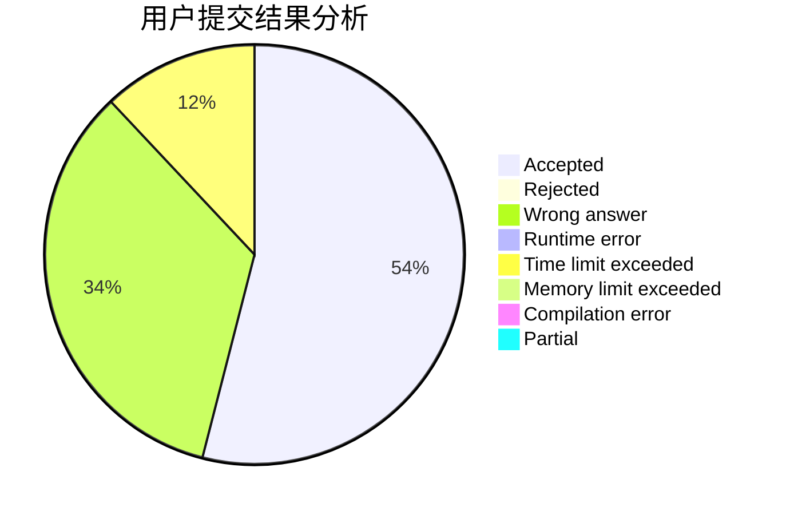
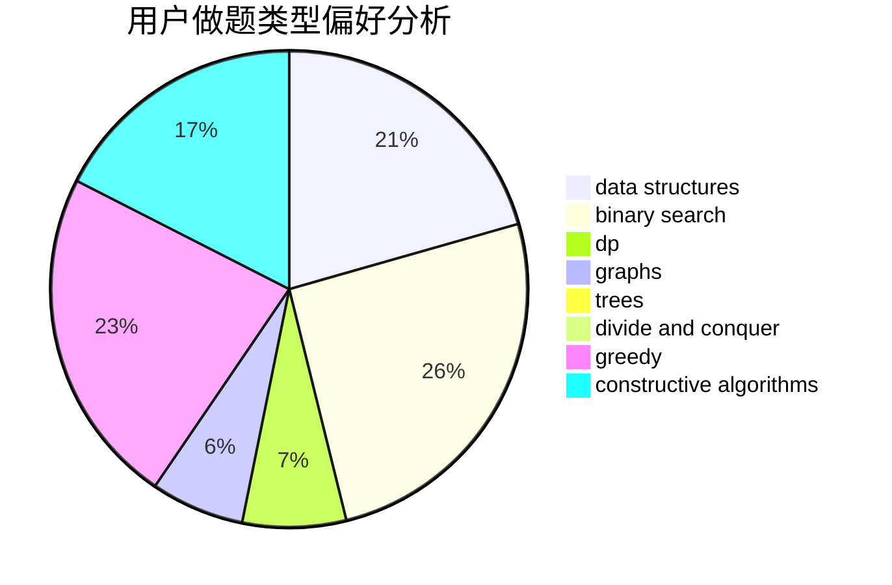
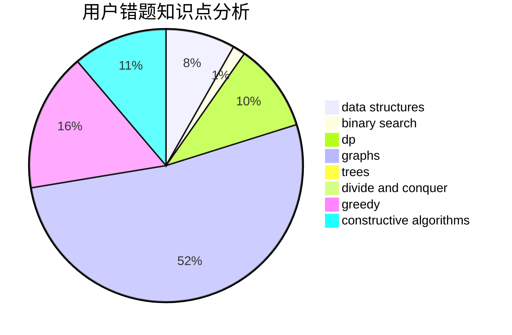

# Icontofig

<!-- tabs:start -->

#### **用户提交结果分析**

#### **用户做题类型偏好分析**

#### **用户错题知识点分析**

<!-- tabs:end -->
# 推荐题目
[212A](https://codeforces.com/contest/212/problem/A)		flows,
                        graphs		  
[181B](https://codeforces.com/contest/181/problem/B)		binary search,
                        brute force		  
[895D](https://codeforces.com/contest/895/problem/D)		combinatorics,
                        math,
                        strings		  
[1279E](https://codeforces.com/contest/1279/problem/E)		combinatorics,
                        dp		  
[773E](https://codeforces.com/contest/773/problem/E)		data structures,
                        sortings		  
[363B](https://codeforces.com/contest/363/problem/B)		brute force,
                        dp		  
[1070M](https://codeforces.com/contest/1070/problem/M)		constructive algorithms,
                        divide and conquer,
                        geometry		  
[1036E](https://codeforces.com/contest/1036/problem/E)		fft,
                        geometry,
                        number theory		  
[1011E](https://codeforces.com/contest/1011/problem/E)		dsu,graphs,sortings,trees		  
[1008A](https://codeforces.com/contest/1008/problem/A)		implementation,
                        strings		  
