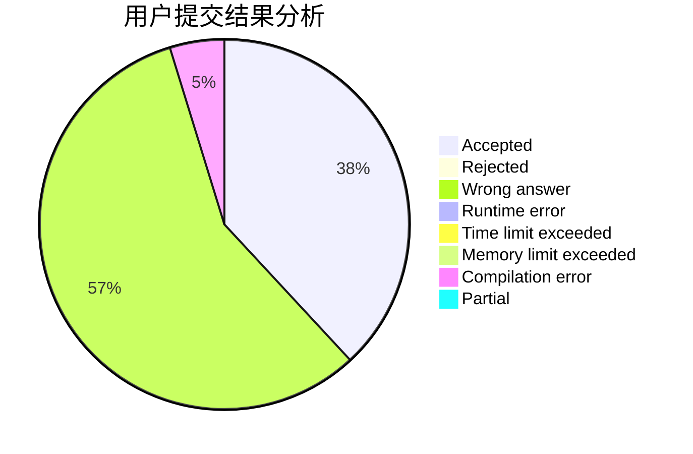
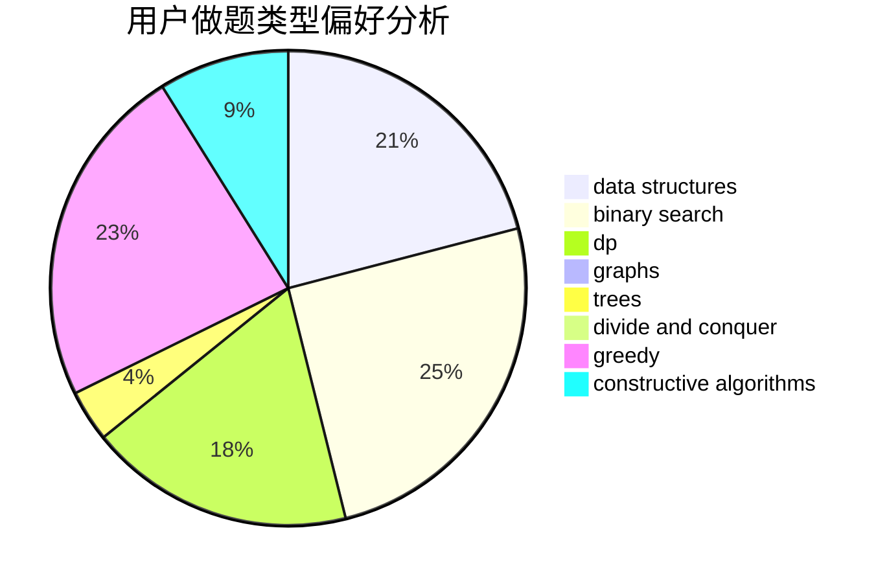

# Ijf007
<!-- tabs:start -->
#### **用户提交结果分析**

#### **用户做题类型偏好分析**

#### **用户错题知识点分析**

<!-- tabs:end -->
# 推荐题目
[XK Segments](http://codeforces.com/problemset/problem/895/B)		binary search,
                        math,
                        sortings,
                        two pointers		  
[Find Number (1 point)](https://codeforces.com/contest/1164/problem/G)		nan		  
[Geometric Progression](http://codeforces.com/problemset/problem/567/C)		binary search,
                        data structures,
                        dp		  
[Strictly Positive Matrix](https://codeforces.com/contest/403/problem/C)		graphs,
                        math		  
[Hamming Distance](https://codeforces.com/contest/194/problem/E)		*special problem		  
[Painting Eggs](http://codeforces.com/problemset/problem/282/B)		greedy,
                        math		  
[Harmony Analysis](http://codeforces.com/problemset/problem/610/C)		constructive algorithms		  
[Toys](http://codeforces.com/problemset/problem/44/I)		brute force,
                        combinatorics		  
[Christmas Trees](http://codeforces.com/problemset/problem/1283/D)		graphs,
                        greedy,
                        shortest paths		  
[Game](http://codeforces.com/problemset/problem/630/R)		games,
                        math		  
<!-- tabs:start -->
#### **data structures**
[XK Segments](http://codeforces.com/problemset/problem/567/C)		binary search,
                        data structures,
                        dp		  
[Find Number (1 point)](http://codeforces.com/problemset/problem/1044/D)		data structures,
                        dsu		  
[Geometric Progression](http://codeforces.com/problemset/problem/763/E)		data structures,
                        divide and conquer,
                        dsu		  
[Strictly Positive Matrix](http://codeforces.com/problemset/problem/629/D)		data structures,
                        dp		  
[Hamming Distance](http://codeforces.com/problemset/problem/1511/G)		bitmasks,
                        brute force,
                        data structures,
                        games,
                        two pointers		  
[Painting Eggs](http://codeforces.com/problemset/problem/1430/C)		constructive algorithms,
                        data structures,
                        greedy,
                        implementation,
                        math		  
[Harmony Analysis](http://codeforces.com/problemset/problem/1492/C)		binary search,
                        data structures,
                        dp,
                        greedy,
                        two pointers		  
[Toys](http://codeforces.com/problemset/problem/1490/G)		binary search,
                        data structures,
                        math		  
[Christmas Trees](http://codeforces.com/problemset/problem/1479/D)		binary search,
                        bitmasks,
                        brute force,
                        data structures,
                        probabilities,
                        trees		  
[Game](http://codeforces.com/problemset/problem/1497/A)		brute force,
                        data structures,
                        greedy,
                        sortings		  
#### **binary search**
[XK Segments](http://codeforces.com/problemset/problem/895/B)		binary search,
                        math,
                        sortings,
                        two pointers		  
[Find Number (1 point)](http://codeforces.com/problemset/problem/567/C)		binary search,
                        data structures,
                        dp		  
[Geometric Progression](http://codeforces.com/problemset/problem/852/D)		binary search,
                        flows,
                        graph matchings,
                        shortest paths		  
[Strictly Positive Matrix](http://codeforces.com/problemset/problem/1114/E)		binary search,
                        interactive,
                        number theory,
                        probabilities		  
[Hamming Distance](http://codeforces.com/problemset/problem/1492/C)		binary search,
                        data structures,
                        dp,
                        greedy,
                        two pointers		  
[Painting Eggs](http://codeforces.com/problemset/problem/1463/D)		binary search,
                        constructive algorithms,
                        greedy,
                        two pointers		  
[Harmony Analysis](http://codeforces.com/problemset/problem/1490/G)		binary search,
                        data structures,
                        math		  
[Toys](http://codeforces.com/problemset/problem/1479/D)		binary search,
                        bitmasks,
                        brute force,
                        data structures,
                        probabilities,
                        trees		  
[Christmas Trees](http://codeforces.com/problemset/problem/1436/E)		binary search,
                        data structures,
                        two pointers		  
[Game](http://codeforces.com/problemset/problem/1461/D)		binary search,
                        brute force,
                        data structures,
                        divide and conquer,
                        implementation,
                        sortings		  
#### **dp**
[XK Segments](http://codeforces.com/problemset/problem/567/C)		binary search,
                        data structures,
                        dp		  
[Find Number (1 point)](http://codeforces.com/problemset/problem/914/H)		combinatorics,
                        dp,
                        games,
                        trees		  
[Geometric Progression](http://codeforces.com/problemset/problem/629/D)		data structures,
                        dp		  
[Strictly Positive Matrix](http://codeforces.com/problemset/problem/855/C)		dp,
                        trees		  
[Hamming Distance](https://codeforces.com/contest/1277/problem/C)		dp,
                        greedy		  
[Painting Eggs](http://codeforces.com/problemset/problem/1381/D)		dfs and similar,
                        dp,
                        greedy,
                        trees,
                        two pointers		  
[Harmony Analysis](http://codeforces.com/problemset/problem/914/G)		bitmasks,
                        divide and conquer,
                        dp,
                        fft,
                        math		  
[Toys](http://codeforces.com/problemset/problem/1492/C)		binary search,
                        data structures,
                        dp,
                        greedy,
                        two pointers		  
[Christmas Trees](https://codeforces.com/contest/1457/problem/C)		brute force,
                        dp,
                        implementation		  
[Game](http://codeforces.com/problemset/problem/1491/C)		brute force,
                        data structures,
                        dp,
                        greedy,
                        implementation		  
#### **graph**
[XK Segments](https://codeforces.com/contest/403/problem/C)		graphs,
                        math		  
[Find Number (1 point)](http://codeforces.com/problemset/problem/1283/D)		graphs,
                        greedy,
                        shortest paths		  
[Geometric Progression](http://codeforces.com/problemset/problem/402/E)		graphs,
                        math		  
[Strictly Positive Matrix](http://codeforces.com/problemset/problem/852/D)		binary search,
                        flows,
                        graph matchings,
                        shortest paths		  
[Hamming Distance](http://codeforces.com/problemset/problem/1487/C)		brute force,
                        constructive algorithms,
                        dfs and similar,
                        graphs,
                        greedy,
                        implementation,
                        math		  
[Painting Eggs](http://codeforces.com/problemset/problem/1437/C)		dp,
                        flows,
                        graph matchings,
                        greedy,
                        math,
                        sortings		  
[Harmony Analysis](http://codeforces.com/problemset/problem/1470/D)		constructive algorithms,
                        dfs and similar,
                        graph matchings,
                        graphs,
                        greedy		  
[Toys](http://codeforces.com/problemset/problem/1476/C)		dp,
                        graphs,
                        greedy		  
[Christmas Trees](http://codeforces.com/problemset/problem/1304/D)		constructive algorithms,
                        graphs,
                        greedy,
                        two pointers		  
[Game](http://codeforces.com/problemset/problem/1475/C)		combinatorics,
                        graphs,
                        math		  
#### **trees**
[XK Segments](http://codeforces.com/problemset/problem/914/H)		combinatorics,
                        dp,
                        games,
                        trees		  
[Find Number (1 point)](http://codeforces.com/problemset/problem/855/C)		dp,
                        trees		  
[Geometric Progression](http://codeforces.com/problemset/problem/1381/D)		dfs and similar,
                        dp,
                        greedy,
                        trees,
                        two pointers		  
[Strictly Positive Matrix](http://codeforces.com/problemset/problem/1479/D)		binary search,
                        bitmasks,
                        brute force,
                        data structures,
                        probabilities,
                        trees		  
[Hamming Distance](http://codeforces.com/problemset/problem/1511/C)		brute force,
                        data structures,
                        implementation,
                        trees		  
[Painting Eggs](http://codeforces.com/problemset/problem/1499/F)		combinatorics,
                        dfs and similar,
                        dp,
                        trees		  
[Harmony Analysis](http://codeforces.com/problemset/problem/1491/E)		brute force,
                        dfs and similar,
                        divide and conquer,
                        number theory,
                        trees		  
[Toys](http://codeforces.com/problemset/problem/1466/D)		data structures,
                        greedy,
                        sortings,
                        trees		  
[Christmas Trees](http://codeforces.com/problemset/problem/1495/D)		combinatorics,
                        dfs and similar,
                        graphs,
                        math,
                        shortest paths,
                        trees		  
[Game](http://codeforces.com/problemset/problem/1303/G)		data structures,
                        divide and conquer,
                        geometry,
                        trees		  
#### **divide and conquer**
[XK Segments](http://codeforces.com/problemset/problem/763/E)		data structures,
                        divide and conquer,
                        dsu		  
[Find Number (1 point)](http://codeforces.com/problemset/problem/914/G)		bitmasks,
                        divide and conquer,
                        dp,
                        fft,
                        math		  
[Geometric Progression](http://codeforces.com/problemset/problem/1461/D)		binary search,
                        brute force,
                        data structures,
                        divide and conquer,
                        implementation,
                        sortings		  
[Strictly Positive Matrix](http://codeforces.com/problemset/problem/1466/G)		combinatorics,
                        divide and conquer,
                        hashing,
                        math,
                        string suffix structures,
                        strings		  
[Hamming Distance](http://codeforces.com/problemset/problem/1490/D)		dfs and similar,
                        divide and conquer,
                        implementation		  
[Painting Eggs](https://codeforces.com/contest/1483/problem/C)		data structures,
                        divide and conquer,
                        dp		  
[Harmony Analysis](http://codeforces.com/problemset/problem/1491/E)		brute force,
                        dfs and similar,
                        divide and conquer,
                        number theory,
                        trees		  
[Toys](http://codeforces.com/problemset/problem/1303/G)		data structures,
                        divide and conquer,
                        geometry,
                        trees		  
[Christmas Trees](http://codeforces.com/problemset/problem/1494/D)		constructive algorithms,
                        data structures,
                        dfs and similar,
                        divide and conquer,
                        dsu,
                        greedy,
                        sortings,
                        trees		  
[Game](http://codeforces.com/problemset/problem/1482/E)		data structures,
                        divide and conquer,
                        dp		  
#### **greedy**
[XK Segments](http://codeforces.com/problemset/problem/282/B)		greedy,
                        math		  
[Find Number (1 point)](http://codeforces.com/problemset/problem/1283/D)		graphs,
                        greedy,
                        shortest paths		  
[Geometric Progression](http://codeforces.com/problemset/problem/1088/C)		constructive algorithms,
                        greedy,
                        math		  
[Strictly Positive Matrix](http://codeforces.com/problemset/problem/45/D)		greedy,
                        meet-in-the-middle,
                        sortings		  
[Hamming Distance](https://codeforces.com/contest/1277/problem/C)		dp,
                        greedy		  
[Painting Eggs](http://codeforces.com/problemset/problem/1381/D)		dfs and similar,
                        dp,
                        greedy,
                        trees,
                        two pointers		  
[Harmony Analysis](http://codeforces.com/problemset/problem/103/A)		greedy,
                        implementation,
                        math		  
[Toys](http://codeforces.com/problemset/problem/1430/C)		constructive algorithms,
                        data structures,
                        greedy,
                        implementation,
                        math		  
[Christmas Trees](http://codeforces.com/problemset/problem/1469/A)		constructive algorithms,
                        greedy		  
[Game](http://codeforces.com/problemset/problem/1492/C)		binary search,
                        data structures,
                        dp,
                        greedy,
                        two pointers		  
#### **constructive algorithms**
[XK Segments](http://codeforces.com/problemset/problem/610/C)		constructive algorithms		  
[Find Number (1 point)](http://codeforces.com/problemset/problem/1088/C)		constructive algorithms,
                        greedy,
                        math		  
[Geometric Progression](http://codeforces.com/problemset/problem/1109/B)		constructive algorithms,
                        hashing,
                        strings		  
[Strictly Positive Matrix](http://codeforces.com/problemset/problem/1430/C)		constructive algorithms,
                        data structures,
                        greedy,
                        implementation,
                        math		  
[Hamming Distance](http://codeforces.com/problemset/problem/1469/A)		constructive algorithms,
                        greedy		  
[Painting Eggs](http://codeforces.com/problemset/problem/1493/A)		constructive algorithms,
                        greedy		  
[Harmony Analysis](http://codeforces.com/problemset/problem/1463/D)		binary search,
                        constructive algorithms,
                        greedy,
                        two pointers		  
[Toys](https://codeforces.com/contest/1456/problem/B)		bitmasks,
                        brute force,
                        constructive algorithms		  
[Christmas Trees](http://codeforces.com/problemset/problem/1492/D)		bitmasks,
                        constructive algorithms,
                        greedy,
                        math		  
[Game](https://codeforces.com/contest/1504/problem/D)		constructive algorithms,
                        games,
                        interactive		  
#### **sortings**
[XK Segments](http://codeforces.com/problemset/problem/895/B)		binary search,
                        math,
                        sortings,
                        two pointers		  
[Find Number (1 point)](http://codeforces.com/problemset/problem/45/D)		greedy,
                        meet-in-the-middle,
                        sortings		  
[Geometric Progression](https://codeforces.com/contest/1496/problem/C)		geometry,
                        greedy,
                        math,
                        sortings		  
[Strictly Positive Matrix](http://codeforces.com/problemset/problem/1495/A)		geometry,
                        greedy,
                        math,
                        sortings		  
[Hamming Distance](http://codeforces.com/problemset/problem/1497/A)		brute force,
                        data structures,
                        greedy,
                        sortings		  
[Painting Eggs](http://codeforces.com/problemset/problem/1427/A)		math,
                        sortings		  
[Harmony Analysis](http://codeforces.com/problemset/problem/1461/D)		binary search,
                        brute force,
                        data structures,
                        divide and conquer,
                        implementation,
                        sortings		  
[Toys](http://codeforces.com/problemset/problem/1437/C)		dp,
                        flows,
                        graph matchings,
                        greedy,
                        math,
                        sortings		  
[Christmas Trees](http://codeforces.com/problemset/problem/1473/A)		greedy,
                        implementation,
                        math,
                        sortings		  
[Game](http://codeforces.com/problemset/problem/1486/B)		binary search,
                        geometry,
                        shortest paths,
                        sortings		  
<!-- tabs:end -->
