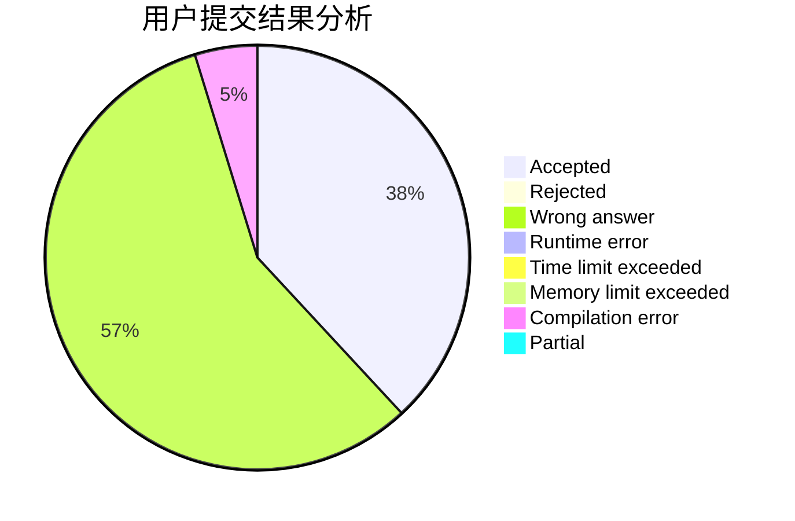
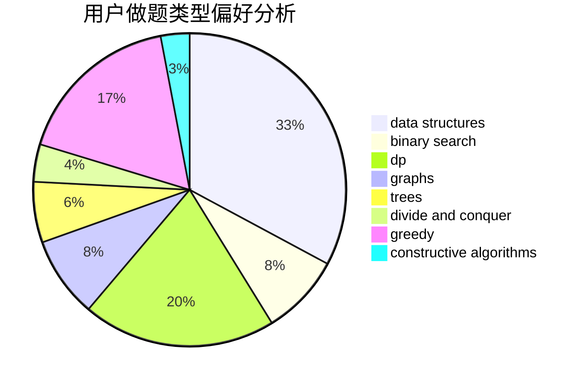

# Ijf007

<!-- tabs:start -->

#### **用户提交结果分析**

#### **用户做题类型偏好分析**

#### **用户错题知识点分析**

<!-- tabs:end -->
# 推荐题目
[912E](https://codeforces.com/contest/912/problem/E)		binary search,
                        dfs and similar,
                        math,
                        meet-in-the-middle,
                        number theory,
                        two pointers		  
[629E](https://codeforces.com/contest/629/problem/E)		combinatorics,
                        data structures,
                        dfs and similar,
                        dp,
                        probabilities,
                        trees		  
[1167F](https://codeforces.com/contest/1167/problem/F)		combinatorics,
                        data structures,
                        math,
                        sortings		  
[1088F](https://codeforces.com/contest/1088/problem/F)		data structures,
                        trees		  
[870C](https://codeforces.com/contest/870/problem/C)		dp,
                        greedy,
                        math,
                        number theory		  
[218A](https://codeforces.com/contest/218/problem/A)		brute force,
                        constructive algorithms,
                        implementation		  
[1290D](https://codeforces.com/contest/1290/problem/D)		constructive algorithms,
                        graphs,
                        interactive		  
[1109F](https://codeforces.com/contest/1109/problem/F)		data structures,
                        trees		  
[1165D](https://codeforces.com/contest/1165/problem/D)		math,
                        number theory		  
[298D](https://codeforces.com/contest/298/problem/D)		dsu,graphs,sortings,trees		  
