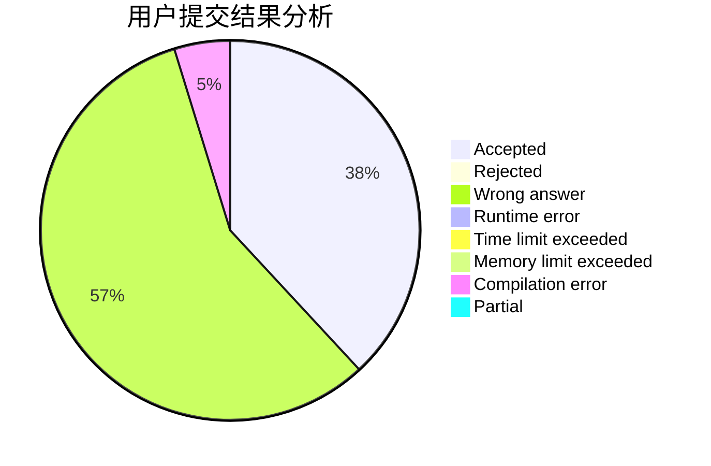
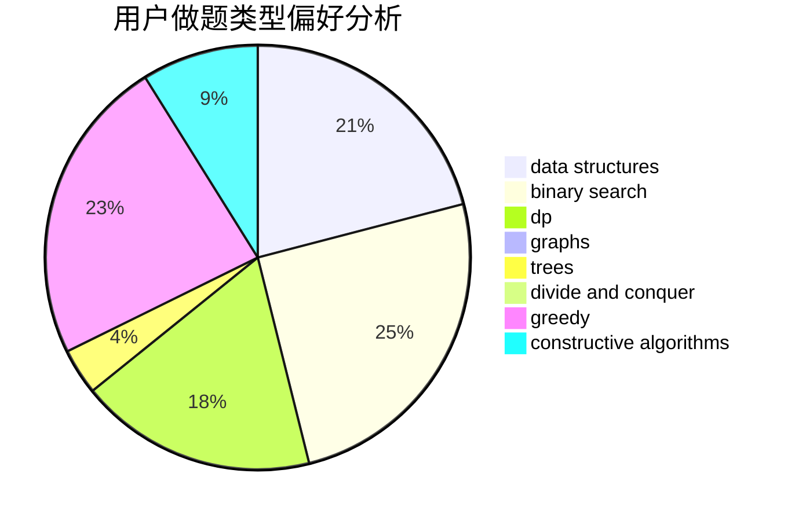

# Ijf007

<!-- tabs:start -->

#### **用户提交结果分析**

#### **用户做题类型偏好分析**

#### **用户错题知识点分析**

<!-- tabs:end -->
# 推荐题目
[895B](https://codeforces.com/contest/895/problem/B)		binary search,
                        math,
                        sortings,
                        two pointers		  
[610C](https://codeforces.com/contest/610/problem/C)		constructive algorithms		  
[1165D](https://codeforces.com/contest/1165/problem/D)		math,
                        number theory		  
[1088C](https://codeforces.com/contest/1088/problem/C)		constructive algorithms,
                        greedy,
                        math		  
[852D](https://codeforces.com/contest/852/problem/D)		binary search,
                        flows,
                        graph matchings,
                        shortest paths		  
[194E](https://codeforces.com/contest/194/problem/E)		dsu,graphs,sortings,trees		  
[1283D](https://codeforces.com/contest/1283/problem/D)		graphs,
                        greedy,
                        shortest paths		  
[1109B](https://codeforces.com/contest/1109/problem/B)		constructive algorithms,
                        hashing,
                        strings		  
[1164G](https://codeforces.com/contest/1164/problem/G)		dsu,graphs,sortings,trees		  
[282B](https://codeforces.com/contest/282/problem/B)		greedy,
                        math		  
