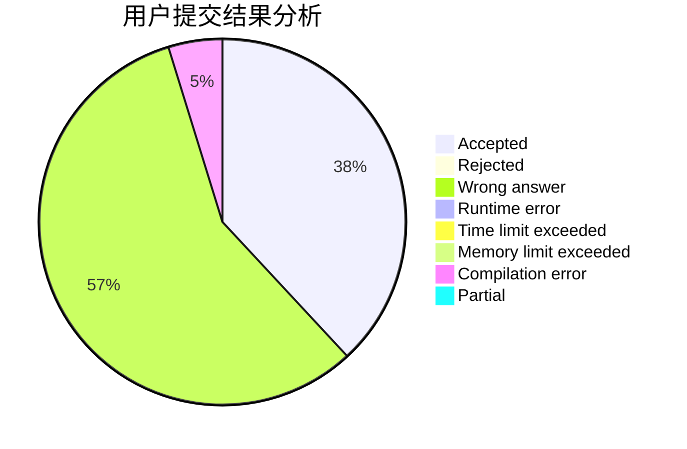
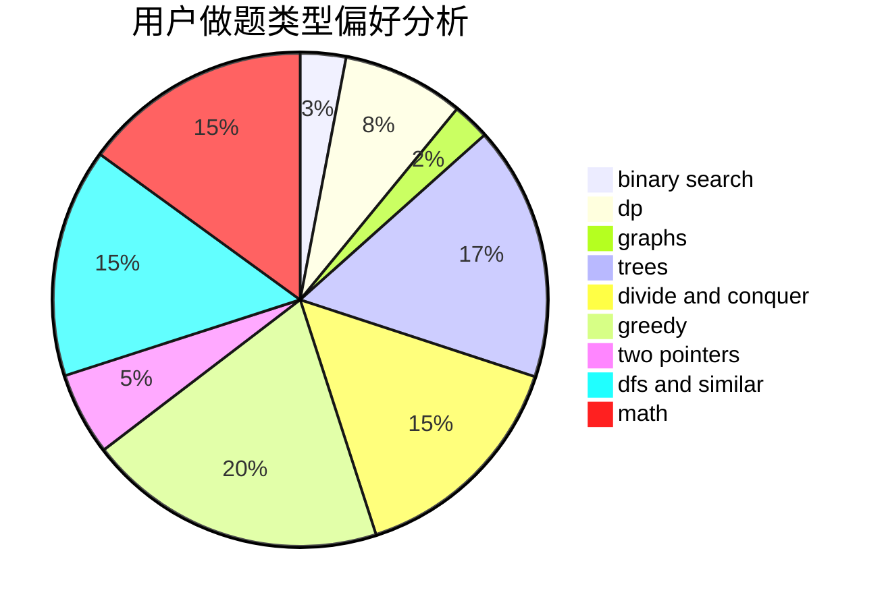

# Ijf007

<!-- tabs:start -->

#### **用户提交结果分析**

#### **用户做题类型偏好分析**

<!-- tabs:end -->
# 推荐题目
[912E](https://codeforces.com/contest/912/problem/E)
[629E](https://codeforces.com/contest/629/problem/E)
[1167F](https://codeforces.com/contest/1167/problem/F)
[1088F](https://codeforces.com/contest/1088/problem/F)
[870C](https://codeforces.com/contest/870/problem/C)
[218A](https://codeforces.com/contest/218/problem/A)
[1290D](https://codeforces.com/contest/1290/problem/D)
[1109F](https://codeforces.com/contest/1109/problem/F)
[1165D](https://codeforces.com/contest/1165/problem/D)
[298D](https://codeforces.com/contest/298/problem/D)
