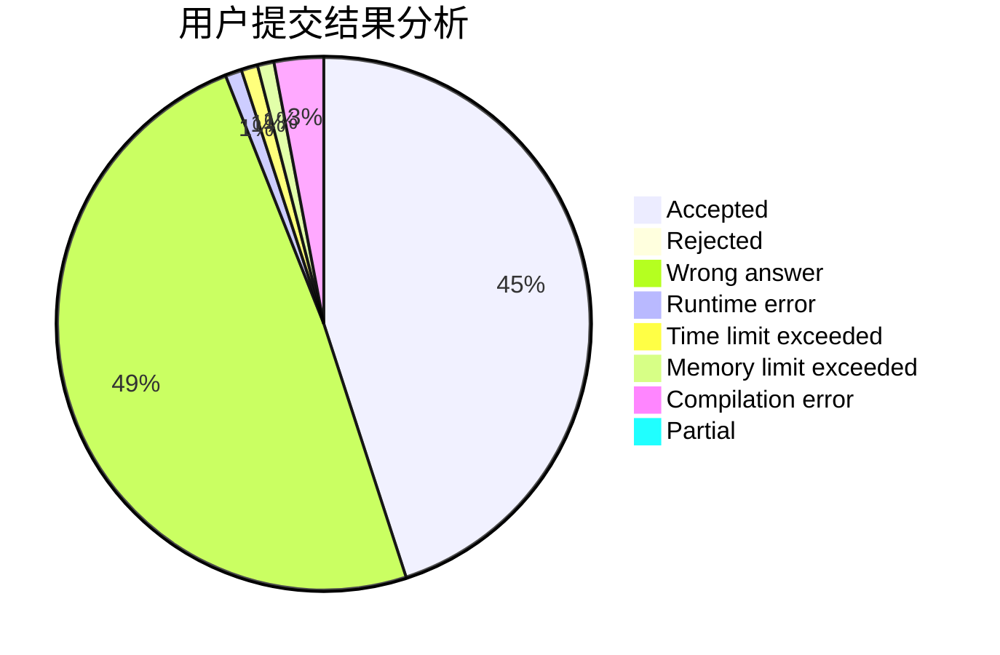
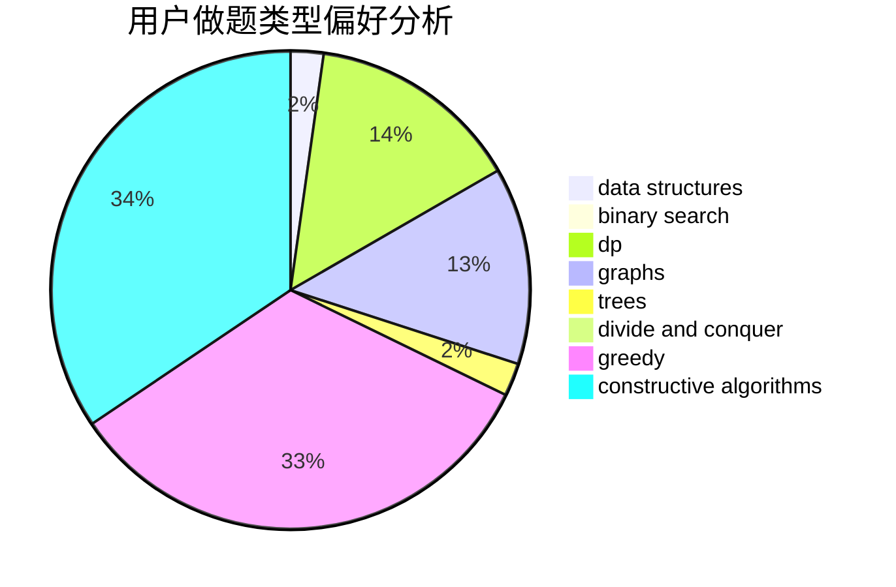
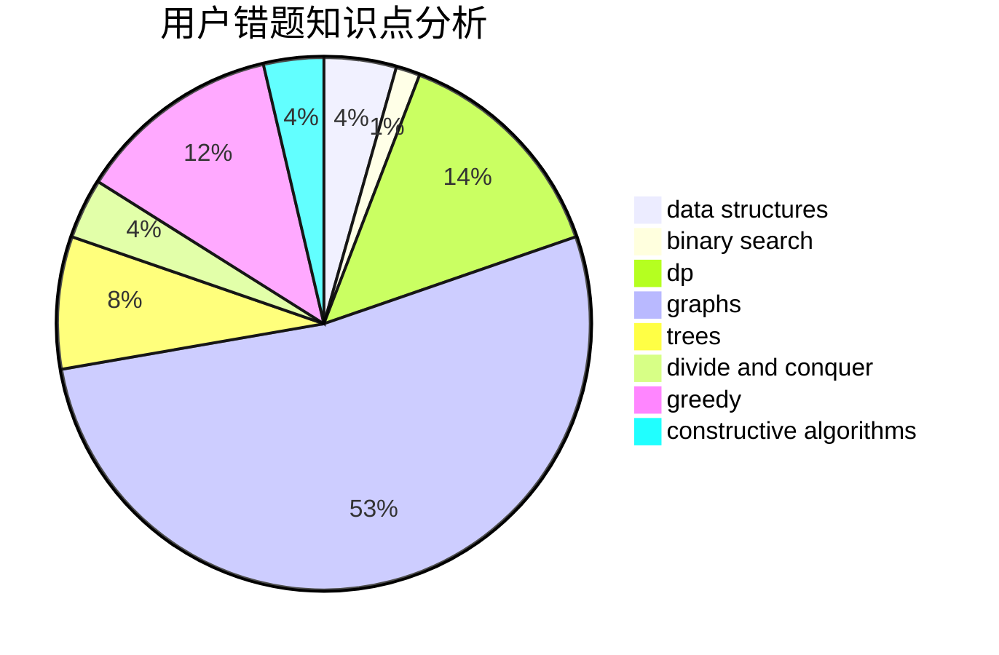

# 2bno_1

<!-- tabs:start -->

#### **用户提交结果分析**

#### **用户做题类型偏好分析**

#### **用户错题知识点分析**

<!-- tabs:end -->
# 推荐题目
[1340D](https://codeforces.com/contest/1340/problem/D)		constructive algorithms,
                        dfs and similar,
                        graphs,
                        trees		  
[1341E](https://codeforces.com/contest/1341/problem/E)		dsu,graphs,sortings,trees		  
[11521](https://codeforces.com/contest/1152/problem/1)		dsu,graphs,sortings,trees		  
[1341F](https://codeforces.com/contest/1341/problem/F)		dsu,graphs,sortings,trees		  
[1340E](https://codeforces.com/contest/1340/problem/E)		graphs,
                        interactive,
                        probabilities		  
[1341D](https://codeforces.com/contest/1341/problem/D)		dsu,graphs,sortings,trees		  
[1181B](https://codeforces.com/contest/1181/problem/B)		greedy,
                        implementation,
                        strings		  
[1340F](https://codeforces.com/contest/1340/problem/F)		brute force,
                        data structures,
                        hashing		  
[1341A](https://codeforces.com/contest/1341/problem/A)		math		  
[1340A](https://codeforces.com/contest/1340/problem/A)		brute force,
                        data structures,
                        greedy,
                        implementation		  
