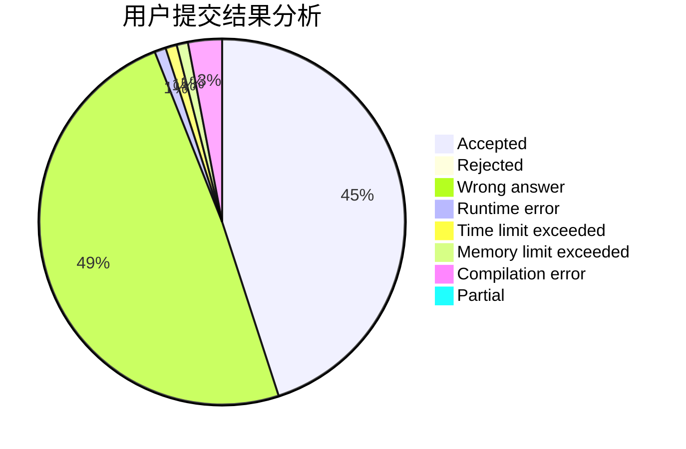
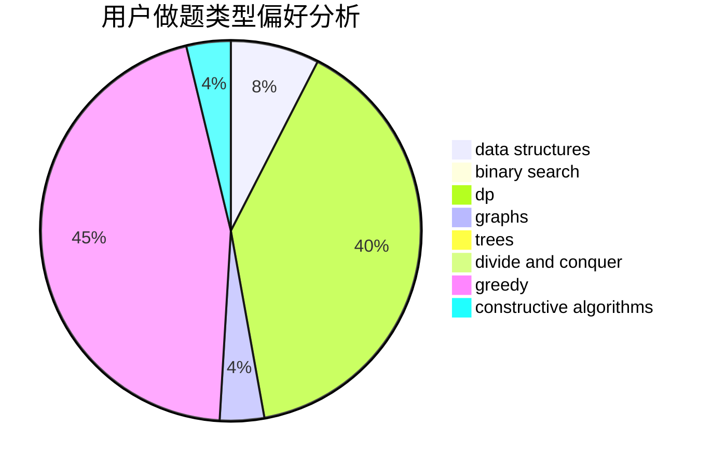
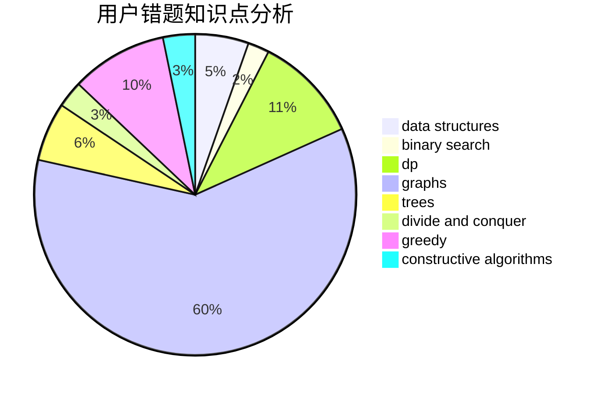

# 2bno_1

<!-- tabs:start -->

#### **用户提交结果分析**

#### **用户做题类型偏好分析**

#### **用户错题知识点分析**

<!-- tabs:end -->
# 推荐题目
[1333E](https://codeforces.com/contest/1333/problem/E)		brute force,
                        constructive algorithms		  
[1334F](https://codeforces.com/contest/1334/problem/F)		binary search,
                        data structures,
                        dp,
                        greedy		  
[114D](https://codeforces.com/contest/114/problem/D)		dsu,graphs,sortings,trees		  
[1334G](https://codeforces.com/contest/1334/problem/G)		bitmasks,
                        brute force,
                        fft		  
[1333F](https://codeforces.com/contest/1333/problem/F)		greedy,
                        implementation,
                        math,
                        number theory,
                        sortings,
                        two pointers		  
[1334E](https://codeforces.com/contest/1334/problem/E)		combinatorics,
                        graphs,
                        greedy,
                        math,
                        number theory		  
[1178F2](https://codeforces.com/contest/1178F/problem/2)		dp		  
[1334A](https://codeforces.com/contest/1334/problem/A)		implementation,
                        math		  
[1334B](https://codeforces.com/contest/1334/problem/B)		greedy,
                        sortings		  
[1333B](https://codeforces.com/contest/1333/problem/B)		greedy,
                        implementation		  
