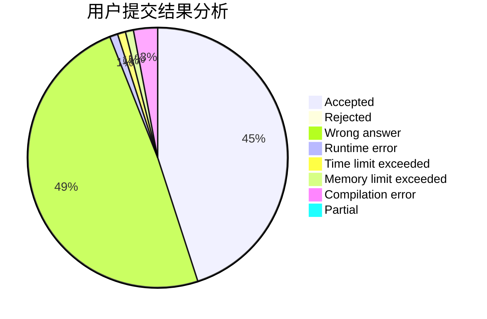
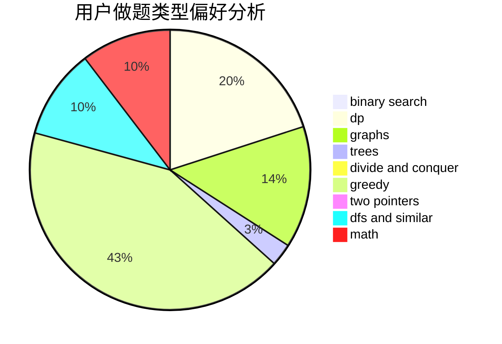

# 2bno_1

<!-- tabs:start -->

#### **用户提交结果分析**

#### **用户做题类型偏好分析**

<!-- tabs:end -->
# 推荐题目
[1340D](https://codeforces.com/contest/1340/problem/D)
[1341E](https://codeforces.com/contest/1341/problem/E)
[11521](https://codeforces.com/contest/1152/problem/1)
[1341F](https://codeforces.com/contest/1341/problem/F)
[1340E](https://codeforces.com/contest/1340/problem/E)
[1341D](https://codeforces.com/contest/1341/problem/D)
[1181B](https://codeforces.com/contest/1181/problem/B)
[1340F](https://codeforces.com/contest/1340/problem/F)
[1341A](https://codeforces.com/contest/1341/problem/A)
[1340A](https://codeforces.com/contest/1340/problem/A)
