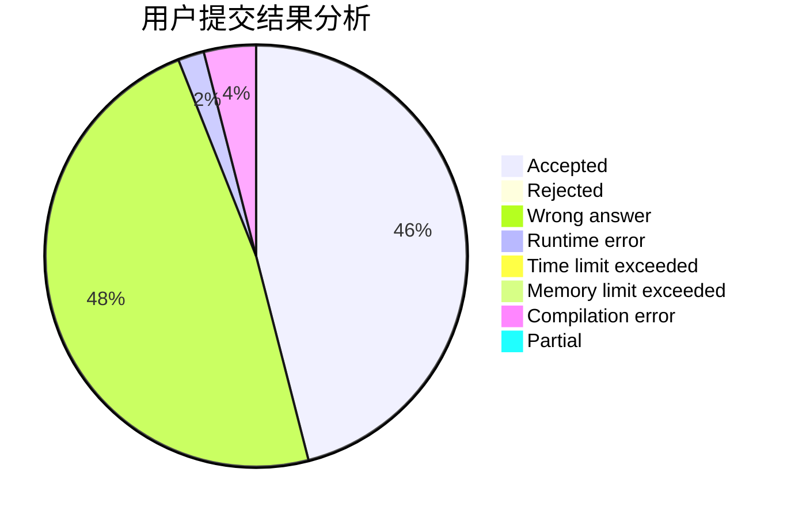
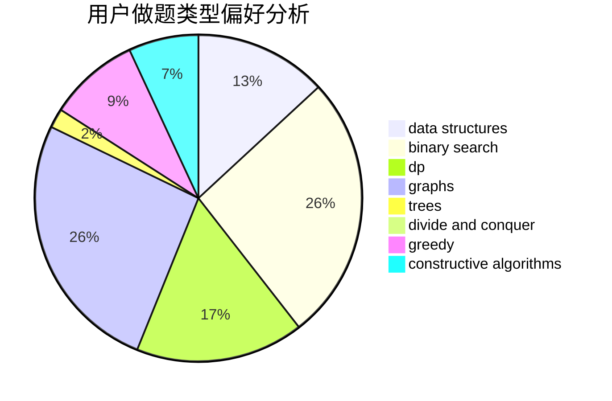

# IjfcnyaIi

<!-- tabs:start -->

#### **用户提交结果分析**

#### **用户做题类型偏好分析**

#### **用户错题知识点分析**

<!-- tabs:end -->
# 推荐题目
[1374F](https://codeforces.com/contest/1374/problem/F)		brute force,
                        constructive algorithms,
                        implementation,
                        sortings		  
[830C](https://codeforces.com/contest/830/problem/C)		brute force,
                        data structures,
                        implementation,
                        math,
                        number theory,
                        sortings,
                        two pointers		  
[719C](https://codeforces.com/contest/719/problem/C)		dsu,graphs,sortings,trees		  
[1209A](https://codeforces.com/contest/1209/problem/A)		greedy,
                        implementation,
                        math		  
[500A](https://codeforces.com/contest/500/problem/A)		dfs and similar,
                        graphs,
                        implementation		  
[364C](https://codeforces.com/contest/364/problem/C)		brute force,
                        number theory		  
[754D](https://codeforces.com/contest/754/problem/D)		binary search,
                        data structures,
                        greedy,
                        sortings		  
[670D1](https://codeforces.com/contest/670D/problem/1)		binary search,
                        brute force,
                        implementation		  
[18E](https://codeforces.com/contest/18/problem/E)		dp		  
[461E](https://codeforces.com/contest/461/problem/E)		binary search,
                        shortest paths,
                        strings		  
