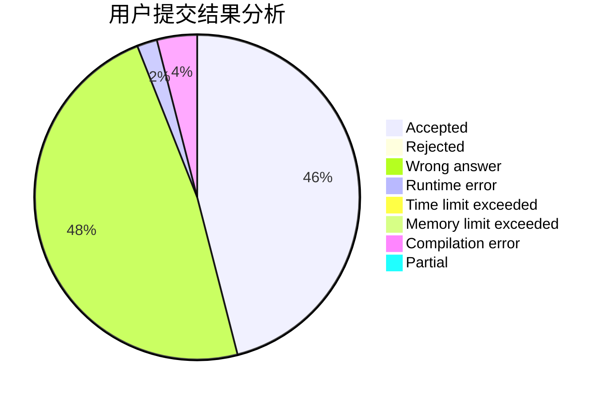
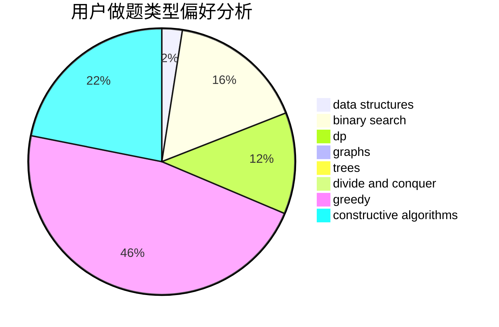

# IjfcnyaIi

<!-- tabs:start -->

#### **用户提交结果分析**

#### **用户做题类型偏好分析**

#### **用户错题知识点分析**

<!-- tabs:end -->
# 推荐题目
[1383F](https://codeforces.com/contest/1383/problem/F)		flows,
                        graphs		  
[848C](https://codeforces.com/contest/848/problem/C)		data structures,
                        divide and conquer		  
[736D](https://codeforces.com/contest/736/problem/D)		math,
                        matrices		  
[1214E](https://codeforces.com/contest/1214/problem/E)		constructive algorithms,
                        graphs,
                        math,
                        sortings,
                        trees		  
[521A](https://codeforces.com/contest/521/problem/A)		dsu,graphs,sortings,trees		  
[3912](https://codeforces.com/contest/391/problem/2)		dsu,graphs,sortings,trees		  
[772E](https://codeforces.com/contest/772/problem/E)		binary search,
                        divide and conquer,
                        interactive,
                        trees		  
[696B](https://codeforces.com/contest/696/problem/B)		dfs and similar,
                        math,
                        probabilities,
                        trees		  
[215C](https://codeforces.com/contest/215/problem/C)		brute force,
                        implementation		  
[480E](https://codeforces.com/contest/480/problem/E)		data structures,
                        divide and conquer		  
