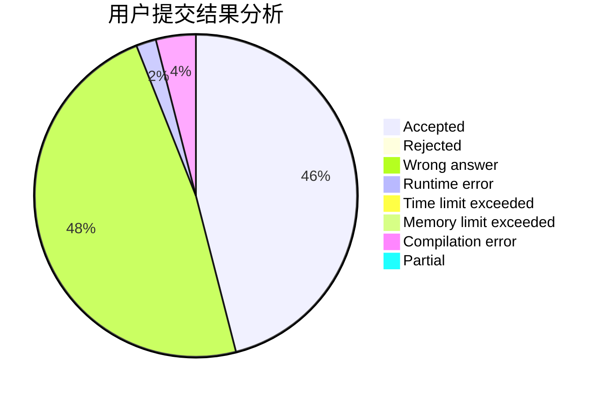
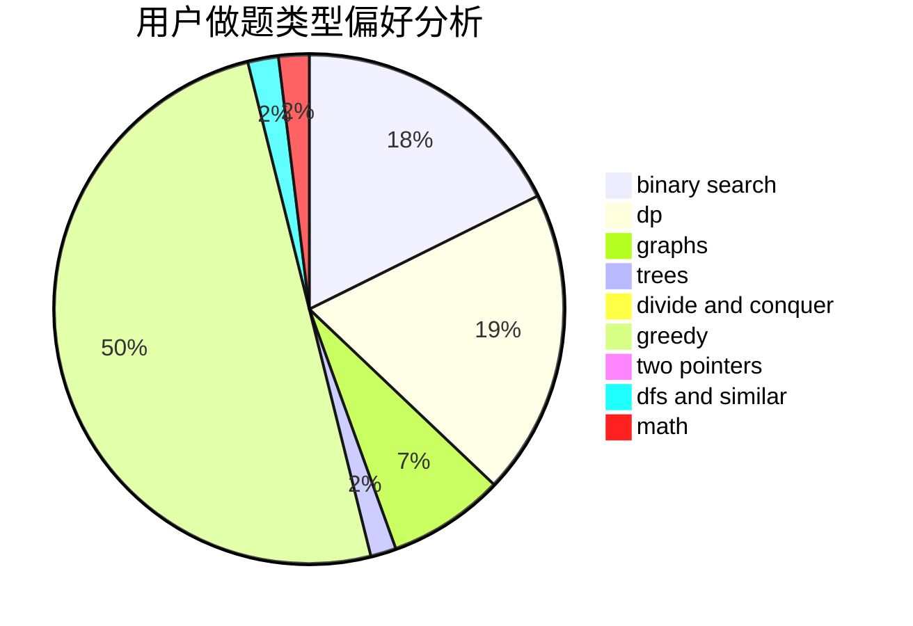

# IjfcnyaIi

<!-- tabs:start -->

#### **用户提交结果分析**

#### **用户做题类型偏好分析**

<!-- tabs:end -->
# 推荐题目
[1383F](https://codeforces.com/contest/1383/problem/F)
[848C](https://codeforces.com/contest/848/problem/C)
[736D](https://codeforces.com/contest/736/problem/D)
[1214E](https://codeforces.com/contest/1214/problem/E)
[521A](https://codeforces.com/contest/521/problem/A)
[3912](https://codeforces.com/contest/391/problem/2)
[772E](https://codeforces.com/contest/772/problem/E)
[696B](https://codeforces.com/contest/696/problem/B)
[215C](https://codeforces.com/contest/215/problem/C)
[480E](https://codeforces.com/contest/480/problem/E)
