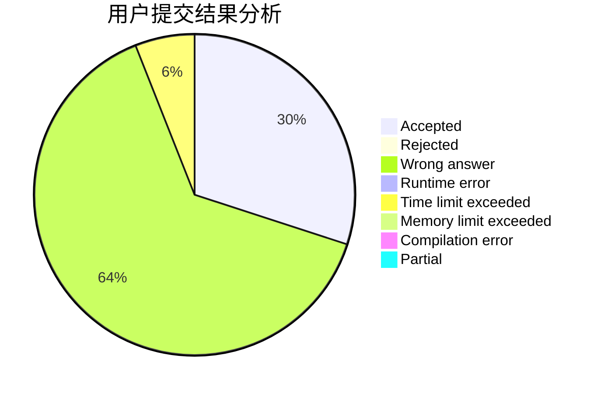
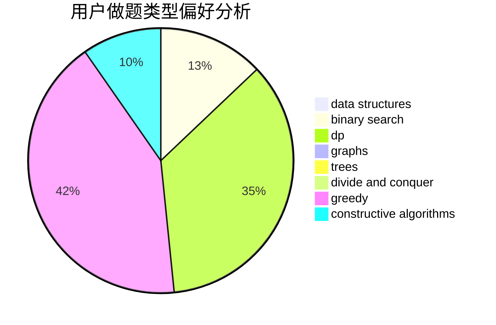
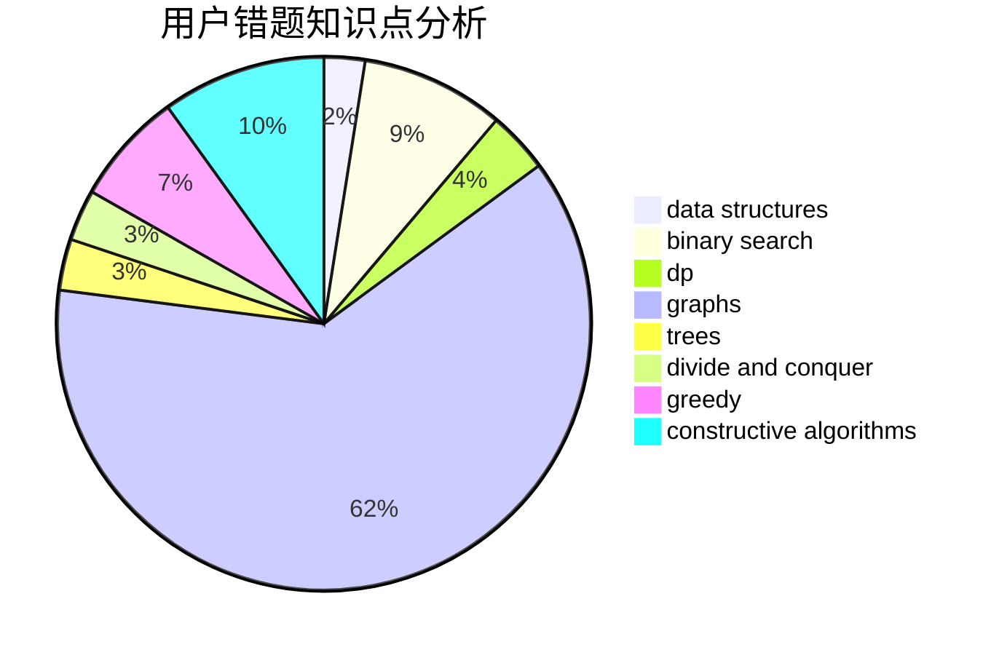

# Iking

<!-- tabs:start -->

#### **用户提交结果分析**

#### **用户做题类型偏好分析**

#### **用户错题知识点分析**

<!-- tabs:end -->
# 推荐题目
[58E](https://codeforces.com/contest/58/problem/E)		dp		  
[1011D](https://codeforces.com/contest/1011/problem/D)		dsu,graphs,sortings,trees		  
[845D](https://codeforces.com/contest/845/problem/D)		data structures,
                        dp,
                        greedy		  
[1264C](https://codeforces.com/contest/1264/problem/C)		data structures,
                        probabilities		  
[877D](https://codeforces.com/contest/877/problem/D)		data structures,
                        dfs and similar,
                        graphs,
                        shortest paths		  
[586F](https://codeforces.com/contest/586/problem/F)		dsu,graphs,sortings,trees		  
[644A](https://codeforces.com/contest/644/problem/A)		*special problem,
                        constructive algorithms		  
[1008C](https://codeforces.com/contest/1008/problem/C)		dsu,graphs,sortings,trees		  
[617E](https://codeforces.com/contest/617/problem/E)		data structures		  
[165D](https://codeforces.com/contest/165/problem/D)		data structures,
                        dsu,
                        trees		  
