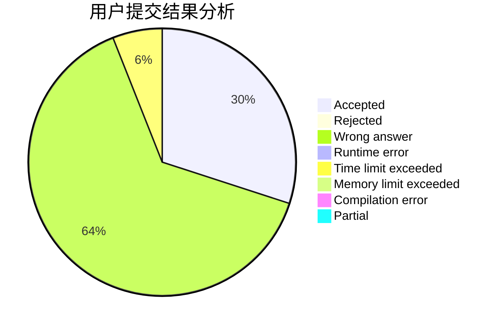
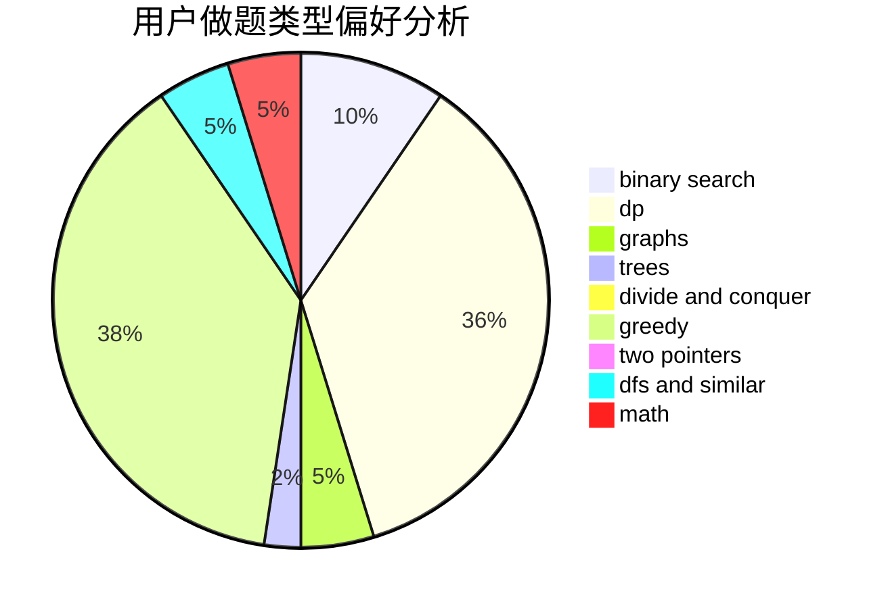

# Iking

<!-- tabs:start -->

#### **用户提交结果分析**

#### **用户做题类型偏好分析**

<!-- tabs:end -->
# 推荐题目
[58E](https://codeforces.com/contest/58/problem/E)
[1011D](https://codeforces.com/contest/1011/problem/D)
[845D](https://codeforces.com/contest/845/problem/D)
[1264C](https://codeforces.com/contest/1264/problem/C)
[877D](https://codeforces.com/contest/877/problem/D)
[586F](https://codeforces.com/contest/586/problem/F)
[644A](https://codeforces.com/contest/644/problem/A)
[1008C](https://codeforces.com/contest/1008/problem/C)
[617E](https://codeforces.com/contest/617/problem/E)
[165D](https://codeforces.com/contest/165/problem/D)
