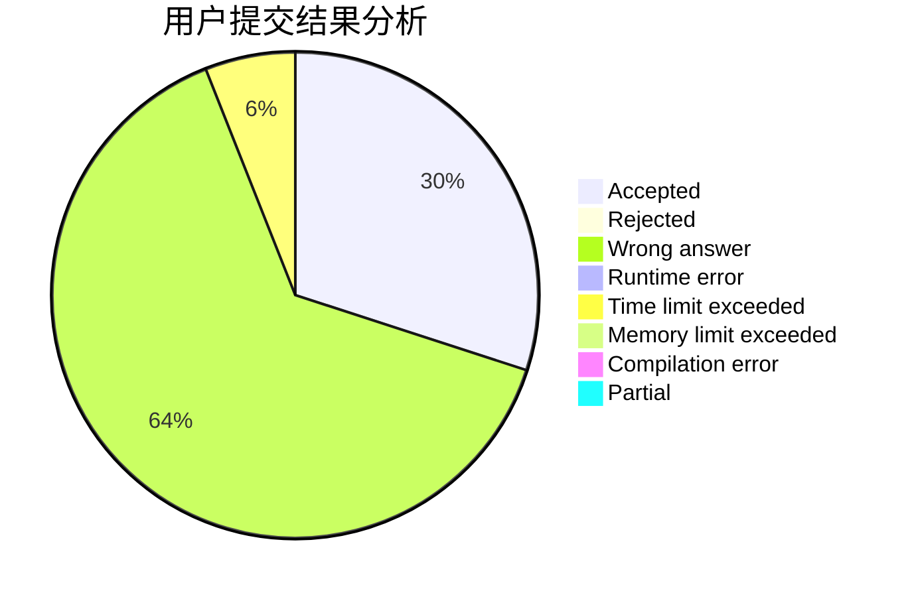
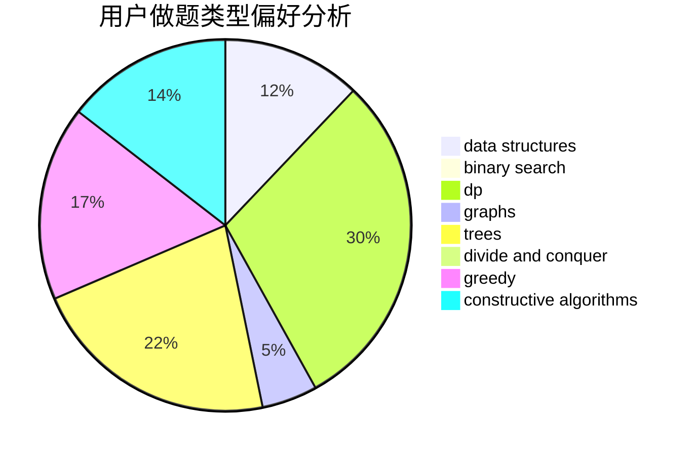
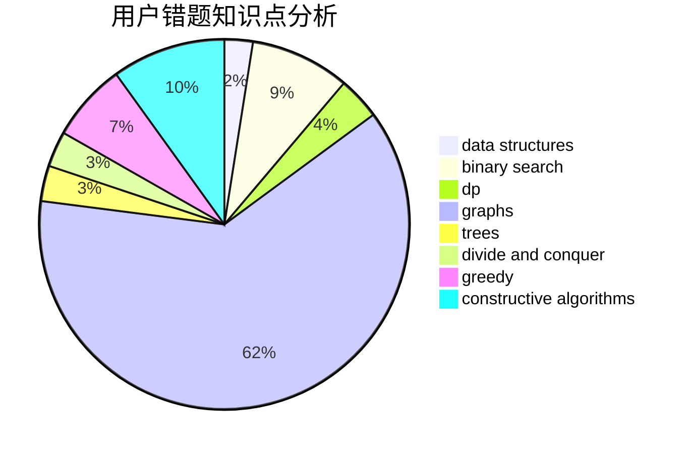

# Iking

<!-- tabs:start -->

#### **用户提交结果分析**

#### **用户做题类型偏好分析**

#### **用户错题知识点分析**

<!-- tabs:end -->
# 推荐题目
[56B](https://codeforces.com/contest/56/problem/B)		implementation		  
[1011A](https://codeforces.com/contest/1011/problem/A)		greedy,
                        implementation,
                        sortings		  
[827A](https://codeforces.com/contest/827/problem/A)		data structures,
                        greedy,
                        sortings,
                        strings		  
[1257C](https://codeforces.com/contest/1257/problem/C)		greedy,
                        implementation,
                        sortings,
                        strings,
                        two pointers		  
[85A](https://codeforces.com/contest/85/problem/A)		constructive algorithms,
                        implementation		  
[567B](https://codeforces.com/contest/567/problem/B)		implementation		  
[620E](https://codeforces.com/contest/620/problem/E)		bitmasks,
                        data structures,
                        trees		  
[1007E](https://codeforces.com/contest/1007/problem/E)		dp		  
[599D](https://codeforces.com/contest/599/problem/D)		brute force,
                        math		  
[1510G](https://codeforces.com/contest/1510/problem/G)		nan		  
