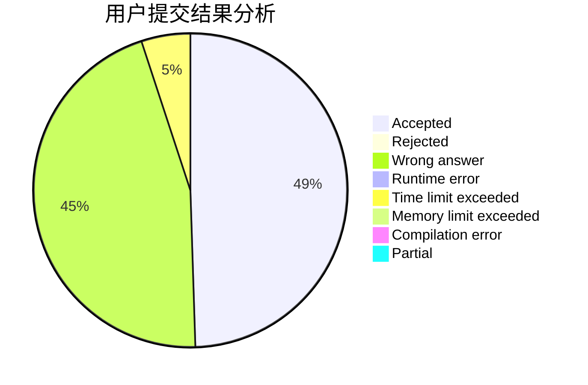
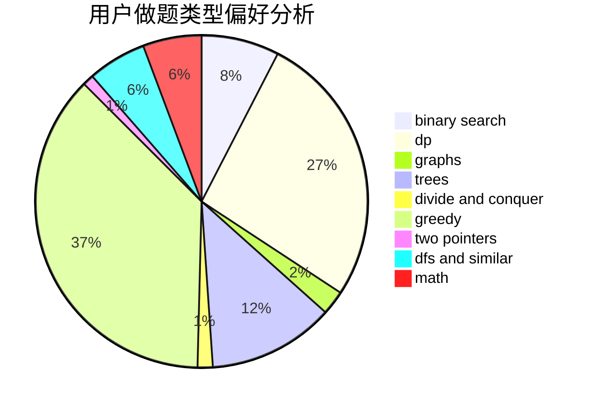

# ImWeakChicken

<!-- tabs:start -->

#### **用户提交结果分析**

#### **用户做题类型偏好分析**

<!-- tabs:end -->
# 推荐题目
[758B](https://codeforces.com/contest/758/problem/B)
[879A](https://codeforces.com/contest/879/problem/A)
[1178C](https://codeforces.com/contest/1178/problem/C)
[821D](https://codeforces.com/contest/821/problem/D)
[157D](https://codeforces.com/contest/157/problem/D)
[418C](https://codeforces.com/contest/418/problem/C)
[79D](https://codeforces.com/contest/79/problem/D)
[476E](https://codeforces.com/contest/476/problem/E)
[1159C](https://codeforces.com/contest/1159/problem/C)
[1223B](https://codeforces.com/contest/1223/problem/B)
