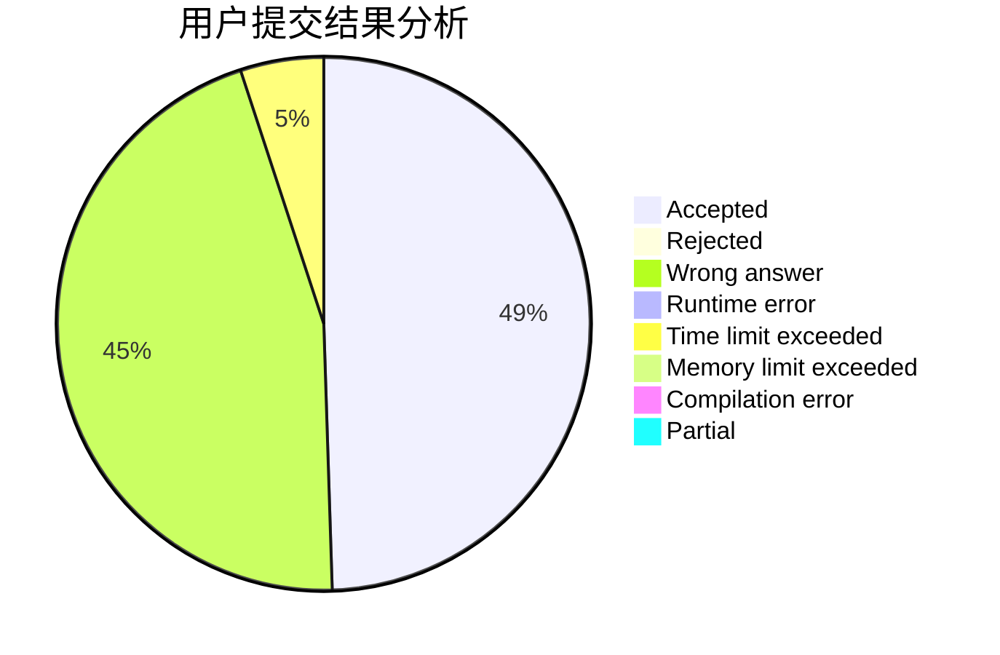
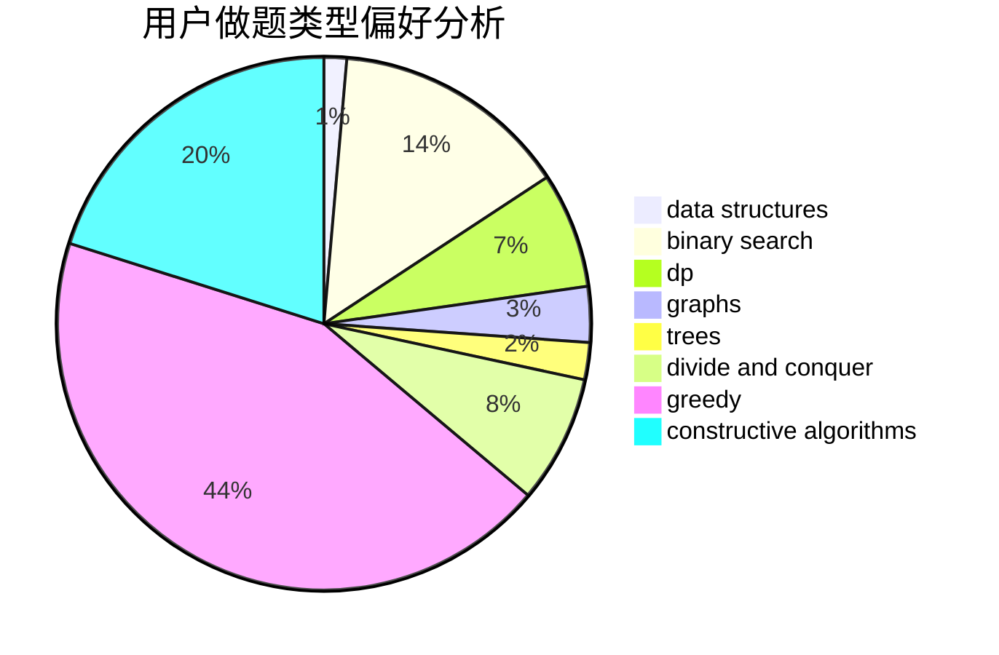
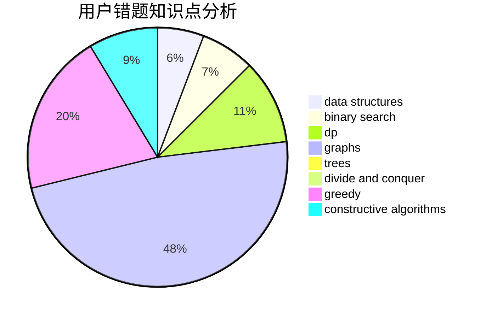

# ImWeakChicken
<!-- tabs:start -->
#### **用户提交结果分析**

#### **用户做题类型偏好分析**

#### **用户错题知识点分析**

<!-- tabs:end -->
# 推荐题目
[Anu Has a Function](https://codeforces.com/contest/1300/problem/C)		brute force,
                        greedy,
                        math		  
[Circular Dance](http://codeforces.com/problemset/problem/1095/D)		implementation		  
[Missile Silos](http://codeforces.com/problemset/problem/144/D)		data structures,
                        dfs and similar,
                        graphs,
                        shortest paths		  
[Electrification](http://codeforces.com/problemset/problem/1175/C)		binary search,
                        brute force,
                        greedy		  
[k-rounding](https://codeforces.com/contest/861/problem/A)		brute force,
                        math,
                        number theory		  
[Intranet of Buses](http://codeforces.com/problemset/problem/780/H)		binary search,
                        geometry,
                        implementation,
                        two pointers		  
[Increasing Subsequence (easy version)](http://codeforces.com/problemset/problem/1157/C1)		greedy		  
[Fraction](http://codeforces.com/problemset/problem/854/A)		brute force,
                        constructive algorithms,
                        math		  
[Permutations](http://codeforces.com/problemset/problem/736/D)		math,
                        matrices		  
[Find Amir](https://codeforces.com/contest/805/problem/C)		constructive algorithms,
                        greedy,
                        math		  
<!-- tabs:start -->
#### **data structures**
[Anu Has a Function](http://codeforces.com/problemset/problem/144/D)		data structures,
                        dfs and similar,
                        graphs,
                        shortest paths		  
[Circular Dance](http://codeforces.com/problemset/problem/455/D)		data structures		  
[Missile Silos](http://codeforces.com/problemset/problem/232/D)		binary search,
                        data structures,
                        string suffix structures		  
[Electrification](http://codeforces.com/problemset/problem/1492/C)		binary search,
                        data structures,
                        dp,
                        greedy,
                        two pointers		  
[k-rounding](http://codeforces.com/problemset/problem/1490/G)		binary search,
                        data structures,
                        math		  
[Intranet of Buses](http://codeforces.com/problemset/problem/1479/D)		binary search,
                        bitmasks,
                        brute force,
                        data structures,
                        probabilities,
                        trees		  
[Increasing Subsequence (easy version)](http://codeforces.com/problemset/problem/1497/A)		brute force,
                        data structures,
                        greedy,
                        sortings		  
[Fraction](http://codeforces.com/problemset/problem/1491/C)		brute force,
                        data structures,
                        dp,
                        greedy,
                        implementation		  
[Permutations](http://codeforces.com/problemset/problem/1492/B)		data structures,
                        greedy,
                        math		  
[Find Amir](http://codeforces.com/problemset/problem/1436/E)		binary search,
                        data structures,
                        two pointers		  
#### **binary search**
[Anu Has a Function](http://codeforces.com/problemset/problem/1175/C)		binary search,
                        brute force,
                        greedy		  
[Circular Dance](http://codeforces.com/problemset/problem/780/H)		binary search,
                        geometry,
                        implementation,
                        two pointers		  
[Missile Silos](http://codeforces.com/problemset/problem/1216/E2)		binary search,
                        math		  
[Electrification](https://codeforces.com/contest/781/problem/F)		binary search,
                        geometry,
                        implementation,
                        two pointers		  
[k-rounding](http://codeforces.com/problemset/problem/232/D)		binary search,
                        data structures,
                        string suffix structures		  
[Intranet of Buses](http://codeforces.com/problemset/problem/1423/K)		binary search,
                        math,
                        number theory,
                        two pointers		  
[Increasing Subsequence (easy version)](http://codeforces.com/problemset/problem/1492/C)		binary search,
                        data structures,
                        dp,
                        greedy,
                        two pointers		  
[Fraction](http://codeforces.com/problemset/problem/1463/D)		binary search,
                        constructive algorithms,
                        greedy,
                        two pointers		  
[Permutations](http://codeforces.com/problemset/problem/1490/G)		binary search,
                        data structures,
                        math		  
[Find Amir](http://codeforces.com/problemset/problem/1479/D)		binary search,
                        bitmasks,
                        brute force,
                        data structures,
                        probabilities,
                        trees		  
#### **dp**
[Anu Has a Function](http://codeforces.com/problemset/problem/140/E)		combinatorics,
                        dp		  
[Circular Dance](http://codeforces.com/problemset/problem/1065/D)		dfs and similar,
                        dp,
                        shortest paths		  
[Missile Silos](http://codeforces.com/problemset/problem/1402/C)		*special problem,
                        combinatorics,
                        dfs and similar,
                        dp,
                        games,
                        graphs,
                        matrices,
                        trees		  
[Electrification](http://codeforces.com/problemset/problem/118/D)		dp		  
[k-rounding](http://codeforces.com/problemset/problem/1245/C)		dp		  
[Intranet of Buses](http://codeforces.com/problemset/problem/1462/B)		dp,
                        implementation,
                        strings		  
[Increasing Subsequence (easy version)](http://codeforces.com/problemset/problem/1492/C)		binary search,
                        data structures,
                        dp,
                        greedy,
                        two pointers		  
[Fraction](https://codeforces.com/contest/1457/problem/C)		brute force,
                        dp,
                        implementation		  
[Permutations](http://codeforces.com/problemset/problem/1491/C)		brute force,
                        data structures,
                        dp,
                        greedy,
                        implementation		  
[Find Amir](http://codeforces.com/problemset/problem/1437/C)		dp,
                        flows,
                        graph matchings,
                        greedy,
                        math,
                        sortings		  
#### **graph**
[Anu Has a Function](http://codeforces.com/problemset/problem/144/D)		data structures,
                        dfs and similar,
                        graphs,
                        shortest paths		  
[Circular Dance](http://codeforces.com/problemset/problem/653/E)		dfs and similar,
                        dsu,
                        graphs,
                        trees		  
[Missile Silos](http://codeforces.com/problemset/problem/1184/E2)		dfs and similar,
                        graphs,
                        shortest paths,
                        trees		  
[Electrification](https://codeforces.com/contest/1440/problem/C2)		constructive algorithms,
                        graphs,
                        greedy,
                        implementation		  
[k-rounding](http://codeforces.com/problemset/problem/1250/N)		dfs and similar,
                        graphs,
                        greedy		  
[Intranet of Buses](http://codeforces.com/problemset/problem/1402/C)		*special problem,
                        combinatorics,
                        dfs and similar,
                        dp,
                        games,
                        graphs,
                        matrices,
                        trees		  
[Increasing Subsequence (easy version)](http://codeforces.com/problemset/problem/1487/C)		brute force,
                        constructive algorithms,
                        dfs and similar,
                        graphs,
                        greedy,
                        implementation,
                        math		  
[Fraction](http://codeforces.com/problemset/problem/1437/C)		dp,
                        flows,
                        graph matchings,
                        greedy,
                        math,
                        sortings		  
[Permutations](http://codeforces.com/problemset/problem/1470/D)		constructive algorithms,
                        dfs and similar,
                        graph matchings,
                        graphs,
                        greedy		  
[Find Amir](http://codeforces.com/problemset/problem/1476/C)		dp,
                        graphs,
                        greedy		  
#### **trees**
[Anu Has a Function](http://codeforces.com/problemset/problem/653/E)		dfs and similar,
                        dsu,
                        graphs,
                        trees		  
[Circular Dance](http://codeforces.com/problemset/problem/1184/E2)		dfs and similar,
                        graphs,
                        shortest paths,
                        trees		  
[Missile Silos](http://codeforces.com/problemset/problem/1402/C)		*special problem,
                        combinatorics,
                        dfs and similar,
                        dp,
                        games,
                        graphs,
                        matrices,
                        trees		  
[Electrification](http://codeforces.com/problemset/problem/288/D)		combinatorics,
                        dfs and similar,
                        trees		  
[k-rounding](http://codeforces.com/problemset/problem/1479/D)		binary search,
                        bitmasks,
                        brute force,
                        data structures,
                        probabilities,
                        trees		  
[Intranet of Buses](http://codeforces.com/problemset/problem/1511/C)		brute force,
                        data structures,
                        implementation,
                        trees		  
[Increasing Subsequence (easy version)](http://codeforces.com/problemset/problem/1499/F)		combinatorics,
                        dfs and similar,
                        dp,
                        trees		  
[Fraction](http://codeforces.com/problemset/problem/1491/E)		brute force,
                        dfs and similar,
                        divide and conquer,
                        number theory,
                        trees		  
[Permutations](http://codeforces.com/problemset/problem/1466/D)		data structures,
                        greedy,
                        sortings,
                        trees		  
[Find Amir](http://codeforces.com/problemset/problem/1495/D)		combinatorics,
                        dfs and similar,
                        graphs,
                        math,
                        shortest paths,
                        trees		  
#### **divide and conquer**
[Anu Has a Function](http://codeforces.com/problemset/problem/1461/D)		binary search,
                        brute force,
                        data structures,
                        divide and conquer,
                        implementation,
                        sortings		  
[Circular Dance](http://codeforces.com/problemset/problem/1466/G)		combinatorics,
                        divide and conquer,
                        hashing,
                        math,
                        string suffix structures,
                        strings		  
[Missile Silos](http://codeforces.com/problemset/problem/1490/D)		dfs and similar,
                        divide and conquer,
                        implementation		  
[Electrification](https://codeforces.com/contest/1483/problem/C)		data structures,
                        divide and conquer,
                        dp		  
[k-rounding](http://codeforces.com/problemset/problem/1491/E)		brute force,
                        dfs and similar,
                        divide and conquer,
                        number theory,
                        trees		  
[Intranet of Buses](http://codeforces.com/problemset/problem/1303/G)		data structures,
                        divide and conquer,
                        geometry,
                        trees		  
[Increasing Subsequence (easy version)](http://codeforces.com/problemset/problem/1494/D)		constructive algorithms,
                        data structures,
                        dfs and similar,
                        divide and conquer,
                        dsu,
                        greedy,
                        sortings,
                        trees		  
[Fraction](http://codeforces.com/problemset/problem/1482/E)		data structures,
                        divide and conquer,
                        dp		  
[Permutations](http://codeforces.com/problemset/problem/566/C)		dfs and similar,
                        divide and conquer,
                        trees		  
[Find Amir](http://codeforces.com/problemset/problem/1428/F)		binary search,
                        data structures,
                        divide and conquer,
                        dp,
                        two pointers		  
#### **greedy**
[Anu Has a Function](https://codeforces.com/contest/1300/problem/C)		brute force,
                        greedy,
                        math		  
[Circular Dance](http://codeforces.com/problemset/problem/1175/C)		binary search,
                        brute force,
                        greedy		  
[Missile Silos](http://codeforces.com/problemset/problem/1157/C1)		greedy		  
[Electrification](https://codeforces.com/contest/805/problem/C)		constructive algorithms,
                        greedy,
                        math		  
[k-rounding](http://codeforces.com/problemset/problem/490/A)		greedy,
                        implementation,
                        sortings		  
[Intranet of Buses](http://codeforces.com/problemset/problem/389/A)		greedy,
                        math		  
[Increasing Subsequence (easy version)](https://codeforces.com/contest/1440/problem/C2)		constructive algorithms,
                        graphs,
                        greedy,
                        implementation		  
[Fraction](http://codeforces.com/problemset/problem/1250/N)		dfs and similar,
                        graphs,
                        greedy		  
[Permutations](http://codeforces.com/problemset/problem/1215/C)		constructive algorithms,
                        greedy		  
[Find Amir](http://codeforces.com/problemset/problem/1130/B)		greedy		  
#### **constructive algorithms**
[Anu Has a Function](http://codeforces.com/problemset/problem/854/A)		brute force,
                        constructive algorithms,
                        math		  
[Circular Dance](https://codeforces.com/contest/805/problem/C)		constructive algorithms,
                        greedy,
                        math		  
[Missile Silos](https://codeforces.com/contest/1440/problem/C2)		constructive algorithms,
                        graphs,
                        greedy,
                        implementation		  
[Electrification](http://codeforces.com/problemset/problem/1215/C)		constructive algorithms,
                        greedy		  
[k-rounding](http://codeforces.com/problemset/problem/1254/C)		constructive algorithms,
                        geometry,
                        interactive,
                        math		  
[Intranet of Buses](http://codeforces.com/problemset/problem/1333/A)		constructive algorithms		  
[Increasing Subsequence (easy version)](http://codeforces.com/problemset/problem/1493/A)		constructive algorithms,
                        greedy		  
[Fraction](http://codeforces.com/problemset/problem/1463/D)		binary search,
                        constructive algorithms,
                        greedy,
                        two pointers		  
[Permutations](https://codeforces.com/contest/1456/problem/B)		bitmasks,
                        brute force,
                        constructive algorithms		  
[Find Amir](http://codeforces.com/problemset/problem/1492/D)		bitmasks,
                        constructive algorithms,
                        greedy,
                        math		  
#### **sortings**
[Anu Has a Function](http://codeforces.com/problemset/problem/490/A)		greedy,
                        implementation,
                        sortings		  
[Circular Dance](https://codeforces.com/contest/1496/problem/C)		geometry,
                        greedy,
                        math,
                        sortings		  
[Missile Silos](http://codeforces.com/problemset/problem/1495/A)		geometry,
                        greedy,
                        math,
                        sortings		  
[Electrification](http://codeforces.com/problemset/problem/1497/A)		brute force,
                        data structures,
                        greedy,
                        sortings		  
[k-rounding](http://codeforces.com/problemset/problem/1427/A)		math,
                        sortings		  
[Intranet of Buses](http://codeforces.com/problemset/problem/1461/D)		binary search,
                        brute force,
                        data structures,
                        divide and conquer,
                        implementation,
                        sortings		  
[Increasing Subsequence (easy version)](http://codeforces.com/problemset/problem/1437/C)		dp,
                        flows,
                        graph matchings,
                        greedy,
                        math,
                        sortings		  
[Fraction](http://codeforces.com/problemset/problem/1473/A)		greedy,
                        implementation,
                        math,
                        sortings		  
[Permutations](http://codeforces.com/problemset/problem/1486/B)		binary search,
                        geometry,
                        shortest paths,
                        sortings		  
[Find Amir](http://codeforces.com/problemset/problem/1480/B)		greedy,
                        implementation,
                        sortings		  
<!-- tabs:end -->
