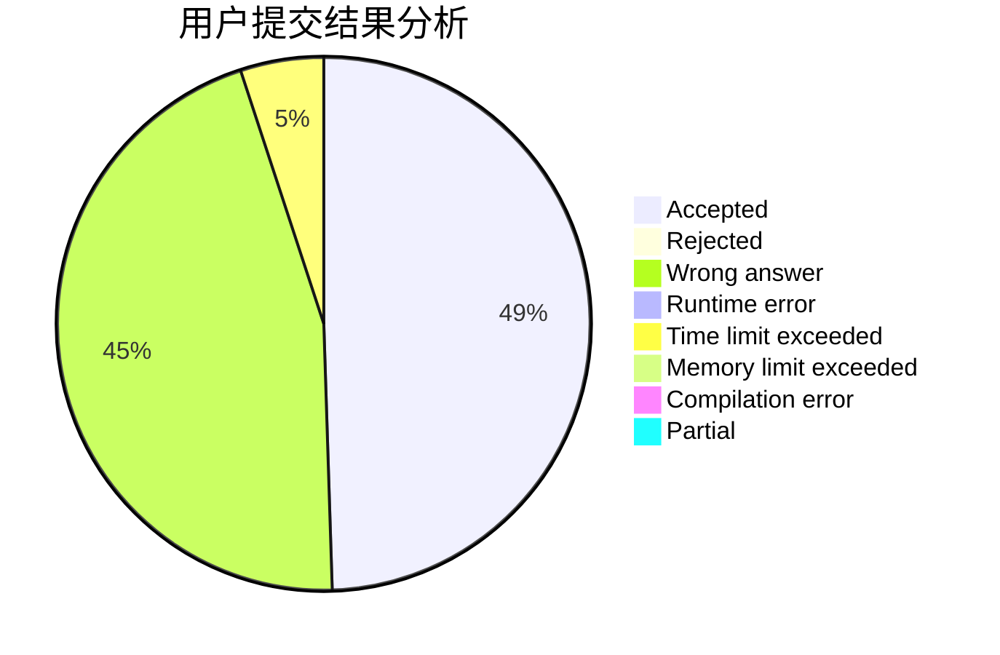
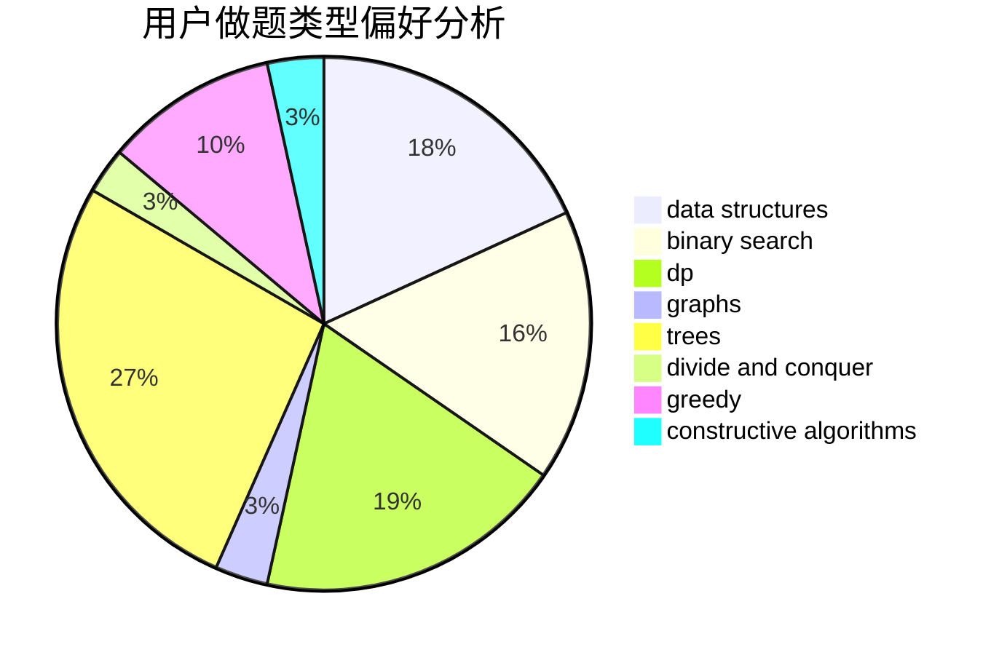
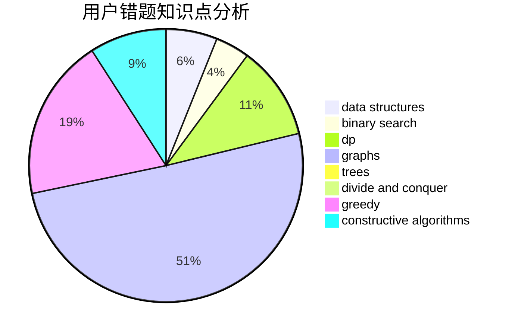

# ImWeakChicken

<!-- tabs:start -->

#### **用户提交结果分析**

#### **用户做题类型偏好分析**

#### **用户错题知识点分析**

<!-- tabs:end -->
# 推荐题目
[758B](https://codeforces.com/contest/758/problem/B)		brute force,
                        implementation,
                        number theory		  
[879A](https://codeforces.com/contest/879/problem/A)		implementation		  
[1178C](https://codeforces.com/contest/1178/problem/C)		combinatorics,
                        greedy,
                        math		  
[821D](https://codeforces.com/contest/821/problem/D)		dfs and similar,
                        graphs,
                        shortest paths		  
[157D](https://codeforces.com/contest/157/problem/D)		dsu,graphs,sortings,trees		  
[418C](https://codeforces.com/contest/418/problem/C)		dsu,graphs,sortings,trees		  
[79D](https://codeforces.com/contest/79/problem/D)		bitmasks,
                        dp,
                        shortest paths		  
[476E](https://codeforces.com/contest/476/problem/E)		dp,
                        strings		  
[1159C](https://codeforces.com/contest/1159/problem/C)		dsu,graphs,sortings,trees		  
[1223B](https://codeforces.com/contest/1223/problem/B)		strings		  
