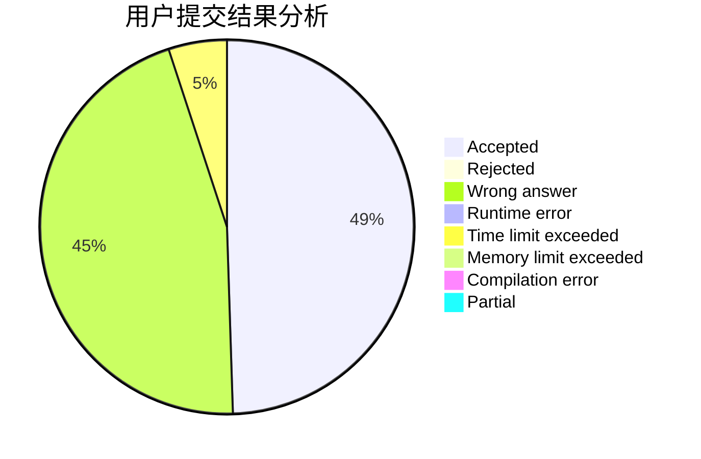
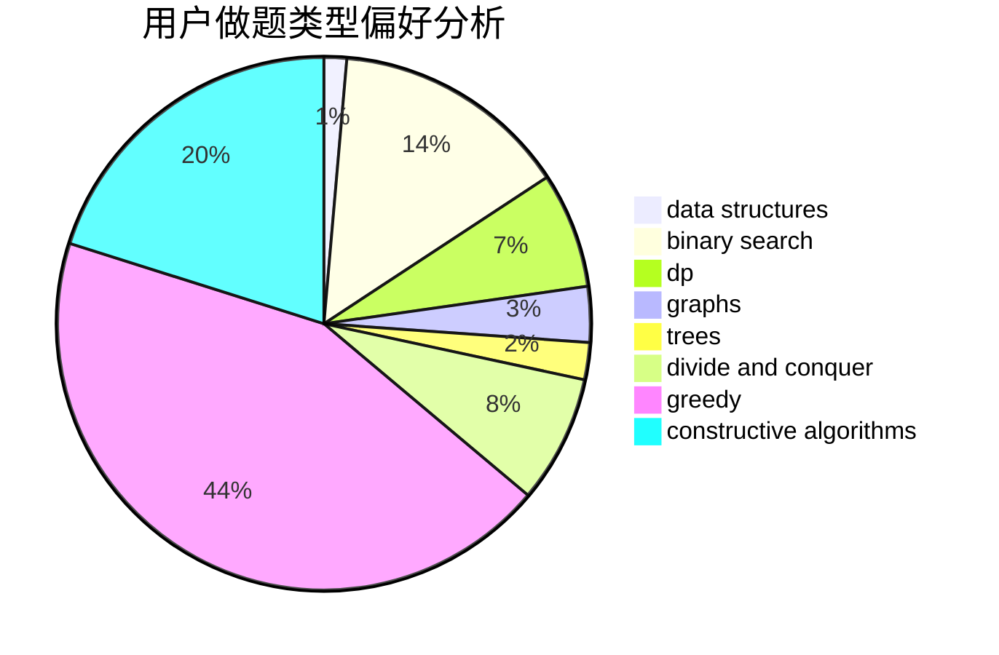
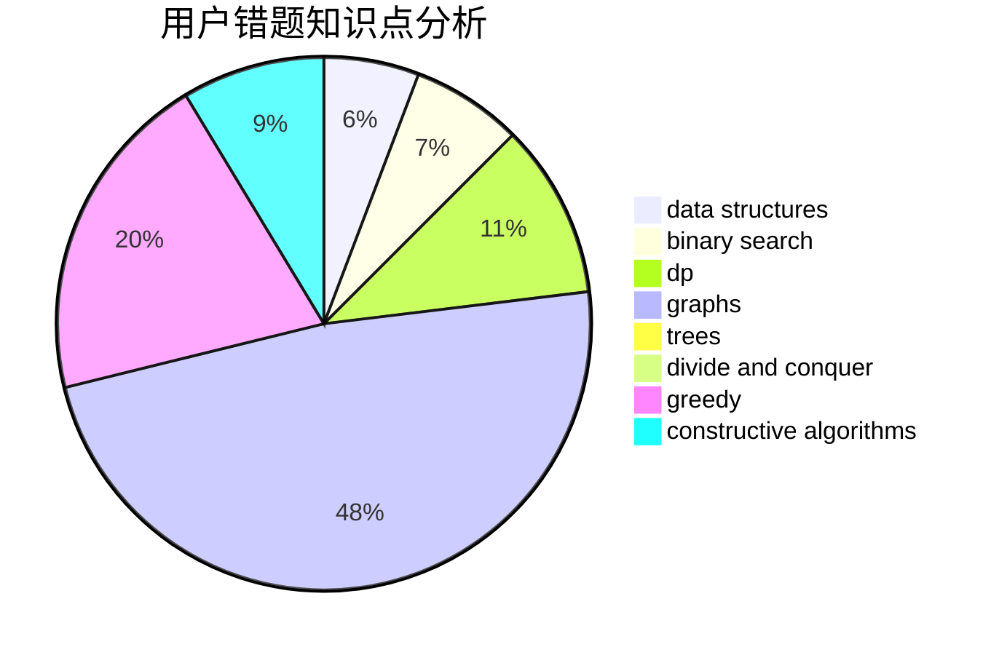

# ImWeakChicken

<!-- tabs:start -->

#### **用户提交结果分析**

#### **用户做题类型偏好分析**

#### **用户错题知识点分析**

<!-- tabs:end -->
# 推荐题目
[736D](https://codeforces.com/contest/736/problem/D)		math,
                        matrices		  
[861A](https://codeforces.com/contest/861/problem/A)		dsu,graphs,sortings,trees		  
[1175C](https://codeforces.com/contest/1175/problem/C)		binary search,
                        brute force,
                        greedy		  
[805C](https://codeforces.com/contest/805/problem/C)		dsu,graphs,sortings,trees		  
[1506C](https://codeforces.com/contest/1506/problem/C)		brute force,
                        implementation,
                        strings		  
[389A](https://codeforces.com/contest/389/problem/A)		greedy,
                        math		  
[780H](https://codeforces.com/contest/780/problem/H)		binary search,
                        geometry,
                        implementation,
                        two pointers		  
[455D](https://codeforces.com/contest/455/problem/D)		data structures		  
[1157C1](https://codeforces.com/contest/1157C/problem/1)		greedy		  
[1216E2](https://codeforces.com/contest/1216E/problem/2)		binary search,
                        math		  
