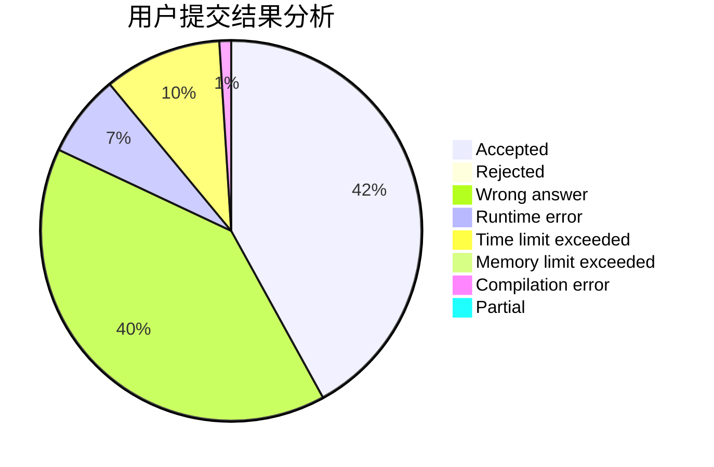
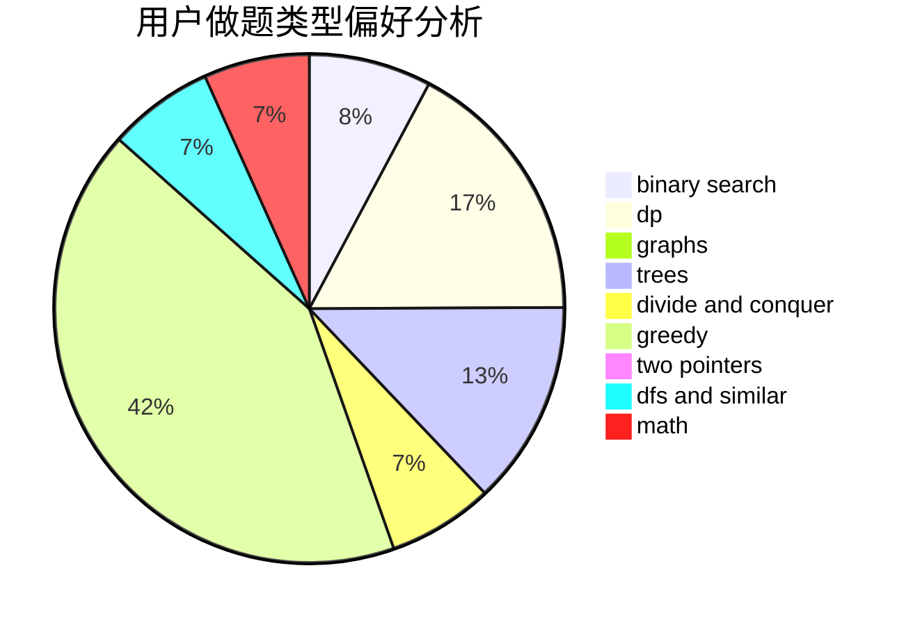

# Imakf

<!-- tabs:start -->

#### **用户提交结果分析**

#### **用户做题类型偏好分析**

<!-- tabs:end -->
# 推荐题目
[1132C](https://codeforces.com/contest/1132/problem/C)
[935B](https://codeforces.com/contest/935/problem/B)
[677C](https://codeforces.com/contest/677/problem/C)
[1073D](https://codeforces.com/contest/1073/problem/D)
[1240A](https://codeforces.com/contest/1240/problem/A)
[1164P](https://codeforces.com/contest/1164/problem/P)
[1314D](https://codeforces.com/contest/1314/problem/D)
[1092E](https://codeforces.com/contest/1092/problem/E)
[896D](https://codeforces.com/contest/896/problem/D)
[856D](https://codeforces.com/contest/856/problem/D)
